# Mininet Web Framework Architecture

## System Overview

The Mininet Web Framework is a comprehensive multi-tier architecture designed to provide web-based management of software-defined networks with AI-powered automation. The system consists of four main components that work together to deliver a complete network simulation and management solution.

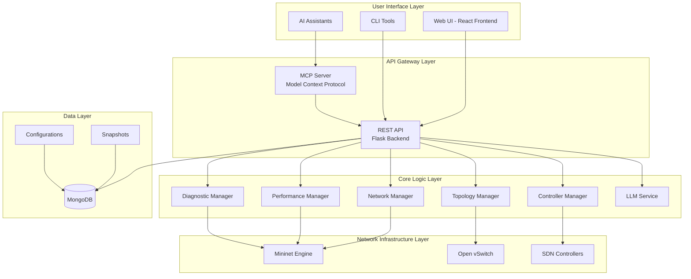

## Component Architecture

### Frontend Architecture

The React frontend follows a modern component-based architecture with hooks and functional components.

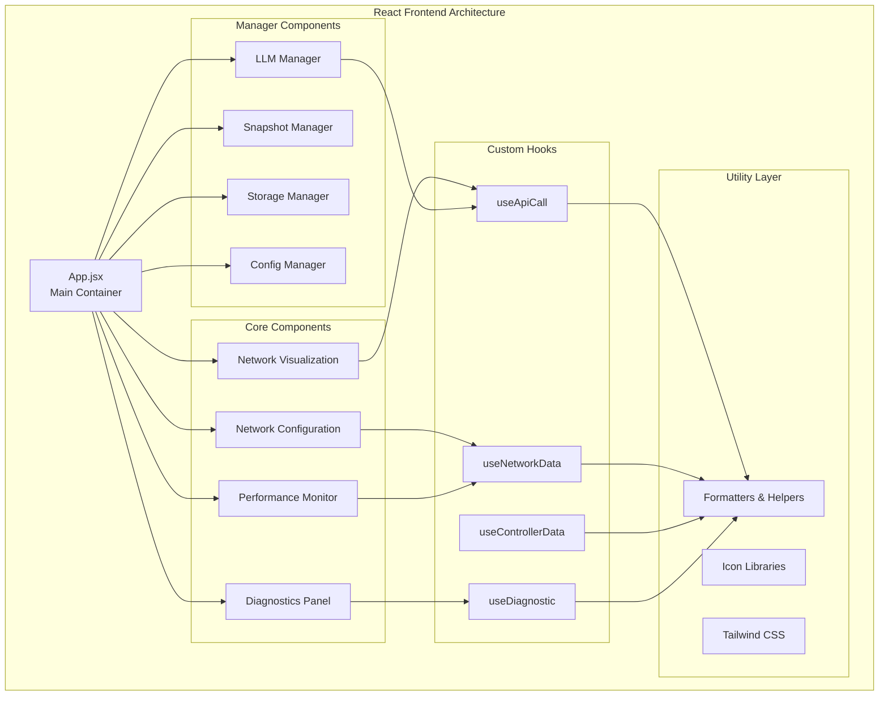

### Backend Architecture

The Flask backend implements a modular blueprint-based architecture with clear separation of concerns.

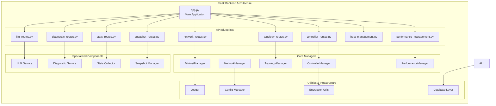

### MCP Server Architecture

The MCP server provides a standardized protocol interface for AI assistant integration.

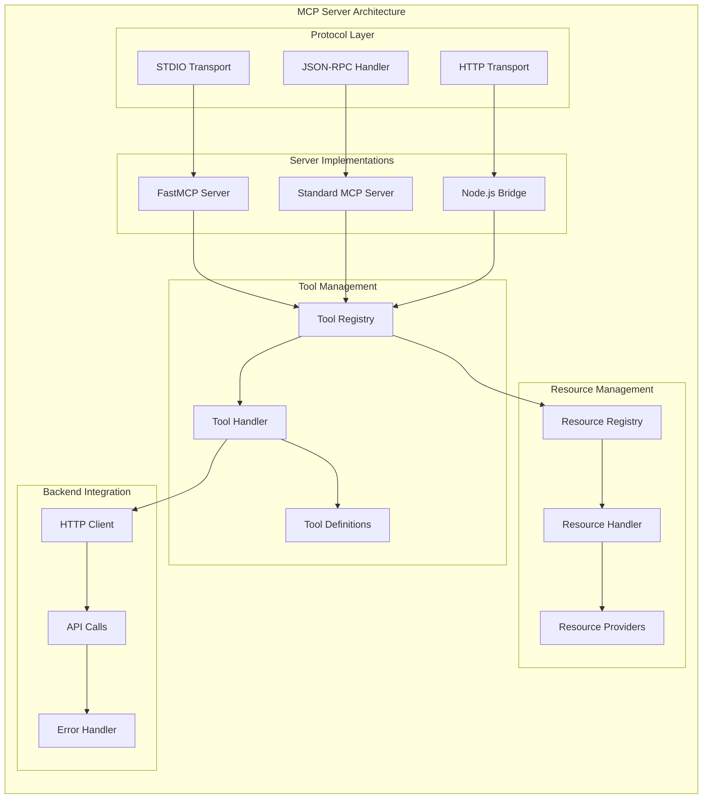

## Data Flow Architecture

### Request Flow Diagram

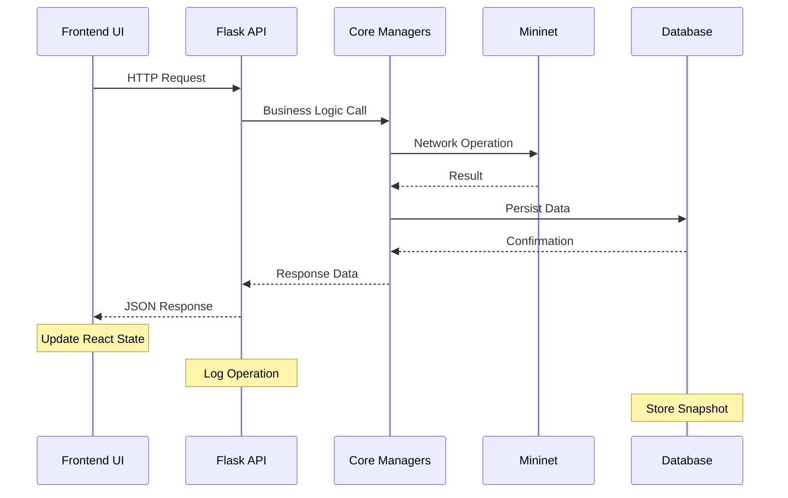

### MCP Tool Execution Flow

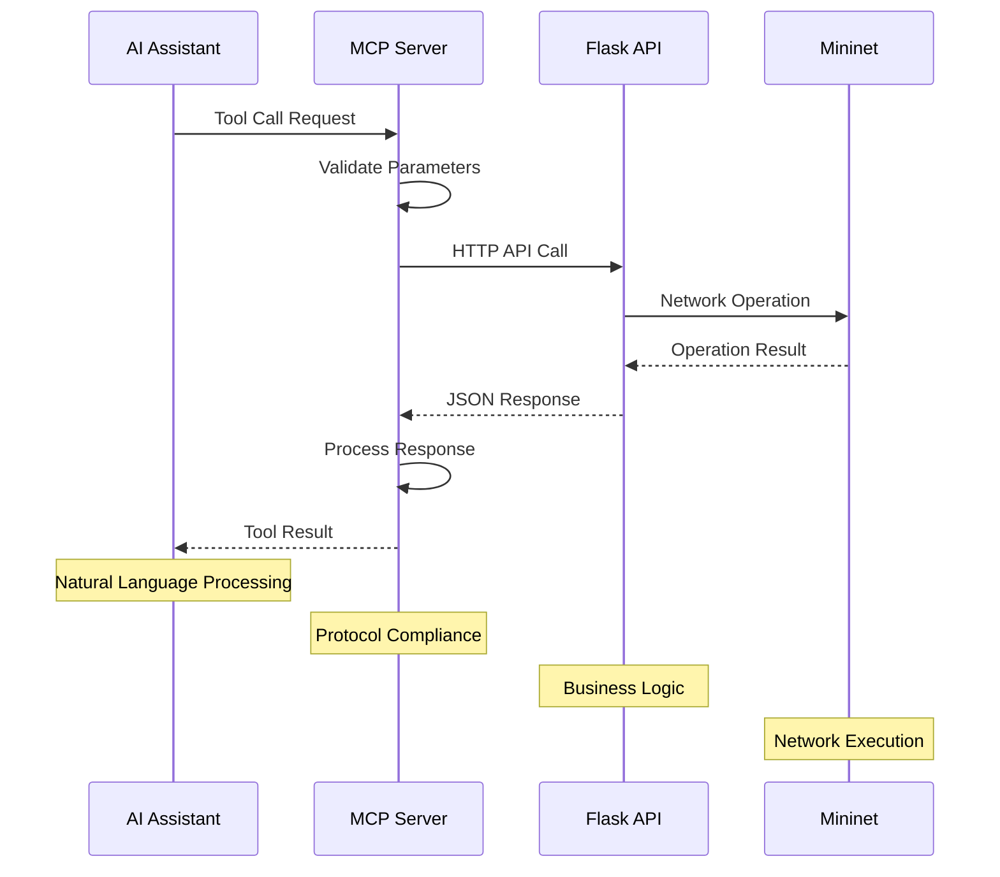

### Real-time Data Flow

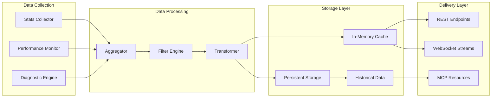

## Network Architecture

### SDN Architecture Integration

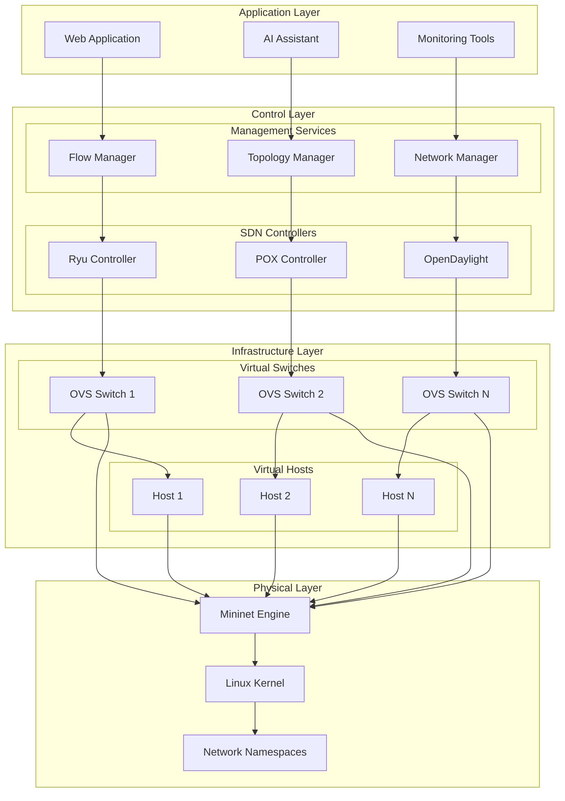

### Network Topology Models

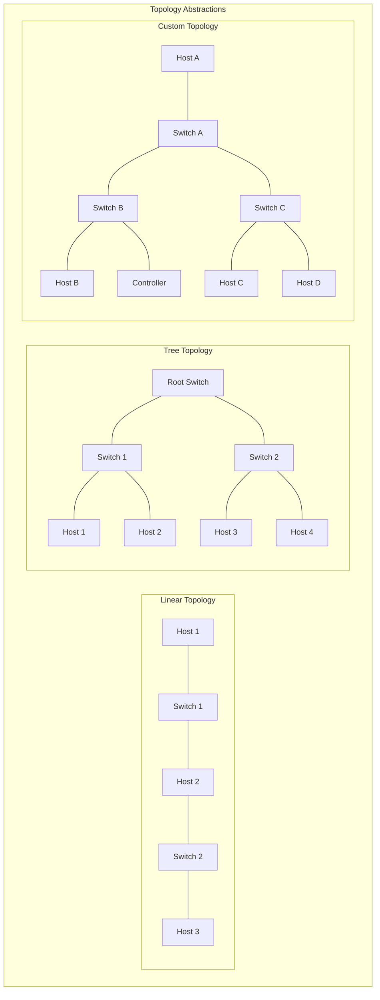

## Design Patterns

### Singleton Pattern (Network Manager)

```python
class MininetManager:
    _instance = None
    _lock = threading.Lock()
    
    def __new__(cls):
        if cls._instance is None:
            with cls._lock:
                if cls._instance is None:
                    cls._instance = super().__new__(cls)
                    cls._instance._initialized = False
        return cls._instance
    
    def __init__(self):
        if not self._initialized:
            self.net = None
            self.is_running = False
            self._initialized = True
```

### Factory Pattern (Controller Factory)

```python
class ControllerFactory:
    @staticmethod
    def create_controller(controller_type, **kwargs):
        if controller_type == 'ryu':
            return RyuController(**kwargs)
        elif controller_type == 'pox':
            return POXController(**kwargs)
        elif controller_type == 'opendaylight':
            return OpenDaylightController(**kwargs)
        else:
            raise ValueError(f"Unknown controller type: {controller_type}")
```

### Observer Pattern (Event System)

```python
class EventManager:
    def __init__(self):
        self.listeners = defaultdict(list)
    
    def subscribe(self, event_type, callback):
        self.listeners[event_type].append(callback)
    
    def emit(self, event_type, data):
        for callback in self.listeners[event_type]:
            callback(data)
```

### Builder Pattern (Topology Builder)

```python
class TopologyBuilder:
    def __init__(self):
        self.hosts = []
        self.switches = []
        self.links = []
        self.controllers = []
    
    def add_host(self, name, ip=None, mac=None):
        self.hosts.append({'name': name, 'ip': ip, 'mac': mac})
        return self
    
    def add_switch(self, name, dpid=None):
        self.switches.append({'name': name, 'dpid': dpid})
        return self
    
    def build(self):
        return {
            'hosts': self.hosts,
            'switches': self.switches,
            'links': self.links,
            'controllers': self.controllers
        }
```

## Performance Architecture

### Scaling Strategies

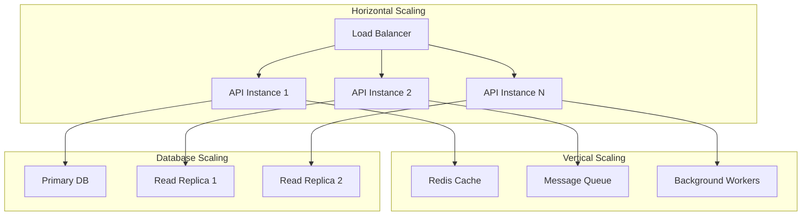

### Memory Management

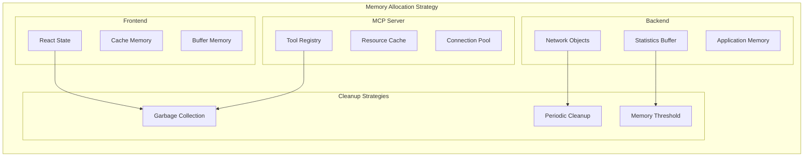

## Security Architecture

### Authentication & Authorization Flow

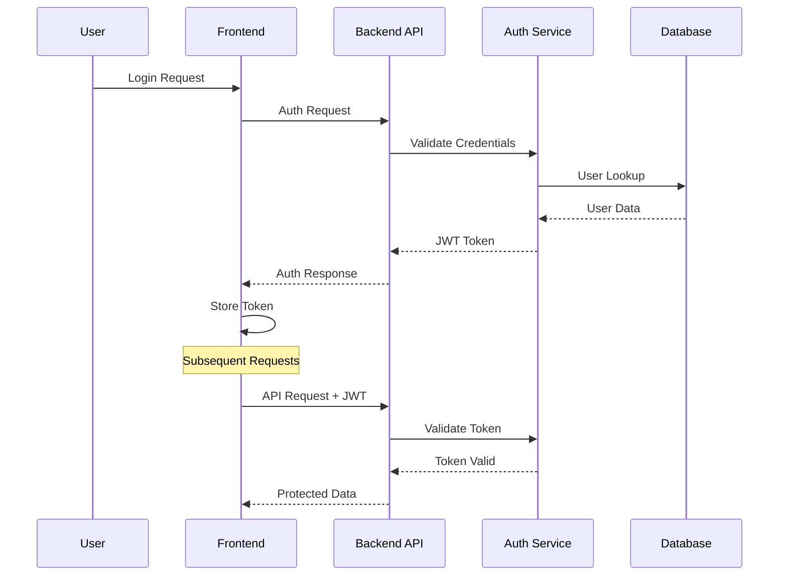

### Security Layers

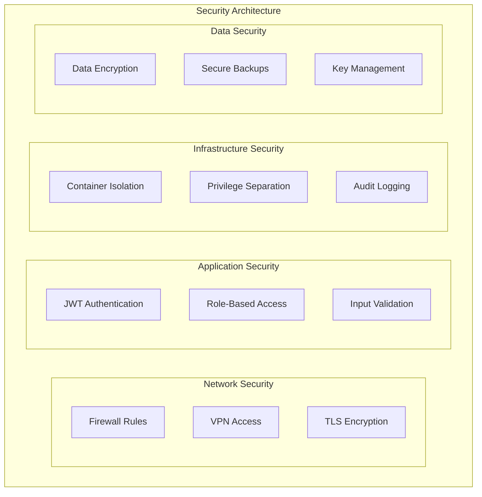

## Deployment Architecture

### Container Deployment

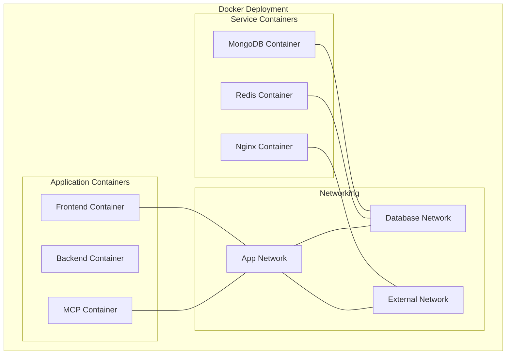

### High Availability Setup

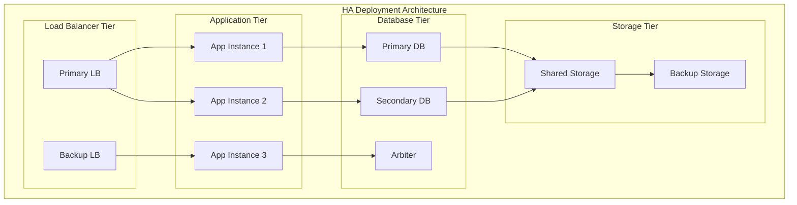

## System Integration

### External System Integration

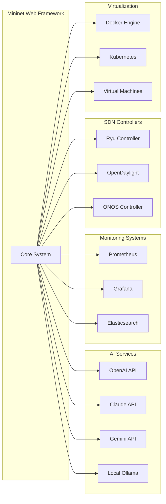

## Technology Stack Summary

### Frontend Stack
- **React** 18.2.0 - UI Framework
- **Tailwind CSS** 3.2.7 - Styling
- **Lucide React** - Icons
- **React Draggable** - Drag & Drop
- **JSON Editor** - Configuration

### Backend Stack
- **Flask** 2.3.3 - Web Framework
- **Python** 3.8+ - Runtime
- **Mininet** - Network Emulation
- **Ryu** - SDN Controller
- **MongoDB** - Database
- **PyYAML** - Configuration

### MCP Stack
- **FastMCP** 2.0+ - Protocol Implementation
- **HTTPX** - HTTP Client
- **Node.js** - Bridge Runtime
- **JSON-RPC** - Protocol Transport

### Infrastructure Stack
- **Docker** - Containerization
- **Nginx** - Reverse Proxy
- **systemd** - Service Management
- **Open vSwitch** - Virtual Switching
- **Linux** - Operating System

This comprehensive architecture enables scalable, maintainable, and extensible network simulation and management capabilities with modern web technologies and AI integration.