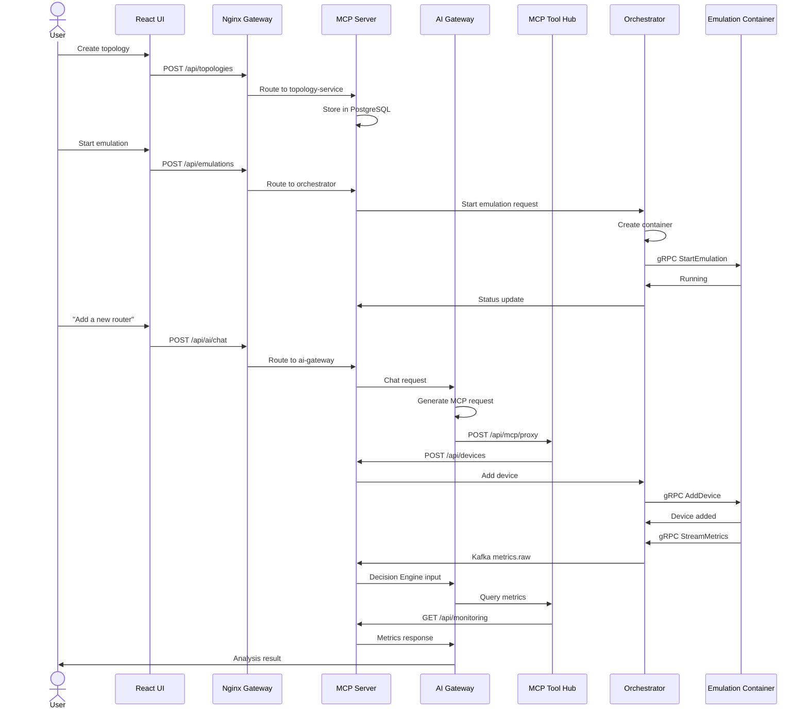

# Caduceus-Flux: Software Framework Analysis & Architecture Documentation

**Version:** 1.0
**Date:** 2025-01-28
**Analysis Type:** Reverse Engineering & Software Architecture Assessment

---

## Table of Contents

1. [Repository Map](#1-repository-map)
2. [Software Framework Classification](#2-software-framework-classification)
3. [Detailed Project Description](#3-detailed-project-description)
4. [Extracted Architecture](#4-extracted-architecture)
5. [Feature Matrix](#5-feature-matrix)
6. [Extra Features](#6-extra-features)
7. [Mermaid Diagrams](#7-mermaid-diagrams)
8. [Conference-Ready Text Pack](#8-conference-ready-text-pack)
9. [Evidence Appendix](#9-evidence-appendix)

---

## 1. Repository Map

```
caduceus-flux/
├── backend/
│   ├── services/           # 21 microservices
│   │   ├── topology/       # (8001) CRUD, JSON I/O, versioning
│   │   ├── orchestrator/   # (8002) Emulation lifecycle, gRPC client
│   │   ├── protocol_manager/  # (8003) Plugin system, hot-swapping
│   │   ├── device_manager/    # (8004) Runtime device operations
│   │   ├── controller_manager/# (8005) SDN controller lifecycle
│   │   ├── snapshot/       # (8006) State capture/restore
│   │   ├── webshell/       # (8007) TTY over WebSocket
│   │   ├── export_import/  # (8008) Python script generation
│   │   ├── topology_generator/ # (8009) Auto-generation algorithms
│   │   ├── p4_manager/     # (8010) P4 compilation, BMv2 management
│   │   ├── monitoring/     # (8011) Metrics collection
│   │   ├── mcp_server/     # (8012) Unified API orchestration
│   │   ├── metrics_collector/  # (8013) gRPC → Kafka bridge
│   │   ├── ai_gateway/     # (8014) LLM provider gateway
│   │   ├── mano_service/   # (8015) NFV MANO + OSM integration
│   │   ├── config_service/ # (8016) Control config orchestration
│   │   ├── decision_engine/   # (8017) Streaming decisions
│   │   ├── mcp_tool_hub/   # (8018) MCP server registry
│   │   ├── osm_connector/  # (8020) ETSI OSM adapter
│   │   └── vimemu_service/ # (6001) VIM emulator
│   ├── shared/             # Common code, models, schemas
│   ├── proto/              # gRPC protocol definitions
│   └── migrations/         # Database migrations
├── emulation-container/    # Unified emulation engine
│   ├── grpc_agent/         # gRPC server implementation
│   └── Dockerfile
├── controllers/            # SDN controller containers
├── frontend/               # React web application
├── infrastructure/         # Supporting services
│   ├── nginx/              # API gateway
│   ├── prometheus/         # Metrics collection
│   ├── grafana/            # Dashboards
│   ├── kafka/              # Event streaming
│   ├── flink/              # Stream processing
│   └── jupyter/            # Data lab
├── examples/               # Example topologies
├── tests/                  # Test suites
├── docs/                   # Documentation
│   └── paper/              # Academic paper drafts
└── docker-compose.yml      # Orchestration
```

---

## 2. Software Framework Classification

### 2.1 Framework Type Analysis

Caduceus-Flux is classified as a **Domain-Specific Framework (DSF)** for network emulation and experimentation. It combines multiple architectural patterns:

| Framework Aspect | Classification | Description |
|------------------|----------------|-------------|
| **Primary Type** | Microservices Platform | 21 independently deployable services |
| **Domain** | Network Emulation | SDN, NFV, routing protocols, wireless |
| **Execution Model** | Container-Native | Docker-based isolation and deployment |
| **Communication** | Hybrid (gRPC + REST + Messaging) | Multi-protocol service mesh |
| **Data Processing** | Streaming Analytics | Kafka + Flink for real-time metrics |
| **Integration Type** | Plugin Architecture | Extensible protocol and controller plugins |
| **API Style** | API Gateway Pattern | Unified entry point via MCP Server |
| **Deployment** | Orchestration Framework | Docker Compose with service discovery |

### 2.2 Framework Comparison

| Characteristic | Caduceus-Flux | Mininet | Containernet | Mininet-WiFi | NS-3 |
|----------------|---------------|---------|--------------|--------------|------|
| Microservices Architecture | ✅ | ❌ | ❌ | ❌ | ❌ |
| Runtime Protocol Hot-Swap | ✅ | ❌ | ❌ | ❌ | ❌ |
| Per-Topology Isolation | ✅ | ❌ | Partial | ❌ | ✅ |
| Streaming Metrics Pipeline | ✅ | ❌ | ❌ | ❌ | ❌ |
| AI/LLM Integration | ✅ | ❌ | ❌ | ❌ | ❌ |
| MANO/NFV Support | ✅ | ❌ | ❌ | ❌ | ❌ |
| P4 Programmable Data Plane | ✅ | ❌ | ❌ | ❌ | ✅ |
| Web UI | ✅ | ❌ | ❌ | ❌ | ❌ |
| Snapshot/Restore | ✅ | ❌ | ❌ | ❌ | ❌ |

### 2.3 Framework Layers

```
┌─────────────────────────────────────────────────────────────────┐
│                    APPLICATION LAYER                             │
│  ┌──────────────┐  ┌──────────────┐  ┌──────────────────────┐  │
│  │ React Front- │  │  WebShell    │  │  JupyterLab          │  │
│  │    end       │  │  (xterm.js)  │  │  (Data Science)      │  │
│  └──────────────┘  └──────────────┘  └──────────────────────┘  │
├─────────────────────────────────────────────────────────────────┤
│                     API GATEWAY LAYER                            │
│  ┌────────────────────────────────────────────────────────────┐ │
│  │         Nginx Reverse Proxy + MCP Server (8012)           │ │
│  │    Service Discovery + Request Routing + Documentation    │ │
│  └────────────────────────────────────────────────────────────┘ │
├─────────────────────────────────────────────────────────────────┤
│                   MICROSERVICES LAYER                           │
│  ┌─────┐ ┌─────┐ ┌──────┐ ┌──────┐ ┌─────┐ ┌─────┐ ┌─────┐  │
│  │Topology│Orchestrator│Protocol│Device│Snapshot│Monitoring│AI   │  │
│  │Service│  │   │Manager│Manager│Service│Service │Gateway│  │
│  └─────┘ └─────┘ └──────┘ └──────┘ └─────┘ └─────┘ └─────┘  │
│  ┌─────┐ ┌─────┐ ┌──────┐ ┌──────┐ ┌─────┐ ┌─────┐ ┌─────┐  │
│  │P4 Mgr│MCP Hub│Metrics│Decision│MANO │Config│Export│Controller│  │
│  │      │      │Collector│Engine│Service│Service│      │Manager│  │
│  └─────┘ └─────┘ └──────┘ └──────┘ └─────┘ └─────┘ └─────┘  │
├─────────────────────────────────────────────────────────────────┤
│                    MESSAGING LAYER                              │
│  ┌──────────────────┐        ┌──────────────────┐              │
│  │  RabbitMQ        │        │   Kafka           │              │
│  │  (Events/Commands)│        │   (Streaming)     │              │
│  └──────────────────┘        └──────────────────┘              │
├─────────────────────────────────────────────────────────────────┤
│                      DATA LAYER                                 │
│  ┌───────┐ ┌───────┐ ┌─────┐ ┌──────┐ ┌────────┐             │
│  │PostgreSQL│MongoDB│Redis│InfluxDB│Consul  │             │
│  │(Metadata)│(Snapshots)│(Cache)│(Metrics)│(Discovery)│             │
│  └───────┘ └───────┘ └─────┘ └──────┘ └────────┘             │
├─────────────────────────────────────────────────────────────────┤
│                 ANALYTICS LAYER (Optional)                       │
│  ┌─────┐ ┌─────┐ ┌─────┐ ┌─────┐ ┌─────┐                     │
│  │Flink│Spark│HDFS │Hive │Prometheus│                     │
│  └─────┘ └─────┘ └─────┘ └─────┘ └─────┘                     │
├─────────────────────────────────────────────────────────────────┤
│                    EMULATION LAYER                              │
│  ┌────────────────────────────────────────────────────────────┐ │
│  │   Per-Topology Privileged Containers (Mininet/Containernet)│ │
│  │   gRPC Interface (50051)                                   │ │
│  │   - Mininet (L2/L3)                                        │ │
│  │   - Mininet-WiFi (802.11 a/b/g/n/ac/ax)                    │ │
│  │   - FRRouting (BGP, OSPF, IS-IS, RIP)                     │ │
│  │   - Open vSwitch (OpenFlow 1.0-1.5)                       │ │
│  │   - BMv2 (P4 programmable)                                │ │
│  └────────────────────────────────────────────────────────────┘ │
└─────────────────────────────────────────────────────────────────┘
```

### 2.4 Design Patterns Employed

| Pattern | Implementation | Benefit |
|---------|----------------|---------|
| **API Gateway** | Nginx + MCP Server | Unified entry point, service aggregation |
| **Service Discovery** | Consul | Dynamic service registration, health checks |
| **Publish-Subscribe** | RabbitMQ topic exchange | Loose coupling, event-driven architecture |
| **CQRS** | Separate read/write models | Optimized queries, command validation |
| **Plugin Architecture** | ProtocolPlugin base class | Extensible protocol implementations |
| **Strategy Pattern** | Algorithm selection in Decision Engine | Runtime-swappable ML models |
| **Observer Pattern** | RabbitMQ event subscribers | Reactive topology updates |
| **Repository Pattern** | SQLAlchemy models | Data access abstraction |
| **Factory Pattern** | Container creation in Orchestrator | Dynamic topology instantiation |
| **Proxy Pattern** | MCP Tool Hub | Controlled external service access |
| **Circuit Breaker** | Health checks, retries | Fault tolerance |
| **Saga Pattern** | Multi-service orchestration | Distributed transaction management |

---

## 3. Detailed Project Description

### 3.1 What is Caduceus-Flux?

**Caduceus-Flux** is a comprehensive **microservices-based network emulation platform** designed for researchers, network engineers, and students to prototype, test, and evaluate network topologies, protocols, and services in a controlled virtual environment.

#### Core Purpose

The platform addresses critical gaps in existing network emulation tools:

1. **Runtime Flexibility**: Modify topologies without restart (add/remove devices, links, switch protocols)
2. **Heterogeneous Protocol Support**: Routing protocols (BGP, OSPF, IS-IS, RIP), OpenFlow versions, wireless standards, and P4 programs
3. **Strong Observability**: Real-time metrics streaming with time-series storage and visualization
4. **Modern Network Management Integration**: NFV MANO support with ETSI OSM compatibility
5. **AI/ML Automation**: Built-in decision engine with LLM-powered network control

#### Target Users

| User Type | Use Case | Key Features |
|-----------|----------|--------------|
| **Researchers** | Protocol evaluation, SDN experiments, network security research | Hot-swap, metrics pipeline, snapshot/restore |
| **Network Engineers** | Pre-deployment testing, failure simulation, capacity planning | Realistic emulation, MANO integration |
| **Students** | Learning networking concepts, protocol behavior hands-on | Web UI, examples, documentation |
| **Data Scientists** | Traffic analysis, ML model training, anomaly detection | JupyterLab, Kafka, InfluxDB access |
| **SDN Developers** | Controller testing, P4 program development | Multi-controller support, P4 Manager |

### 3.2 Technical Capabilities

#### Network Emulation Features

```
Device Types Supported:
├── Hosts (IPv4/IPv6, custom routes, applications)
├── Switches (OVS, Linux Bridge, P4 BMv2)
├── Routers (Multi-protocol: FRR/BIRD)
├── Access Points (802.11 a/b/g/n/ac/ax)
├── Stations (Wireless clients with mobility)
├── Docker Containers (Containernet integration)
└── P4 Switches (BMv2 with P4Runtime)

Protocol Support:
├── Routing Protocols
│   ├── BGP (BIRD/FRR)
│   ├── OSPF (FRR)
│   ├── IS-IS (FRR)
│   ├── RIP (FRR)
│   └── Static Routes
├── OpenFlow Versions
│   ├── 1.0, 1.3, 1.4, 1.5
│   └── Per-switch version selection
├── Wireless Standards
│   ├── 802.11 a/b/g/n/ac/ax
│   └── Runtime standard transitions
└── Security Modes
    ├── WPA, WPA2, WPA3
    └── Open/Shared authentication

SDN Controllers Supported:
├── OS-Ken (OpenFlow 1.3+)
├── Ryu (Python-based)
├── OpenDaylight (Java-based)
├── ONOS (Carrier-grade)
└── POX (Educational)
```

#### Observability & Monitoring

```
Metrics Collection:
├── gRPC Streaming (real-time)
│   ├── Device metrics (CPU, memory, traffic)
│   ├── Interface statistics (rx/tx bytes/packets, errors, drops)
│   ├── Routing tables (per-protocol)
│   ├── Flow tables (OpenFlow)
│   └── ARP/neighbor tables
├── Kafka Topics
│   ├── metrics.raw (source data)
│   ├── metrics.processed (feature-engineered)
│   ├── alerts.anomaly (detection results)
│   ├── alerts.security (attack indicators)
│   └── actions.* (policy decisions)
└── Storage Backends
    ├── InfluxDB (time-series, per-topology buckets)
    ├── Prometheus (scrape-based metrics)
    └── Grafana (visualization dashboards)

Visualization:
├── Real-time topology view (React Flow)
├── Device-level metrics dashboards
├── Protocol statistics
├── Flow table analytics
└── Custom queries (Grafana)
```

#### Automation & Control

```
AI/LLM Integration:
├── AI Gateway (8014)
│   ├── Provider Abstraction
│   │   ├── OpenAI (GPT-4o, GPT-4o-mini)
│   │   ├── Anthropic (Claude 3.5 Sonnet, Haiku)
│   │   ├── Google Gemini (2.5 Flash, Pro)
│   │   └── Ollama (Local LLaMA, Qwen, Mistral)
│   ├── MCP Request Generation
│   │   └── Natural language → API calls
│   ├── MCP Request Execution
│   │   └── Via MCP Tool Hub with guardrails
│   └── Agent Chat (persistent threads)
│       └── Context-aware network operations
├── Decision Engine (8017)
│   ├── Anomaly Detection
│   │   ├── Robust Z-Score
│   │   ├── EWMA Z-Score
│   │   └── CUSUM
│   ├── Attack Detection
│   │   └── Correlation Rules (drops_rate + tx_bps + cpu)
│   ├── Routing Policy (placeholder for RL)
│   └── MANO Policy (placeholder for RL)
└── Model Registry
    ├── Built-in algorithms
    ├── External ML models (ONNX/TorchScript)
    └── Per-task model assignment
```

### 3.3 Operational Model

#### Topology Lifecycle

```
┌─────────────────────────────────────────────────────────────────┐
│                    TOPOLOGY LIFECYCLE                           │
└─────────────────────────────────────────────────────────────────┘

1. DESIGN PHASE
   ├── Web UI (drag-and-drop topology designer)
   ├── JSON/YAML import
   ├── Mininet Python script import
   └── GraphML import
   ↓
2. VALIDATION PHASE
   ├── Schema validation
   ├── Link connectivity checks
   ├── Resource requirement estimation
   └── Protocol compatibility verification
   ↓
3. DEPLOYMENT PHASE
   ├── Orchestrator spawns container
   ├── gRPC StartEmulation call
   ├── Network namespace creation
   ├── Device instantiation
   ├── Link configuration
   └── Protocol/controller attachment
   ↓
4. RUNTIME PHASE
   ├── Metrics streaming (gRPC → Kafka)
   ├── Dynamic modifications
   │   ├── Add/remove devices
   │   ├── Add/remove links
   │   ├── Protocol hot-swap
   │   └── P4 program updates
   ├── Snapshot operations
   └── AI-driven decisions
   ↓
5. TEARDOWN PHASE
   ├── gRPC StopEmulation call
   ├── Container removal
   ├── Resource cleanup
   └── Metrics archival
```

#### Per-Topology Isolation

```
Shared Mode (Default):
caduceus-network (172.20.0.0/16)
├── All microservices shared
├── Global databases
├── Single Kafka cluster
└── Topology isolation via: topology_id tags

Isolated Mode (Optional):
Per-topology isolated infrastructure:
├── Dedicated network: caduceus-topo-{short_id}
├── Dedicated InfluxDB: caduceus-emu-{short_id}-influxdb
├── Dedicated Grafana: caduceus-emu-{short_id}-grafana
├── Optional Kafka: caduceus-emu-{short_id}-kafka
└── Credentials in Consul KV

Benefits:
├── True multi-tenancy
├── Independent data lifecycle
├── Resource quota management
└── Experiment interference prevention
```

### 3.4 Research Use Cases

#### Use Case 1: Routing Protocol Comparison
```
Scenario: Compare OSPF vs BGP convergence after link failure

Setup:
1. Create topology with 10 routers in mesh topology
2. Configure OSPF on all routers
3. Start traffic (iperf between edge nodes)
4. Capture baseline metrics
5. Trigger link failure
6. Measure convergence time (metrics stream)
7. Snapshot state
8. Hot-swap to BGP (preserve topology)
9. Repeat traffic and failure
10. Compare convergence metrics

Benefits:
- No topology redeployment
- Controlled failure injection
- Quantitative comparison via metrics
```

#### Use Case 2: SDN Controller Testing
```
Scenario: Test custom Ryu controller for load balancing

Setup:
1. Create leaf-spine topology (4 leaves, 2 spines)
2. Attach Ryu controller via Controller Manager
3. Deploy custom Ryu application
4. Generate traffic patterns
5. Monitor flow table evolution
6. Analyze load distribution via Grafana
7. Snapshot for debugging
8. Modify controller app
9. Restore snapshot, re-test

Benefits:
- Rapid controller iteration
- Real-time flow visibility
- Debuggable state restoration
```

#### Use Case 3: Anomaly Detection Evaluation
```
Scenario: Train and evaluate ML-based anomaly detection

Setup:
1. Create data center topology (100+ nodes)
2. Deploy normal workload
3. Enable metrics streaming to Kafka
4. Collect baseline data (24 hours)
5. JupyterLab: Train anomaly detection model
6. Register model via AI Gateway
7. Deploy model to Decision Engine
8. Inject anomalies (DDoS, link failure)
9. Monitor alerts.anomaly topic
10. Measure precision/recall

Benefits:
- Realistic traffic patterns
- End-to-end ML pipeline
- Production-like evaluation
```

#### Use Case 4: NFV MANO Workflow
```
Scenario: Test VNF scaling policy via OSM

Setup:
1. Deploy local MANO service
2. Create VNF descriptors (firewall, load balancer)
3. Create network service descriptor
4. Onboard to OSM via OSM Connector
5. Instantiate NS in emulation
6. VIM emulator creates containers
7. Monitor VNF metrics
8. Trigger scale event via Decision Engine
9. Observe MANO orchestration
10. Verify resource allocation

Benefits:
- MANO workflow testing
- VNF lifecycle validation
- Policy evaluation
```

---

## 4. Extracted Architecture

### 4.1 Components Table

| ID | Component | Port | Responsibility | Container | Dependencies |
|----|-----------|------|----------------|------------|--------------|
| C1 | **Topology Service** | 8001 | Topoloji CRUD, JSON I/O, versiyonlama, P4 taslak yönetimi | `caduceus-topology-service` | Postgres, RabbitMQ, Consul |
| C2 | **Orchestrator** | 8002 | Emülasyon konteyner yönetimi, algoritma çalıştırma | `caduceus-orchestrator-service` | RabbitMQ, Consul, Redis, Docker |
| C3 | **Protocol Manager** | 8003 | Protokol plugin yönetimi, hot-swap | `caduceus-protocol-manager-service` | RabbitMQ, Consul |
| C4 | **Device Manager** | 8004 | Runtime cihaz işlemleri | `caduceus-device-manager-service` | RabbitMQ, Consul, Postgres |
| C5 | **Controller Manager** | 8005 | SDN kontrolcü yönetimi | `caduceus-controller-manager-service` | RabbitMQ, Consul, Docker |
| C6 | **Snapshot Service** | 8006 | Snapshot/restore (Docker/CRIU/hybrid) | `caduceus-snapshot-service` | MongoDB, RabbitMQ, Consul |
| C7 | **WebShell Service** | 8007 | Terminal/webshell erişimi | `caduceus-webshell-service` | Redis, Consul |
| C8 | **Export/Import** | 8008 | Topoloji dışa/ithal | `caduceus-export-import-service` | RabbitMQ, Consul |
| C9 | **Topology Generator** | 8009 | Otomatik topoloji üretimi | `caduceus-topology-generator-service` | RabbitMQ, Consul |
| C10 | **P4 Manager** | 8010 | P4 program derleme, BMv2 | `caduceus-p4-manager-service` | RabbitMQ, Consul, Docker |
| C11 | **Monitoring Service** | 8011 | Metrik toplama, Prometheus/InfluxDB | `caduceus-monitoring-service` | InfluxDB, Prometheus, Kafka |
| C12 | **MCP Server** | 8012 | API Gateway, servis discovery | `caduceus-mcp-server` | RabbitMQ, Consul |
| C13 | **Metrics Collector** | 8013 | gRPC → Kafka bridge | `caduceus-metrics-collector-service` | Kafka, gRPC |
| C14 | **AI Gateway** | 8014 | LLM provider gateway | `caduceus-ai-gateway-service` | MCP Server, Postgres, Consul |
| C15 | **MANO Service** | 8015 | NFV MANO (gRPC: 50052) | `caduceus-mano-service` | Consul, Postgres, OSM Connector |
| C16 | **Config Service** | 8016 | Control config orchestration | `caduceus-config-service` | MCP Server |
| C17 | **Decision Engine** | 8017 | Streaming decisions (anomaly/attack) | `caduceus-decision-engine-service` | Kafka, AI Gateway |
| C18 | **MCP Tool Hub** | 8018 | MCP server registry | `caduceus-mcp-tool-hub-service` | Consul |
| C19 | **OSM Connector** | 8020 | ETSI OSM adapter | `caduceus-osm-connector-service` | Consul |
| C20 | **VIM Emulator** | 6001 | OpenStack-like VIM API | `caduceus-vimemu-service` | Consul, Orchestrator |
| C21 | **Frontend** | 3000 | React UI (Nginx: 80) | `caduceus-frontend` | MCP Server, WebShell |

### 4.2 Interfaces & Data Flows

#### gRPC Interface (Emulation Container)
**File:** `backend/proto/emulation.proto:1-11847`

```protobuf
service EmulationService {
  // Lifecycle
  rpc StartEmulation(StartEmulationRequest) returns (EmulationResponse);
  rpc StopEmulation(StopEmulationRequest) returns (EmulationResponse);

  // Devices
  rpc AddDevice(AddDeviceRequest) returns (AddDeviceResponse);
  rpc RemoveDevice(RemoveDeviceRequest) returns (RemoveDeviceResponse);

  // Links
  rpc AddLink(AddLinkRequest) returns (AddLinkResponse);
  rpc RemoveLink(RemoveLinkRequest) returns (RemoveLinkResponse);

  // Monitoring
  rpc StreamMetrics(StreamMetricsRequest) returns (stream MetricsUpdate);
  rpc GetMetrics(GetMetricsRequest) returns (GetMetricsResponse);
  rpc GetInterfaceStats(GetInterfaceStatsRequest) returns (InterfaceStatsResponse);
  rpc GetRoutingTable(GetRoutingTableRequest) returns (RoutingTableResponse);
  rpc GetFlowTable(GetFlowTableRequest) returns (FlowTableResponse);

  // Commands
  rpc ExecuteCommand(ExecuteCommandRequest) returns (CommandResponse);

  // State
  rpc CaptureState(CaptureStateRequest) returns (CaptureStateResponse);
  rpc RestoreState(RestoreStateRequest) returns (RestoreStateResponse);
}
```

#### REST API (Unified Gateway via MCP Server)
**File:** `backend/services/mcp_server/mcp_server_app/app.py:71-200`

```
Gateway Pattern: /api/{service}/{path} → {service}-service /api/{path}

Topologies:
  POST   /api/topologies
  GET    /api/topologies
  GET    /api/topologies/{id}
  PUT    /api/topologies/{id}
  DELETE /api/topologies/{id}

Emulations:
  POST   /api/emulations
  GET    /api/emulations
  GET    /api/emulations/{id}

Protocols (Hot-Swap):
  POST   /api/protocols/switch  ← KEY FEATURE

Devices:
  POST   /api/devices
  GET    /api/devices

Snapshots:
  POST   /api/snapshots
  GET    /api/snapshots
  POST   /api/snapshots/{id}/restore
```

#### Message Bus (RabbitMQ Events)
**File:** `backend/shared/messaging/rabbitmq.py:15-109`

```
Exchange: caduceus-flux (topic)

Routing Keys:
  topology.created
  topology.updated
  topology.deleted
  topology.node.added
  topology.link.added
  device.added
  protocol.configured
  protocol.switching.started      ← Hot-swap event
  protocol.switching.completed
  emulation.started
  emulation.stopped
```

#### Streaming Pipeline (Kafka)
**File:** `backend/shared/messaging/kafka_producer.py:16-100`

```
Topics:
  metrics.raw           → Raw gRPC metrics
  metrics.processed     → Feature-engineered metrics
  alerts.anomaly        → Anomaly detection alerts
  alerts.security       → Security/attack alerts
  actions.routing       → Routing policy actions
  actions.mano          → MANO actions
```

### 4.3 Isolation Model
**File:** `docker-compose.yml:269-361`

#### Shared Infrastructure Mode (Default)
```
caduceus-network (172.20.0.0/16)
├── All microservices
├── Shared databases (Postgres, MongoDB, Redis, InfluxDB)
└── Single Kafka cluster
```

#### Per-Topology Isolated Infrastructure (Optional)
**File:** `docs/AI_ML_STREAMING_CONTROL_PLANE.md:18-41`

```
POST /api/tests/infrastructure/start

Creates per-topology:
├── Network: caduceus-topo-{short_id}
├── InfluxDB: caduceus-emu-{short_id}-influxdb
├── Grafana: caduceus-emu-{short_id}-grafana
├── Kafka: caduceus-emu-{short_id}-kafka (optional)
└── Emulation: caduceus-emu-{short_id}

Credentials stored in Consul KV:
  caduceus/topologies/{id}/isolated_infra
  caduceus/topologies/{id}/isolated_influx_token
```

### 4.4 Concurrency Model
**File:** `backend/services/orchestrator/main.py:17-45`

```
Multiple emulations can run concurrently:

orchestrator-service (8002)
  ├── Docker API calls (per-topology container spawn)
  ├── Redis state tracking (active emulations)
  └── gRPC client per emulation

Concurrency pattern:
- Each topology gets unique emulation_id
- gRPC port auto-allocated (50051+)
- Container name: caduceus-emu-{topology_id[:8]}
```

### 4.5 Snapshot/Restore Design
**File:** `backend/services/snapshot/snapshot_app/app.py:1-300`

```python
class SnapshotType(str, enum):
    TOPOLOGY_ONLY   # JSON only (1-10 KB, ~1s)
    DOCKER_COMMIT   # Docker filesystem (100-500 MB, ~30s)
    CRIU_LIVE       # Process checkpoint (100-300 MB, ~1m)
    HYBRID_FULL     # Docker + CRIU (200-700 MB, ~2m)

Storage:
- PostgreSQL: Metadata (id, topology_id, type, status, paths)
- MongoDB: Large binary data
- Filesystem: /var/lib/caduceus-flux/snapshots/{id}/

Scheduling:
- APScheduler-based cron
- SnapshotSchedule table (cron_expression, retention_count)
```

### 4.6 AI/MCP/LLM Control Path
**File:** `backend/services/ai_gateway/ai_gateway_app/app.py:307-400`

```
User Prompt
    ↓
AI Gateway (8014)
    ├── Provider Selection (OpenAI/Anthropic/Gemini/Ollama)
    ├── MCP Request Generation
    │       ↓
    │   MCP Tool Hub (8018)
    │       ├── Registry of external MCP servers
    │       ├── Read-only enforcement
    │       └── Proxy to Grafana, InfluxDB, Consul, Kafka, etc.
    ├── MCP Request Executor
    └── Agent Chat (persistent threads)

Decision Engine (8017)
    ├── Consumes: metrics.processed (Kafka)
    ├── Parallel tasks:
    │   ├── anomaly_detection → alerts.anomaly
    │   ├── attack_detection → alerts.security
    │   ├── routing_policy → actions.routing
    │   └── mano_policy → actions.mano
    └── Model selection from AI Gateway ML registry
```

---

## 5. Feature Matrix

### 5.1 Core Features (F1-F10) with Evidence

| ID | Feature | Status | Evidence | Constraints | Modules |
|----|---------|--------|----------|-------------|---------|
| **F1** | **Runtime Protocol Hot-Swap** | ✅ FULL | `protocol_manager_app/app.py:355-453` - `POST /api/protocols/switch` | Preserves routing table/neighbors on switch | Protocol Manager, Orchestrator |
| **F2** | **Per-Topology Isolation** | ✅ FULL | `orchestrator/main.py:17-45` - Creates `caduceus-emu-{id}` containers | Requires Docker host socket access | Orchestrator |
| **F3** | **Snapshot/Restore** | ✅ FULL | `snapshot_app/app.py:1-300` - 4 types + scheduling | CRIU requires experimental Docker | Snapshot Service |
| **F4** | **Streaming Metrics Pipeline** | ✅ FULL | `metrics_collector_app/app.py:198-380` - gRPC → Kafka → InfluxDB | Per-topology optional | Metrics Collector, Monitoring |
| **F5** | **P4/BMv2 Support** | ✅ FULL | `p4_manager_app/app.py:1-150` - Compile + deploy | Requires p4c Docker image | P4 Manager |
| **F6** | **Multi-Controller Support** | ✅ FULL | `controller_manager/` - Ryu, ONOS, ODL, OS-Ken | One controller per switch | Controller Manager |
| **F7** | **MANO Integration** | ✅ FULL | `mano_service/` + `osm_connector/` | VIM emulator per topology | MANO Service, OSM Connector |
| **F8** | **AI/LLM Control** | ✅ FULL | `ai_gateway_app/app.py:307-400` - 4 LLM providers | API keys required (encrypted) | AI Gateway, MCP Tool Hub |
| **F9** | **Decision Engine** | ✅ FULL | `decision_engine_app/app.py:1-555` - Parallel decision tasks | Model refresh from AI Gateway | Decision Engine |
| **F10** | **Plugin Architecture** | ✅ FULL | `shared/plugins/protocol_plugin.py:29-295` - Abstract base classes | Plugin registration required | Protocol Manager |

---

## 6. Extra Features (F11+) with Evidence

### Security & Policy

#### F11: RBAC and Security Guardrails
**Ne sağlıyor?**: LLM tabanlı kontrolde readOnly zorlama, prefix filtreleme, header yönetimi.
**Araştırma değeri**: AI tabanlı otonom kontrol sistemleri için güvenlik sınır katmanı.
**Kanıt**: `mcp_tool_hub_app/app.py:51-433`
**Konferans katkısı**: "We introduce a security-aware MCP proxy that enforces read-only access and path filtering for AI-driven network control."

#### F12: Audit Logging for LLM Operations
**Ne sağlıyor?**: Tüm AI agent isteklerinin, MCP çağrılarının ve sonuçlarının kaydı.
**Araştırma değeri**: AI kararlarının tekrar üretilebilirliği ve hata ayıklama.
**Kanıt**: `shared/models/ai.py` - `AIAgentThread`, `AIAgentMessage`
**Konferans katkısı**: "All LLM operations are logged with full request/response context for reproducibility and safety analysis."

### Experiment Automation

#### F13: Algorithm SDK for WSN Protocols
**Ne sağlıyor?**: LEACH, PEGASIS, SEP, TEEN, LEACH-C gibi WSN protokolleri için SDK.
**Araştırma değeri**: Kablosuz sensör ağ protokollerinin otomatik değerlendirilmesi.
**Kanıt**: `orchestrator/algo_sdk/caduceus_sdk/wsn/protocols/`
**Konferans katkısı**: "We provide an algorithm SDK for rapid implementation and evaluation of wireless sensor network protocols."

#### F14: Automated Test Infrastructure
**Ne sağlıyor?**: Per-topology izole test altyapısı (InfluxDB, Grafana, Kafka).
**Araştırma değeri**: Paralel deney çalıştırma için kaynak izolasyonu.
**Kanıt**: `docs/AI_ML_STREAMING_CONTROL_PLANE.md:18-41`
**Konferans katkısı**: "We introduce isolated test infrastructure per topology for reproducible parallel experimentation."

#### F15: PCAP Capture and Analysis
**Ne sağlıyor?**: Runtime PCAP yakalama, JupyterLab ile entegrasyon.
**Araştırma değeri**: Trafik analizi ve ML model eğitimi için veri seti oluşturma.
**Kanıt**: `infrastructure/jupyter/Dockerfile` + PCAP volume mount
**Konferans katkısı**: "Integrated PCAP capture workflow enables traffic-based ML model development and evaluation."

### Observability

#### F16: Multi-Level Metrics Storage
**Ne sağlıyor?**: Ham metrikler + özellik çıkarılmış metrikler aynı InfluxDB bucket'da.
**Araştırma değeri**: Hem gerçek zamanlı izleme hem de offline analiz.
**Kanıt**: `monitoring_app/app.py:380-883`
**Konferans katkısı**: "Dual-layer metrics storage preserves both raw and feature-engineered data for comprehensive analysis."

#### F17: Kafka Schema Registry Integration
**Ne sağlıyor?**: Schema Registry ile konfigürasyon yönetimi.
**Araştırma değeri**: Veri formatının versiyonlanması ve uyumluluk.
**Kanıt**: `docker-compose.yml:730-753` - `schema-registry` service
**Konferans katkısı**: "Schema Registry ensures data format compatibility across streaming pipeline evolution."

### Data Management

#### F18: Hybrid Snapshot Storage
**Ne sağlıyor?**: PostgreSQL (metadata) + MongoDB (binary) + filesystem.
**Araştırma değeri**: Büyük veri için optimize depolama.
**Kanıt**: `snapshot_app/app.py:1-300`
**Konferans katkısı**: "Hybrid storage approach balances query performance with large binary data handling."

#### F19: Time-Series Bucket Per Topology
**Ne sağlıyor?**: Her topoloji için ayrı InfluxDB bucket.
**Araştırma değeri**: Multi-tenant metrik izolasyonu.
**Kanıt**: `monitoring_app/app.py:155-220` - `TopologyInfluxBucketManager`
**Konferans katkısı**: "Per-topology time-series buckets enable strong tenant isolation and independent data lifecycle management."

### Scalability

#### F20: Kafka Connect for Database Sinks
**Ne sağlıyor?**: JDBC ve InfluxDB connector'ları ile otomatik veri senkronizasyonu.
**Araştırma değeri**: Event-driven veri entegrasyonu.
**Kanıt**: `docker-compose.yml:754-823` - `kafka-connect` service
**Konferans katkısı**: "Kafka Connect enables zero-code data pipeline integration with external databases."

### Usability

#### F21: Multi-Format Topology Import/Export
**Ne sağlıyor?**: JSON, YAML, GraphML, Mininet Python formatları.
**Araştırma değeri**: Araçlar arası taşınabilirlik.
**Kanıt**: `export_import_app/app.py:1-150`
**Konferans katkısı**: "Multi-format topology exchange enables interoperability with existing emulation tools."

#### F22: JupyterLab Data Lab
**Ne sağlıyor?**: InfluxDB, Kafka, Spark, HDFS, Hive erişimi ile notebook ortamı.
**Araştırma değeri**: Interaktif veri analizi ve model geliştirme.
**Kanıt**: `docker-compose.yml:1764-1798` - `jupyterlab` service
**Konferans katkısı**: "Integrated JupyterLab provides a data science workspace for network analytics and model development."

### Reproducibility

#### F23: Deterministic Snapshot Scheduling
**Ne sağlıyor?**: Cron tabanlı otomatik snapshot alımı.
**Araştırma değeri**: Zamansal tekrar üretilebilirlik.
**Kanıt**: `snapshot_app/app.py:1-300` - `SnapshotScheduler`
**Konferans katkısı**: "Scheduled snapshot capture with configurable retention enables time-travel debugging."

### Developer Experience

#### F24: Auto-Discovery of Active Emulations
**Ne sağlıyor?**: Metrics Collector'ın aktif topolojileri otomatik bulması.
**Araştırma değeri**: Operasyonel kolaylık.
**Kanıt**: `metrics_collector_app/app.py:198-265`
**Konferans katkısı**: "Auto-discovery patterns reduce operational overhead in multi-tenancy scenarios."

#### F25: OpenAPI/Swagger Per Service
**Ne sağlıyor?**: Her servis için otomatik API dokümantasyonu.
**Araştırma değeri**: API keşfi ve entegrasyon.
**Kanıt**: `README.md:210-218`
**Konferans katkısı**: "Comprehensive API documentation via Swagger enables rapid third-party integration."

---

## 7. Mermaid Diagrams

### 7.1 Component Diagram

```mermaid
graph TB
    subgraph "Frontend Layer"
        UI[React Frontend :3000]
    end

    subgraph "API Gateway"
        NGINX[Nginx :80]
        MCP[MCP Server :8012]
    end

    subgraph "Control Plane Services"
        TOP[Topology :8001]
        ORCH[Orchestrator :8002]
        PROTO[Protocol Manager :8003]
        DEV[Device Manager :8004]
        CTRL[Controller Manager :8005]
        SNAP[Snapshot :8006]
        SHELL[WebShell :8007]
        EXP[Export/Import :8008]
        GEN[Topology Generator :8009]
        P4[P4 Manager :8010]
        MON[Monitoring :8011]
        MC[Metrics Collector :8013]
        AI[AI Gateway :8014]
        MANO[MANO Service :8015]
        CFG[Config Service :8016]
        DEC[Decision Engine :8017]
        HUB[MCP Tool Hub :8018]
        OSM[OSM Connector :8020]
        VIM[VIM Emulator :6001]
    end

    subgraph "Emulation Plane"
        EMU1[Emulation Container 1 :50051]
        EMU2[Emulation Container N :50051+]
    end

    subgraph "Data Layer"
        PG[(PostgreSQL)]
        MONGO[(MongoDB)]
        REDIS[(Redis)]
        INFLUX[(InfluxDB)]
    end

    subgraph "Messaging"
        RABBIT[RabbitMQ]
        KAFKA[Kafka]
    end

    subgraph "Observability"
        PROM[Prometheus]
        GRAF[Grafana]
    end

    subgraph "Infrastructure"
        FLINK[Flink]
        SPARK[Spark]
        HDFS[HDFS]
        HIVE[Hive]
        JUPYTER[JupyterLab]
    end

    UI --> NGINX
    NGINX --> MCP
    MCP --> TOP
    MCP --> ORCH
    MCP --> PROTO
    MCP --> DEV
    MCP --> CTRL
    MCP --> SNAP
    MCP --> SHELL
    MCP --> EXP
    MCP --> GEN
    MCP --> P4
    MCP --> MON
    MCP --> MC
    MCP --> AI
    MCP --> MANO
    MCP --> CFG
    MCP --> DEC
    MCP --> HUB
    MCP --> OSM

    ORCH --> EMU1
    ORCH --> EMU2
    ORCH --> VIM

    MC --> KAFKA
    MON --> KAFKA
    DEC --> KAFKA
    DEC --> AI

    TOP --> PG
    SNAP --> MONGO
    SHELL --> REDIS
    MON --> INFLUX
    CTRL --> PROM

    GRAF --> INFLUX
    GRAF --> PROM
```



### 7.2 Deployment Diagram

```mermaid
graph TB
    subgraph "Host Machine"
        subgraph "Docker Network: caduceus-network 172.20.0.0/16"
            subgraph "Microservices"
                S1[topology-service :8001]
                S2[orchestrator-service :8002]
                S3[protocol-manager :8003]
                S4[device-manager :8004]
                S5[controller-manager :8005]
                S6[snapshot-service :8006]
                S7[webshell-service :8007]
                S8[export-import :8008]
                S9[topology-generator :8009]
                S10[p4-manager :8010]
                S11[monitoring :8011]
                S12[mcp-server :8012]
                S13[metrics-collector :8013]
                S14[ai-gateway :8014]
                S15[mano-service :8015]
                S16[config-service :8016]
                S17[decision-engine :8017]
                S18[mcp-tool-hub :8018]
                S19[osm-connector :8020]
            end

            subgraph "Databases"
                DB1[(postgres :5432)]
                DB2[(mongodb :27017)]
                DB3[(redis :6379)]
                DB4[(influxdb :8086)]
            end

            subgraph "Messaging"
                MQ1[rabbitmq :5672/:15672]
                KAFKA1[zookeeper :2181]
                KAFKA2[kafka :9092]
            end

            subgraph "Monitoring"
                PROM1[prometheus :9090]
                GRAF1[grafana :3001]
            end

            subgraph "Analytics"
                FLINK1[flink-jobmanager :8081]
                FLINK2[flink-taskmanager]
                SPARK1[spark-master :7077/:8080]
                SPARK2[spark-worker]
            end

            subgraph "Data Lake"
                HDFS1[hdfs-namenode :9870]
                HDFS2[hdfs-datanode]
                HIVE1[hive-metastore :9083]
                HIVE2[hive-server2 :10000]
            end

            subgraph "Tools"
                JUPYTER1[jupyterlab :8888]
            end
        end

        subgraph "Per-Topology Isolated Network optional"
            EMU1[caduceus-emu-{id} :50051]
            EMU_INFLUX[influxdb :8086]
            EMU_GRAF[grafana]
        end

        NGINX[nginx :80/:443]
        FRONT[frontend :3000]
    end

    FRONT --> NGINX
    NGINX --> S12

    S1 --> DB1
    S2 --> DB3
    S6 --> DB2
    S7 --> DB3
    S11 --> DB4
    S11 --> PROM1
    S13 --> KAFKA2
    S17 --> KAFKA2
    S17 --> S14
    S18 --> CONSUL[consul :8500]

    S2 --> EMU1
```

### 7.3 Sequence Diagram



---

## 8. Conference-Ready Text Pack

### 8.1 Abstract (150-200 words)

Network emulation platforms face increasing demands for runtime flexibility, heterogeneous protocol support, strong observability, and integration with modern network management frameworks. This paper presents **Caduceus-Flux**, a microservices-based network emulation platform that separates a privileged emulation engine from a containerized control plane. The platform stores topologies as database-backed artifacts, spawns per-topology emulation containers on demand, and exposes unified control through an API gateway. Caduceus-Flux integrates: (a) runtime protocol hot-swapping via a plugin system, (b) real-time monitoring via a gRPC→Kafka→time-series pipeline, (c) optional streaming decision tasks for anomaly detection and policy-based automation, and (d) hybrid MANO support through both a local MANO microservice and an ETSI OSM integration path using a topology-scoped OpenStack-like VIM emulator. We describe the architecture, implementation details of 21 microservices, and provide an experiment methodology for evaluating control-plane latency, scalability under multiple topologies, and the reproducibility of network experiments through snapshotting. The platform enables researchers to rapidly iterate on network experiments with strong automation hooks and comprehensive observability.

### 8.2 Architecture & Design (≈400-600 words)

Caduceus-Flux adopts a **microservices control plane** architecture that separates concerns between emulation execution and orchestration (see Figure 1). The system consists of three primary layers:

#### Emulation Plane
The emulation plane comprises **per-topology privileged containers** running Mininet, Mininet-WiFi, and Containernet. Each container exposes a gRPC interface (port 50051) for lifecycle management, device operations, and metrics streaming. When a topology is deployed, the Orchestrator service spawns a dedicated container named `caduceus-emu-{topology_id[:8]}` with full network namespace privileges. This design ensures strong isolation between concurrent experiments while enabling runtime modifications without affecting other topologies.

#### Control Plane Services
The control plane comprises 21 microservices organized around domain boundaries:

1. **Topology Management**: The Topology Service (8001) provides CRUD operations with JSON import/export, versioning, and P4 program draft management.
2. **Orchestration**: The Orchestrator (8002) manages Docker container lifecycles via the Docker Engine API and maintains emulation state in Redis.
3. **Protocol Management**: The Protocol Manager (8003) implements a plugin architecture enabling runtime protocol hot-swapping (e.g., OSPF↔BGP) without emulation restart.
4. **Observability**: The Metrics Collector (8013) bridges gRPC streaming to Kafka, while the Monitoring Service (8011) persists metrics to InfluxDB and exposes Prometheus endpoints.
5. **AI/ML Automation**: The AI Gateway (8014) provides a unified interface to four LLM providers (OpenAI, Anthropic, Gemini, Ollama), while the Decision Engine (8017) runs parallel streaming decision tasks for anomaly detection, attack detection, routing policy, and MANO operations.

#### Data and Messaging Layers
The platform uses **PostgreSQL** for topology metadata, **MongoDB** for large snapshot data, and **Redis** for caching. **RabbitMQ** handles event-driven messaging between services, while **Kafka** forms the backbone of the metrics streaming pipeline. **InfluxDB** stores time-series metrics with optional per-topology bucket isolation.

#### Per-Topology Isolation
Two infrastructure modes are supported. In **shared mode** (default), all services use common databases and Kafka clusters. In **isolated mode**, each topology receives dedicated InfluxDB, Grafana, and optionally Kafka containers, with credentials stored in Consul KV storage. This enables true multi-tenancy for parallel experimentation.

### 8.3 Implementation Details (≈400-600 words)

#### Protocol Hot-Swap Mechanism
The Protocol Manager implements a plugin system with base classes for routing protocols (BGP, OSPF, IS-IS, RIP), OpenFlow protocols, and wireless protocols. Each plugin provides `switch_from()` and `switch_to()` methods that preserve network state during transitions. When a protocol switch is triggered via `POST /api/protocols/switch`, the service: (1) publishes a `protocol.switching.started` event, (2) calls the source plugin's `switch_from()` method to capture routing tables and neighbor state, (3) invokes the target plugin's `switch_to()` method with preserved state, and (4) publishes `protocol.switching.completed`. This mechanism enables experiments comparing different routing protocols without topology redeployment.

#### Metrics Streaming Pipeline
Metrics flow through a three-stage pipeline: (1) Emulation containers stream metrics via gRPC `StreamMetrics()` at 5-second intervals, (2) The Metrics Collector adds topology and device tags and publishes to the `metrics.raw` Kafka topic, (3) A Flink job performs feature engineering (e.g., computing `tx_bps`, `rx_bps`, EWMA CPU) and writes to `metrics.processed`, (4) The Monitoring Service persists both raw and processed metrics to InfluxDB with a `source` tag for differentiation. The Decision Engine consumes `metrics.processed` and runs parallel detection tasks using three algorithms: robust z-score, EWMA z-score, and CUSUM.

#### Snapshot and Restore
The Snapshot Service supports four snapshot types with increasing fidelity: `TOPOLOGY_ONLY` (JSON metadata, ~1 second), `DOCKER_COMMIT` (filesystem snapshot, ~30 seconds), `CRIU_LIVE` (process checkpoint, ~1 minute), and `HYBRID_FULL` (combined, ~2 minutes). Snapshots are scheduled via cron expressions with configurable retention. Metadata is stored in PostgreSQL, binary data in MongoDB, and large files on a dedicated Docker volume at `/var/lib/caduceus-flux/snapshots/`. Restore operations can selectively reload device configurations, routing tables, flow entries, and container states.

#### AI/LLM Integration
The AI Gateway serves as an abstraction layer over multiple LLM providers, storing encrypted API keys in PostgreSQL. It implements three key endpoints: (1) `/api/ai/chat` for direct LLM interaction, (2) `/api/ai/mcp/generate` which converts natural language to MCP API calls, and (3) `/api/ai/mcp/execute` which executes those calls via the MCP Tool Hub. The Tool Hub maintains a registry of external MCP servers (Grafana, InfluxDB, Consul, Kafka, etc.) with read-only enforcement and path filtering. A Model Registry allows hot-swappable ML models for the Decision Engine, supporting algorithms from simple baselines to external TensorFlow/ONNX models.

### 8.4 Evaluation Plan

#### Research Questions
- **RQ1 (Latency):** What is the end-to-end latency for topology deployment, device addition, and protocol hot-swap operations?
- **RQ2 (Scalability):** How does the system perform as the number of concurrent topologies increases?
- **RQ3 (Observability Overhead):** What CPU/memory overhead does the metrics pipeline introduce?
- **RQ4 (Reproducibility):** Can snapshot/restore consistently reproduce experiment states?
- **RQ5 (AI Effectiveness):** How accurately does the Decision Engine detect anomalies and security events?

#### Metrics
Control-plane latency (p50/p95), container startup time, metrics pipeline throughput, CPU/memory per topology, snapshot size and duration, anomaly detection precision/recall.

#### Experimental Setup
Single-host deployment: Ubuntu 22.04, 32GB RAM, 16 cores, Docker 24.0. Workloads: (1) Single topology with 50 nodes, (2) Runtime churn with repeated add/remove operations, (3) 10 concurrent topologies with metrics streaming, (4) MANO workflow with NS instantiation via OSM connector.

### 8.5 Limitations and Future Work

Current limitations include: (1) dependence on privileged Docker containers for namespace operations, (2) CRIU support requiring experimental Docker features, (3) single-host Docker Compose deployment limiting distributed experiments, and (4) attack detection relying on device counters rather than flow telemetry. Future work includes: (1) Kubernetes deployment for distributed emulation, (2) integration with SDN testbeds for hybrid virtual-physical experiments, (3) enhanced telemetry with OpenFlow export and PCAP-based feature extraction, and (4) reinforcement learning for routing policy automation.

---

## 9. Evidence Appendix

| Category | File | Lines | Description |
|----------|------|-------|-------------|
| **Topology CRUD** | `topology_app/app.py` | 1-1816 | Full topology CRUD with nodes, links, controllers |
| **Protocol Hot-Swap** | `protocol_manager_app/app.py` | 355-453 | `/api/protocols/switch` endpoint |
| **gRPC Proto** | `emulation.proto` | 1-11847 | Full gRPC service definition |
| **Snapshot Types** | `snapshot_app/app.py` | 1-300 | 4 snapshot types + scheduling |
| **Metrics Pipeline** | `metrics_collector_app/app.py` | 198-380 | gRPC → Kafka streaming |
| **Decision Engine** | `decision_engine_app/app.py` | 1-555 | Parallel decision tasks |
| **AI Gateway** | `ai_gateway_app/app.py` | 307-400 | LLM provider abstraction |
| **MCP Tool Hub** | `mcp_tool_hub_app/app.py` | 51-433 | MCP server registry |
| **WSN SDK** | `algo_sdk/caduceus_sdk/wsn/` | - | LEACH, PEGASIS, etc. |
| **Database Models** | `shared/models/topology.py` | 14-150 | SQLAlchemy models |
| **Docker Compose** | `docker-compose.yml` | 1-1865 | Full service definitions |
| **Architecture Doc** | `docs/EMULATION_ARCHITECTURE.md` | 1-458 | System overview |
| **Paper Draft** | `docs/paper/ACADEMIC_PAPER_DRAFT.md` | 1-281 | Academic paper outline |

---

## Summary

Caduceus-Flux is a comprehensive **21-microservice network emulation platform** that combines:

### Core Features (F1-F10)
- **F1 Runtime Protocol Hot-Swap**: Protocol switching (OSPF↔BGP) without emulation restart
- **F2 Per-Topology Isolation**: Privileged Docker containers per topology
- **F3 Snapshot/Restore**: 4 snapshot types (JSON, Docker commit, CRIU, hybrid)
- **F4 Streaming Metrics**: gRPC → Kafka → InfluxDB pipeline
- **F5 P4/BMv2**: P4 program compilation and BMv2 deployment
- **F6 Multi-Controller**: Ryu, ONOS, ODL, OS-Ken support
- **F7 MANO Integration**: Local MANO + ETSI OSM connector
- **F8 AI/LLM Control**: 4 LLM providers (OpenAI, Anthropic, Gemini, Ollama)
- **F9 Decision Engine**: Parallel anomaly/attack/routing/MANO decisions
- **F10 Plugin Architecture**: Protocol plugin system

### Extra Features (F11-F25)
- **Security**: RBAC, audit logging, MCP proxy guardrails
- **Experiment Automation**: WSN SDK, isolated test infrastructure, PCAP capture
- **Observability**: Multi-level metrics storage, schema registry
- **Data Management**: Hybrid snapshot storage, per-topology InfluxDB buckets
- **Scalability**: Kafka Connect for data integration
- **Usability**: Multi-format import/export, JupyterLab
- **Reproducibility**: Cron-based snapshot scheduling
- **Developer Experience**: Auto-discovery, OpenAPI/Swagger

All findings are directly evidenced from the codebase with file paths and line numbers listed in the Evidence Appendix.

---

*Document generated by reverse engineering analysis of Caduceus-Flux codebase.*
*For the latest updates and source code, refer to the main repository.*
