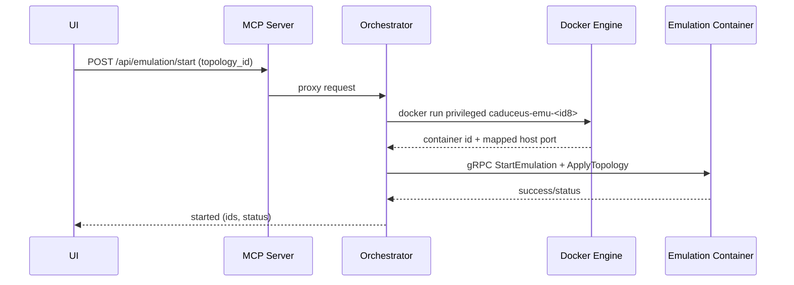
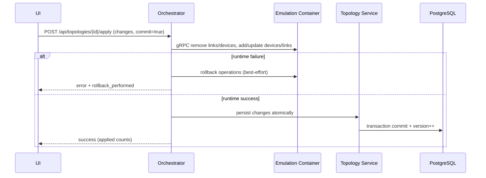

# Caduceus‑Flux — Software Architecture & Development Document (SADD)

**Purpose of this file:** a single, developer-facing document that explains **what the project is**, **why it exists**, **how the architecture works**, **how the code is organized**, and **how to operate/extend it**. This is the document you can cite and adapt when writing your academic paper.

**Last updated:** 2026-01-06  
**Repository root:** `caduceus-flux/`  
**Scope:** Docker Compose control plane + per-topology emulation runtimes + observability + MANO/OSM + AI/ML automation hooks.

Related docs (deeper dives):
- Architecture diagrams and flows: `docs/paper/SYSTEM_ARCHITECTURE.md`
- Academic paper template: `docs/paper/ACADEMIC_PAPER_DRAFT.md`
- Control Config (unified JSON control plane): `docs/CONTROL_CONFIG.md`
- Metrics pipeline: `METRICS_PIPELINE.md`
- MANO + OSM integration: `docs/MANO_FEATURES.md`, `docs/OSM_INTEGRATION.md`
- External MCP integration plan: `docs/MCP_INTEGRATION_PLAN.md`

---

## 1) System Vision

### 1.1 Problem statement

Network research and complex system prototyping often require an environment that can:

- model **heterogeneous networks** (wired + wireless + containers + SDN + routing + P4),
- change topology and configuration **at runtime**,
- provide **repeatable experiment artifacts** (snapshots, pcaps, stored topologies),
- expose an **operable control plane** (unified APIs + dashboards + automation),
- integrate with **NFV/MANO workflows** (e.g., ETSI OSM), and
- support streaming analytics for closed-loop experiments (metrics → decisions → actions).

### 1.2 Goal

Build a platform where a user can:
1) design/store a topology as a durable artifact,  
2) start a per-topology emulation runtime on demand,  
3) apply staged changes safely (rollback on failure),  
4) collect telemetry and export artifacts for analysis, and  
5) optionally orchestrate NFV/SDN workflows and automation actions.

### 1.3 Non-goals / constraints

- **Privileged emulation is required:** Mininet/Containernet generally needs elevated Linux capabilities. This is intentionally isolated to the emulation runtime and orchestrator.
- **Research prototype posture:** security hardening and multi-tenant isolation are not the primary focus (but trust boundaries are documented).
- **Protocol fidelity varies:** realism is evaluated per protocol/tool; the architecture is designed so you can measure and improve fidelity.

---

## 2) Requirements (Engineering View)

### 2.1 Functional requirements

- **Topology lifecycle:** create/update/list/delete projects/topologies/nodes/links; import/export.
- **Emulation lifecycle:** start/stop/pause/resume a topology’s runtime.
- **Runtime operations:** add/remove/update devices and links while running; execute commands on devices; capture pcaps.
- **Protocol management:** configure/enable/disable/switch protocols using a plugin abstraction.
- **Observability:** periodic metrics export from emulation runtime; store in time-series DB; dashboards; optional streaming analytics.
- **Snapshotting:** capture and restore emulation state (best effort; optional CRIU checkpoint support).
- **MANO integration:** local MANO workflows + ETSI OSM integration via adapter and VIM emulator.
- **Automation control plane:** accept a single JSON “plan” to execute cross-subsystem actions (dry-run supported).

### 2.2 Non-functional requirements

- **Reproducibility:** persisted topology artifacts, deterministic naming conventions, exportable configs, snapshot/pcap artifacts.
- **Operability:** health endpoints, logs, dashboards, service discovery.
- **Extensibility:** add new protocols, device types, exporters, monitoring collectors.
- **Performance/scalability (research):** support multiple concurrent topologies (per-topology runtimes); evaluate startup and control-plane latency.

---

## 3) Architecture Overview

### 3.1 Key architectural decisions (why it’s built this way)

1. **Split control plane vs. emulation plane**
   - Control plane: standard microservices (FastAPI) + databases + message bus.
   - Emulation plane: privileged runtime per topology, controlled via gRPC.

2. **Single external API surface**
   - UI and clients talk to one gateway (Nginx) and one aggregator (MCP server).
   - Internals can evolve without breaking the frontend.

3. **Two messaging styles**
   - RabbitMQ for control-plane events (low volume, coordination).
   - Kafka for telemetry streams (high volume, analytics-friendly).

4. **“Apply changes” semantics**
   - Runtime-first apply to emulation, rollback on failure, then commit to DB (atomic update semantics for experiments).

### 3.2 System context (who talks to what)

```mermaid
flowchart TB
  UI[Frontend (React)] -->|HTTP/WS| GW[Nginx Gateway]
  GW --> MCP[MCP Server (API aggregator)]

  MCP --> Topology[Topology Service]
  MCP --> Orch[Orchestrator]
  MCP --> DeviceMgr[Device Manager]
  MCP --> ProtoMgr[Protocol Manager]
  MCP --> Snap[Snapshot Service]
  MCP --> WebShell[WebShell Service]
  MCP --> Monitoring[Monitoring Service]
  MCP --> MetricsCollector[Metrics Collector]
  MCP --> P4Mgr[P4 Manager]
  MCP --> MANO[MANO Service]
  MCP --> OSMConn[OSM Connector]
  MCP --> Config[Config Service]
  MCP --> AIGW[AI Gateway]
  MCP --> Decision[Decision Engine]

  Topology <--> PG[(PostgreSQL)]
  Snap <--> PG
  Snap <--> Mongo[(MongoDB)]
  Orch <--> Redis[(Redis)]
  Monitoring <--> Influx[(InfluxDB)]

  Topology --> Rabbit[(RabbitMQ events)]
  Orch --> Rabbit

  Orch -->|docker.sock| Docker[Docker Engine]
  Orch --> Emu[Emulation Container per topology\ncaduceus-emu-<id8> :50051]
  Orch -->|gRPC| Emu
  MetricsCollector -->|gRPC StreamMetrics| Emu
  MetricsCollector --> Kafka[(Kafka topics)]
  Decision --> Kafka
```

### 3.3 Deployment/runtime view (Docker Compose + per-topology runtimes)

There are two “classes” of containers:

1. **Always-on stack (Docker Compose)**: control plane services + infra (Postgres, Kafka, InfluxDB, etc.).
2. **Topology-scoped runtimes (spawned by orchestrator)**:
   - Emulation container: `caduceus-emu-<topology_id[:8]>` (gRPC `50051` mapped to a host port).
   - Optional topology-scoped stacks (e.g., isolated OSM, isolated InfluxDB), depending on infra mode.

The orchestrator is the component that:
- talks to Docker Engine (`/var/run/docker.sock`),
- allocates host ports for topology gRPC endpoints,
- labels containers and manages lifecycle,
- reconciles runtime state (Redis + Docker reality).

### 3.4 Service catalog (developer view)

The authoritative wiring is `docker-compose.yml`. The main control plane services are implemented under `backend/services/*`.

| Service (compose) | Default port | Code entrypoint | Role |
|---|---:|---|---|
| `nginx` | 80 | `infrastructure/nginx/*` | reverse proxy for UI + `/api/*` |
| `mcp-server` | 8012 | `backend/services/mcp_server/mcp_server_app/app.py` | API aggregator/router to internal services |
| `topology-service` | 8001 | `backend/services/topology/topology_app/app.py` | topology CRUD + editor WebSocket + topology metadata |
| `orchestrator-service` | 8002 | `backend/services/orchestrator/orchestrator_app/app.py` | emulation lifecycle, infra ensure, apply changes, pcaps |
| `device-manager-service` | 8004 | `backend/services/device_manager/device_manager_app/app.py` | runtime device ops wrapper + runtime device DB registry |
| `protocol-manager-service` | 8003 | `backend/services/protocol_manager/protocol_manager_app/app.py` | protocol plugin management APIs |
| `controller-manager-service` | 8005 | `backend/services/controller_manager/controller_manager_app/app.py` | SDN controller lifecycle |
| `webshell-service` | 8007 | `backend/services/webshell/webshell_app/app.py` | browser terminal sessions via WebSocket |
| `export-import-service` | 8008 | `backend/services/export_import/export_import_app/app.py` | export/import formats (Mininet script etc.) |
| `topology-generator-service` | 8009 | `backend/services/topology_generator/topology_generator_app/app.py` | generate common topologies |
| `p4-manager-service` | 8010 | `backend/services/p4_manager/p4_manager_app/app.py` | compile/manage P4 artifacts + BMv2 support |
| `monitoring-service` | 8011 | `backend/services/monitoring/monitoring_app/app.py` | Prometheus metrics + Influx writes + monitoring APIs |
| `metrics-collector-service` | 8013 | `backend/services/metrics_collector/metrics_collector_app/app.py` | gRPC metrics stream → Kafka (+ optional Influx) |
| `snapshot-service` | 8006 | `backend/services/snapshot/snapshot_app/app.py` | snapshot create/restore + scheduling (Postgres + Mongo + volume) |
| `ai-gateway-service` | 8014 | `backend/services/ai_gateway/ai_gateway_app/app.py` | LLM gateway + model registry + MCP request generation/execution |
| `mano-service` | 8015 | `backend/services/mano_service/mano_service_app/app.py` | local MANO + OSM mirror/sync (gRPC: 50052) |
| `config-service` | 8016 | `backend/services/config_service/config_service_app/app.py` | unified JSON action-plan executor (`dry_run` supported) |
| `decision-engine-service` | 8017 | `backend/services/decision_engine/decision_engine_app/app.py` | consumes processed metrics; emits alerts/actions |
| `mcp-tool-hub-service` | 8018 | `backend/services/mcp_tool_hub/mcp_tool_hub_app/app.py` | external MCP server registry + safe proxy |
| `osm-connector-service` | 8020 | `backend/services/osm_connector/osm_connector_app/app.py` | SOL005/NBI adapter + authenticated proxy |
| `vimemu-service` | 6001 | `backend/services/vimemu_service/vimemu_service_app/app.py` | OpenStack-like VIM emulator for topology-scoped OSM workflows |

### 3.5 Emulation runtime (gRPC server)

The emulation container implements the gRPC interface defined in:
- `backend/proto/emulation.proto`

Implementation entrypoints:
- `emulation-container/grpc_agent/server.py`
- `emulation-container/grpc_agent/emulation_manager.py`
- `emulation-container/grpc_agent/device_handler.py`
- `emulation-container/grpc_agent/link_handler.py`
- `emulation-container/grpc_agent/monitoring_handler.py`
- `emulation-container/grpc_agent/state_handler.py`

---

## 4) Key Runtime Flows (How the system behaves)

### 4.1 Topology CRUD and live editing

- Topology artifacts are stored in PostgreSQL via `topology-service`.
- The frontend can subscribe to live editor events via `/ws/topology/{topology_id}`.

### 4.2 Start emulation (per-topology container spawn)



### 4.3 Apply staged changes (runtime-first, rollback, then commit)

This is the core “button-triggered apply” pattern (runtime is the first gate, DB is committed only after runtime success).



Reference: `IMPLEMENTATION_COMPLETE.md` (end-to-end description).

### 4.4 Metrics pipeline (telemetry)

1. Emulation runtime exports device metrics via gRPC streaming.
2. Metrics collector writes to Kafka (`metrics.raw`).
3. Monitoring service writes time-series to InfluxDB and exposes Prometheus metrics.
4. Optional: feature engineering produces `metrics.processed`; decision engine consumes it and emits alerts/actions.

See: `METRICS_PIPELINE.md`, `docs/AI_ML_STREAMING_CONTROL_PLANE.md`.

### 4.5 Snapshot pipeline (reproducibility)

- Snapshot service creates snapshot records (Postgres), stores payload (Mongo + snapshot volume), and can schedule snapshots.
- Optional: CRIU checkpoint/restore when Docker experimental + CRIU are enabled (environment dependent).

See: `CRIU_SETUP_GUIDE.md`, `NEXT_STEPS.md`.

### 4.6 MANO / ETSI OSM workflow (optional)

Two paths:
1) local MANO (direct emulation orchestration), and  
2) ETSI OSM integration (isolated OSM stack + adapter + VIM emulator).

See: `docs/MANO_FEATURES.md`, `docs/OSM_INTEGRATION.md`.

---

## 5) Data Architecture (What is stored where)

### 5.1 PostgreSQL (control-plane source of truth)

Postgres stores durable control-plane entities, including:
- projects/topologies/nodes/links/controllers (`backend/shared/models/topology.py`)
- runtime device registry (`backend/shared/models/runtime.py`)
- MANO catalog and instance state (`backend/shared/models/mano*.py`)
- AI gateway registry and run metadata (`backend/shared/models/ai*.py`, `backend/shared/models/ml_models.py`)

### 5.2 MongoDB (snapshot documents)

MongoDB stores large snapshot payloads / documents used for restore workflows (see snapshot service).

### 5.3 InfluxDB + Prometheus (metrics)

- InfluxDB stores time-series telemetry.
- Prometheus scrapes `/metrics` endpoints (monitoring service), Grafana visualizes.

### 5.4 Redis (runtime coordination)

Redis is used for fast runtime state tracking (e.g., active emulations) and coordination.

### 5.5 Volumes and artifacts

Key Docker volumes in `docker-compose.yml`:
- P4 programs/artifacts volume
- PCAP capture volume
- Snapshot storage volume

---

## 6) Repository Structure (Where to implement things)

### Control plane (microservices)

- `backend/services/*`: FastAPI services (see `docker-compose.yml` for the authoritative runtime wiring).
- `backend/shared/*`: shared database models, schemas, messaging clients, plugin interfaces.
- `infrastructure/*`: nginx config, prometheus/grafana, connectors, and optional stacks (e.g., OSM).

### Emulation plane (privileged runtime)

- `emulation-container/`: Dockerfiles + gRPC agent implementing Mininet/Mininet‑WiFi/Containernet operations.
- `emulation-container/grpc_agent/server.py`: gRPC service entrypoint; delegates to handlers (devices/links/monitoring/state).

### Frontend

- `frontend/`: React-based UI and its reverse-proxy configuration for same-origin access through Nginx.

---

## 7) Module/Subsystem Notes (Developer-facing)

This section answers “what did we build?” in the language of software modules.

### 7.1 Topology subsystem

- **Service:** `topology-service` (8001)
- **Stores:** Postgres
- **Responsibilities:** topology CRUD, import/export, topology metadata, live editor updates
- **Implementation:** `backend/services/topology/topology_app/app.py`

### 7.2 Orchestration subsystem

- **Service:** `orchestrator-service` (8002)
- **Stores:** Redis + (reads/writes via Topology service) + shared volumes
- **Responsibilities:**
  - spawn and manage per-topology emulation containers,
  - apply changes to running emulations with rollback,
  - ensure/purge topology-scoped infrastructure (optional),
  - capture pcaps and support experiment tooling.
- **Implementation:** `backend/services/orchestrator/orchestrator_app/app.py`

### 7.3 Emulation subsystem

- **Runtime:** per-topology container `caduceus-emu-<id8>`
- **Interface:** gRPC (`backend/proto/emulation.proto`)
- **Implementation:** `emulation-container/grpc_agent/*`

### 7.4 Observability subsystem

- **Metrics Collector:** gRPC stream → Kafka → optional Influx (best-effort)
- **Monitoring:** Prometheus metrics endpoint + Influx writes + query APIs

### 7.5 Protocol subsystem (plugins)

- **Plugin API:** `backend/shared/plugins/protocol_plugin.py`
- **Service:** `protocol-manager-service` loads plugins and exposes protocol APIs.

### 7.6 MANO subsystem

- **Local MANO:** `mano-service` (NS/VNF lifecycle + operations log)
- **OSM integration:** `osm-connector-service` + topology-scoped `vimemu` and optional per-topology OSM stacks

### 7.7 Automation subsystem

- **Control Config:** schema-driven multi-step orchestration via `config-service` (dry-run supported).
- **AI/ML:** `ai-gateway-service` model registry + assignments; `decision-engine-service` consumes processed metrics and emits alerts/actions.

---

## 8) Development & Operations Guide

### 8.1 Running the platform

- Primary entrypoint: `docker-compose.yml`
- Typical workflow: `docker compose up -d` (then use gateway/UI)

Health checks:
- each service exposes `/health` (or equivalent) for Compose healthchecks.

### 8.2 Extending the system

**Add a new microservice**
1. Create `backend/services/<new_service>/...` (follow existing pattern: `*_app/app.py` + `main.py`).
2. Add Dockerfile under `backend/services/<new_service>/Dockerfile`.
3. Add the service to `docker-compose.yml` and to MCP routing rules if it should be reachable via `/api/*`.

**Add a new protocol**
1. Implement a plugin in `backend/services/protocol_manager/plugins/<name>_plugin.py`.
2. Ensure it subclasses the shared plugin base and registers with the plugin registry.
3. Expose it via `protocol-manager-service` API.

### 8.3 Operational notes (trust boundaries)

The emulation runtime is privileged by design; treat it as a trusted component in the experiment environment.

For paper/security sections, document:
- UI/client boundary (Nginx/MCP),
- control plane services boundary,
- privileged emulation runtime boundary,
- Docker Engine access boundary.

---

## 9) Project Status (What’s done vs. evolving)

The fastest “truth sources” for status are:
- `SYSTEM_STATUS.md` (deployment state)
- `IMPLEMENTATION_COMPLETE.md` (apply-flow architecture)
- `00_START_HERE.md` (documentation index + guidance)
- `docker-compose.yml` (what actually runs)

Common next steps for paper readiness:
- lock a commit hash / release tag,
- capture screenshots of UI and dashboards,
- run repeatable evaluation workloads and store pcaps/snapshots as artifacts.

---

## 10) Mapping to the academic paper

This SADD can feed directly into:
- paper “system design” section,
- implementation section (service decomposition + interfaces),
- evaluation methodology (startup/control-plane latency, throughput/lag of metrics pipeline, reproducibility via snapshots).

Start with: `docs/paper/ACADEMIC_PAPER_DRAFT.md`.
