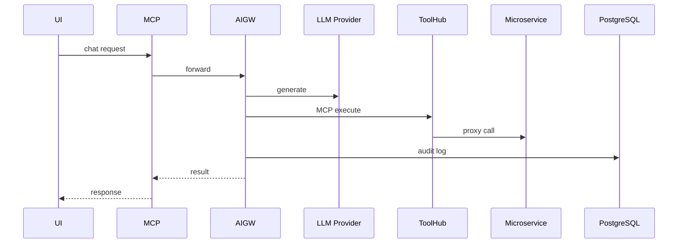
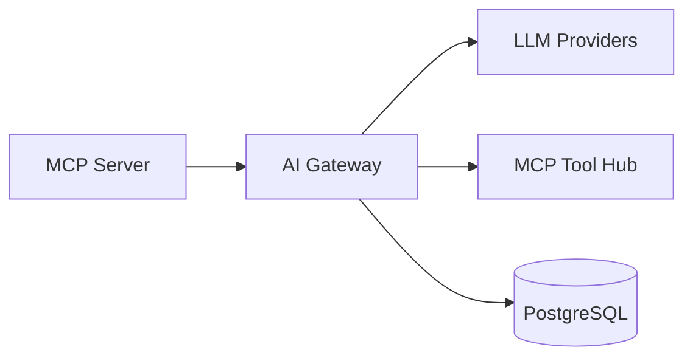

# AI Gateway Service (Port 8014)

## Rol ve Amac
LLM saglayicilarini tek arayuzde toplayan AI gateway ve MCP istek uretim/uygulama servistir.

## Sorumluluk Sinirlari (Ne Yapar / Ne Yapmaz)
- Yapar: chat request, MCP request generate/execute, audit logging.
- Yapmaz: domain is mantigi (mikroservisler yapar).

## Calisma Modeli (Adim Adim)
1. Kullanici girdisini alir ve secilen LLM saglayicisi ile cevap uretir.
2. Dogal dili MCP isteklerine cevirir ve policy/scope kontrolu uygular.
3. Sonuclari ve token metriklerini kaydeder.

## API ve Giris/Cikis
- REST: /api/ai/chat
- REST: /api/ai/mcp/generate
- REST: /api/ai/mcp/execute
- Endpoint Listesi (gorunen):
  - DELETE /api/ai/credentials
  - DELETE /api/ai/ml/models/{model_id}
  - GET /api/ai/ml/models/{model_id}/download
  - GET /api/ai/models
  - GET /api/ai/providers
  - GET /api/ai/settings
  - GET /health
  - POST /api/ai/reports/thread/{thread_id}
  - PUT /api/ai/credentials
  - PUT /api/ai/ml/assignments
  - PUT /api/ai/settings/default-model
## Veri ve Durum Yonetimi
- PostgreSQL: LLM anahtarlar, agent thread ve audit kayitlari.

## Tipik Is Senaryolari
- UI uzerinden chat ile topoloji calistirma.
- MCP tool cagrilari ile servis otomasyonu.

## Hata Senaryolari ve Kurtarma
- LLM saglayici timeout veya rate limit hata dondurebilir.
- Policy uyumsuz MCP istekleri reddedilir.

## Gozlemlenebilirlik
- Saglik endpointi (/health) servis durumunu raporlar.
- LLM cagri sayisi, token kullanimi ve latency.
- MCP execute basarim/hatali oranlari.
- Audit log yazim basarimi.
## Guvenlik ve Politika
- Scope enforcement ve policy filtreleri ile guvenli cagrilar.
- Sensitive veri redaction ve audit logging.

## Olceklenebilirlik Notlari
- Provider baglanti limitleri ve token maliyeti dikkate alinmali.

## Genisletme Noktalari
- Yeni LLM saglayicilari veya model profilleri eklenebilir.

## Bagimliliklar
- PostgreSQL
- Consul
- MCP Server

## Entegrasyonlar
- MCP Tool Hub ile guvenli proxy/registry akisi.
- Decision Engine model registry/konfig entegrasyonu.

## Veri Modeli Ozeti (DB Tablolari)
- PostgreSQL:
  - ai_provider_config: provider, api_key_encrypted, default_model.
  - ai_agent: id, name, scope, allowed_prefixes/methods, system_prompt.
  - ai_thread: id, agent_id, topology_id, title.
  - ai_message: id, thread_id, role, content_md, meta_json, embedding_vec.
  - ai_tool_call: id, message_id, toon, status, result_json, duration_ms.
  - ai_artifact: id, thread_id, type, title, content_md/json.
  - ai_run: provider, model, request_id, usage_json, status, duration_ms.
  - ai_pinned_context: topology_id, emulation_id, content_md/json.
  - ml_model: task, name, algorithm, framework, artifact_path, input_schema, output_schema.
  - ml_model_assignment: task -> model_id.
- MongoDB/Redis: yok.

## UI Baglantisi ve Kullanici Akisi
- UI ekranlari:
  - /ai-settings: provider credential + default model.
  - /ai-console: agent/threads, MCP tool calls, rapor export.
  - /ml-models: ML model yukleme/atama.
  - /network-manager: diagnostics/ai destekli analiz.
  - /topology/:id (TopologyTests): test analizi.
- Feature -> servis haritasi:
  - Provider ayarlari -> /api/ai/settings, /api/ai/credentials.
  - MCP generate/execute -> /api/ai/mcp/*.
  - Agent chat/threads -> /api/ai/agents/*.
  - Diagnostics/test analizi -> /api/ai/network/*.
  - ML model registry -> /api/ai/ml/*.
- Tipik kullanici akisi:
  1. /ai-settings uzerinden provider key girilir.
  2. /ai-console ile sohbet ve tool-call calistirilir.
  3. Network Manager'da diagnostics raporu uretilir.

## Diyagramlar

### Sequence

### Deployment

