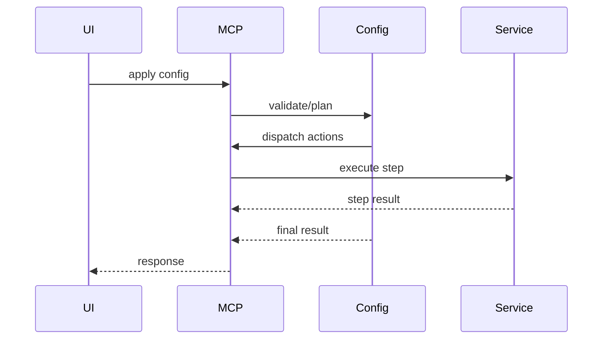
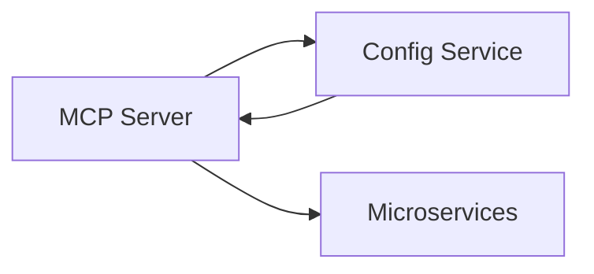

# Config Service (Port 8016)

## Rol ve Amac
JSON tabanli control-config senaryolarini dogrular ve uygular.

## Sorumluluk Sinirlari (Ne Yapar / Ne Yapmaz)
- Yapar: multi-step aksiyon planlama ve uygulama.
- Yapmaz: runtime is mantigi (mikroservisler yapar).

## Calisma Modeli (Adim Adim)
1. Config JSON girisini parse eder ve plan uretir.
2. Dry-run/validate ile hata kontrolu yapar.
3. MCP Server uzerinden sirali aksiyonlari uygular.
4. Plan icindeki adimlarin sonucunu raporlar.

## API ve Giris/Cikis
- REST: /api/template
- REST: /api/validate
- REST: /api/apply
- Endpoint Listesi (gorunen):
  - GET /api/template
  - GET /health
## Veri ve Durum Yonetimi
- Plan ve validation state gecici bellek yapilarinda tutulur.

## Tipik Is Senaryolari
- Tek seferde topoloji olustur + baslat + test kos akisi.
- Cok adimli operasyonlari tek config dosyasi ile yurutme.

## Hata Senaryolari ve Kurtarma
- Plan validation basarisizsa apply edilmez.
- Ara adim basarisizsa tum plan durdurulabilir.

## Gozlemlenebilirlik
- Saglik endpointi (/health) servis durumunu raporlar.
- Validate/apply istek sayilari ve hata oranlari.
- Plan adim sureleri ve basarisiz adimlar.
## Guvenlik ve Politika
- MCP Server policy kontrolleri ile calisir.

## Olceklenebilirlik Notlari
- Stateless; yatay olceklenebilir.

## Genisletme Noktalari
- Yeni aksiyon tipleri config planina eklenebilir.

## Bagimliliklar
- MCP Server

## Entegrasyonlar
- Coklu mikroservis aksiyonlarini tek akista birlestirir.

## Veri Modeli Ozeti (DB Tablolari)
- PostgreSQL/MongoDB/Redis: yok (config JSON islenir, kalici tablo tutulmaz).

## UI Baglantisi ve Kullanici Akisi
- UI ekranlari:
  - /network-manager: ControlConfigPanel.
- Feature -> servis haritasi:
  - Template -> /api/config/template.
  - Validate -> /api/config/validate.
  - Apply -> /api/config/apply (MCP/Orchestrator/Topology isteklerini tetikler).
- Tipik kullanici akisi:
  1. Template cekilir ve ozellestirilir.
  2. Validate ile plan gorulur.
  3. Apply ile adimlar calistirilir.

## Diyagramlar

### Sequence

### Deployment

