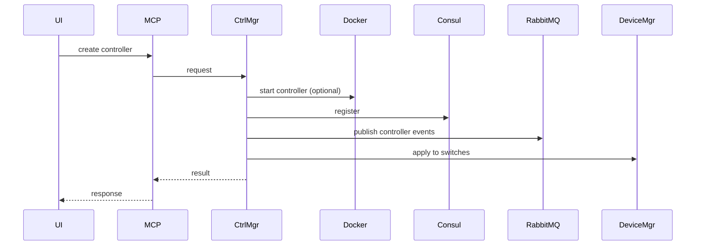
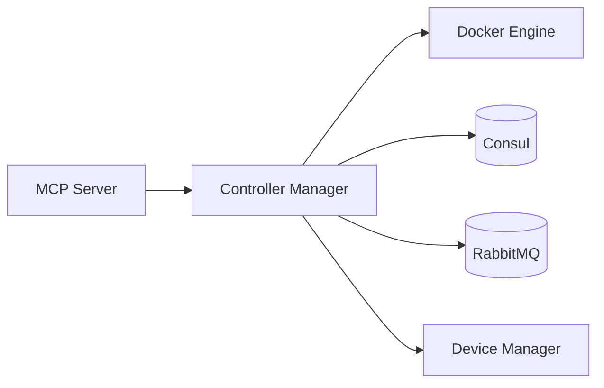

# Controller Manager Service (Port 8005)

## Rol ve Amac
SDN controller yasam dongusunu ve controller kayitlarini yoneten servistir.

## Sorumluluk Sinirlari (Ne Yapar / Ne Yapmaz)
- Yapar: controller create/start/stop, controller registry.
- Yapmaz: switch konfigunu dogrudan uygulama, topoloji CRUD.

## Calisma Modeli (Adim Adim)
1. Controller tipine gore Docker tabanli controller baslatir veya dis servis kaydi yapar.
2. Desteklenen tipler: osken, ryu, opendaylight/odl, onos, custom.
3. Controller bilgisi topolojiye baglanir ve switch'lere uygulanmak uzere referanslanir.

## API ve Giris/Cikis
- REST: /api/controllers (create/list/update/stop)
- Endpoint Listesi (gorunen):
  - GET /api/controllers/{controller_id}/logs
  - GET /api/controllers/{controller_id}/status
  - GET /health
  - POST /api/controllers/{controller_id}/start
  - POST /api/controllers/{controller_id}/stop
## Veri ve Durum Yonetimi
- Controller envanteri ve runtime mapping serviste tutulur.

## Tipik Is Senaryolari
- Ryu/OS-Ken controller baslatma ve switch baglama.
- ONOS/OpenDaylight gibi dis controller endpoint kaydi.
- Topolojiye birden fazla controller tanimlama.

## Hata Senaryolari ve Kurtarma
- Controller container baslatma hatasi durumunda kayit olusturulmaz.
- Dis endpoint erisilemezse controller status hata olur.

## Gozlemlenebilirlik
- Saglik endpointi (/health) servis durumunu raporlar.
- Controller create/start/stop sayilari ve hata oranlari.
- Controller UI erisim ve proxy hata loglari.
- controller.* event sayilari.
## Guvenlik ve Politika
- Controller UI erisimleri Nginx proxy ile same-origin uzerinden verilir.
- Custom controller endpointleri allowlist/validasyon ile sinirlanmalidir.

## Olceklenebilirlik Notlari
- Her topoloji icin birden fazla controller desteklenebilir.

## Genisletme Noktalari
- Yeni controller tipleri (custom) kayit edilebilir.

## Bagimliliklar
- Docker
- Consul
- RabbitMQ

## Entegrasyonlar
- Device Manager switch controller ayarlarini uygular.
- Nginx proxy uzerinden ONOS UI gibi arayuzlere erisim saglanir.

## Veri Modeli Ozeti (DB Tablolari)
- PostgreSQL/MongoDB/Redis: yok (controller lifecycle Docker ve runtime uzerinden).

## UI Baglantisi ve Kullanici Akisi
- UI ekranlari:
  - /network-manager: Controllers tab (controller containerlari, UI proxy linkleri).
  - /topology/:id: controller konfig gorsellestirme (topoloji metadata).
- Feature -> servis haritasi:
  - Controller create/start/stop/logs -> /api/controllers/* (programatik kullanim; UI'da dogrudan cagri gorunmuyor).
  - Controller UI proxy -> /infra-proxy/controllers/{topo}/{controllerId}/{port}/ (Infrastructure/NetworkManager).
- Tipik kullanici akisi:
  1. Topolojiye controller tanimi eklenir (Topology Service).
  2. Infrastructure/Network Manager uzerinden controller containerlari ayaga kaldirilir.
  3. UI proxy ile ONOS/ODL arayuzu acilir.

## Diyagramlar

### Sequence

### Deployment

