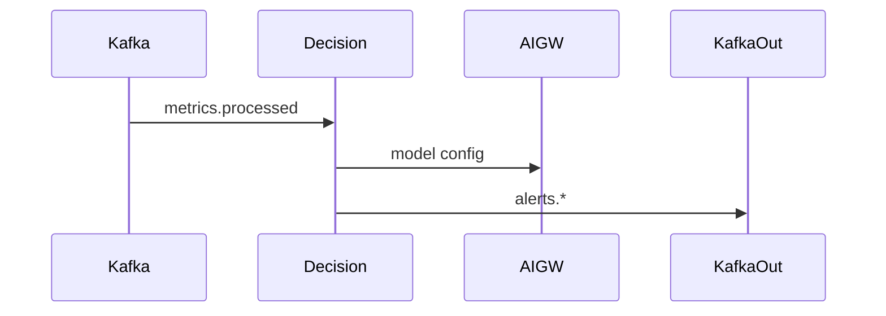
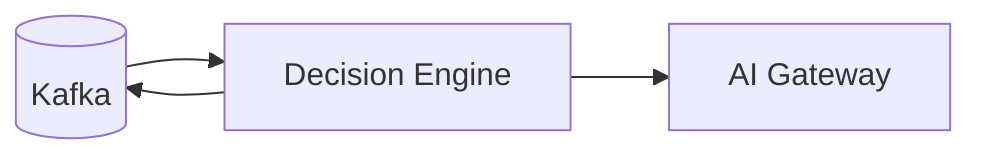

# Decision Engine Service (Port 8017)

## Rol ve Amac
Streaming metriklerden karar ureten analiz motorudur.

## Sorumluluk Sinirlari (Ne Yapar / Ne Yapmaz)
- Yapar: anomali/guvenlik/routing/MANO kararlarini uretme.
- Yapmaz: metrik toplama veya depolama.

## Calisma Modeli (Adim Adim)
1. Kafka uzerinden islenmis metrikleri alir.
2. Parallel kuyruklarda farkli karar tasklari calistirir.
3. Alert veya policy tetikleyici ciktilari uretir.
4. Model/algoritma secimleri AI Gateway uzerinden yenilenebilir.

## API ve Giris/Cikis
- Kafka consumer/producer (metrics.processed, alerts.*)
- Endpoint Listesi (gorunen):
  - GET /api/stats
  - GET /health
## Veri ve Durum Yonetimi
- Algoritma state (EWMA/CUSUM vb) bellek icinde tutulur.

## Tipik Is Senaryolari
- Ani trafik artisi -> anomaly alert.
- Policy tetikleme -> MANO veya routing aksiyonu.

## Hata Senaryolari ve Kurtarma
- Kafka baglanti sorunlari karar uretimini kesintiye ugratur.

## Gozlemlenebilirlik
- Saglik endpointi (/health) servis durumunu raporlar.
- Alert uretim sayisi ve turleri.
- Algoritma bazli threshold asimlari.
- Kafka lag ve processing latency.
## Guvenlik ve Politika
- Topoloji tag'leri ile alert izolasyonu saglanir.

## Olceklenebilirlik Notlari
- Paralel task sayisi artirilabilir; Kafka throughput sinirlar.

## Genisletme Noktalari
- Yeni algoritma pluginleri veya ML modelleri eklenebilir.

## Bagimliliklar
- Kafka
- AI Gateway (model registry)

## Entegrasyonlar
- Monitoring/Metrics Collector pipeline'lari ile birlikte calisir.
- MANO ve routing policy tetiklemeleri icin entegrasyon.

## Veri Modeli Ozeti (DB Tablolari)
- Kalici DB yok.
- In-memory:
  - EWMA/CUSUM gibi algoritmalar icin per-key state.
- Kafka:
  - metrics.processed input; alerts/anomaly output (topic isimleri).

## UI Baglantisi ve Kullanici Akisi
- UI ekranlari: dogrudan bagli bir ekran yok (sonuclar Monitoring/AI katmanina yansir).
- Feature -> servis haritasi:
  - Anomali/atak/routing/mano karar akisi -> Kafka uzerinden calisir.
- Tipik kullanici akisi:
  1. Metrics stream aktif olur.
  2. Decision Engine alert uretir; Monitoring/AI katmani goruntuler.

## Diyagramlar

### Sequence

### Deployment

