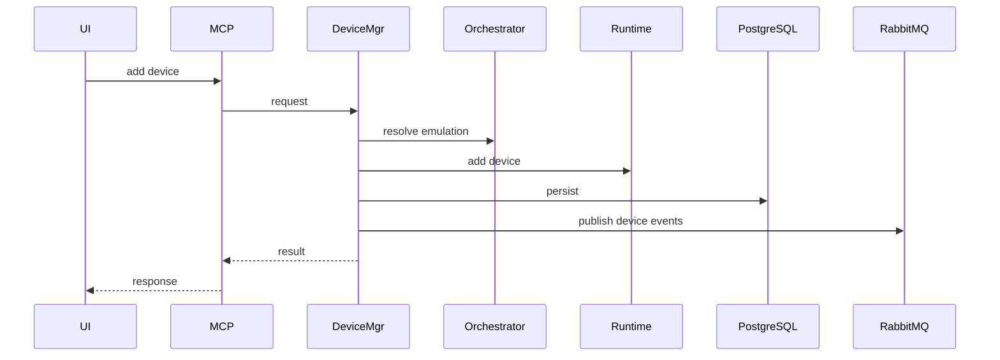
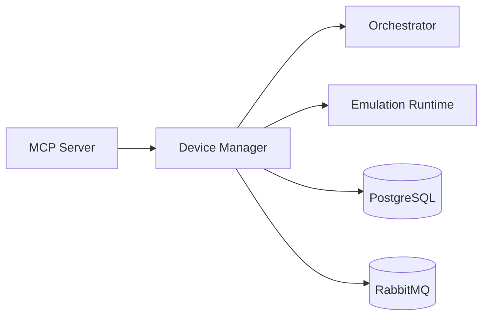

# Device Manager Service (Port 8004)

## Rol ve Amac
Calisan emulasyonda cihaz ekleme/silme/guncelleme islemlerini yurutur ve runtime envanteri tutar.

## Sorumluluk Sinirlari (Ne Yapar / Ne Yapmaz)
- Yapar: runtime cihaz operasyonlari, device listesi ve durum sorgulama.
- Yapmaz: topoloji CRUD, controller lifecycle, metrik analiz.

## Calisma Modeli (Adim Adim)
1. Aktif emulasyon bilgisi Orchestrator uzerinden bulunur.
2. Cihaz istekleri gRPC ile runtime'a gonderilir.
3. Cihaz tipine gore parametre setleri (host/switch/router/ap/station/container/p4switch) uygulanir.
4. Runtime durum PostgreSQL'de saklanir ve event yayini yapilir.

## API ve Giris/Cikis
- REST: /api/devices (GET/POST)
- REST: /api/devices/{name} (PUT/DELETE)
- Endpoint Listesi (gorunen):
  - GET /api/devices/{device_name}/interfaces
  - GET /api/devices/{device_name}/stats
  - GET /health
  - POST /api/devices/{device_name}/execute
## Veri ve Durum Yonetimi
- PostgreSQL: runtime device envanteri ve metadata.

## Tipik Is Senaryolari
- Calisan topolojiye yeni host/switch/router/container ekleme.
- Cihaz parametrelerini guncelleme (IP, interface vb).
- Cihaz silme ve runtime envanteri guncelleme.

## Hata Senaryolari ve Kurtarma
- Cihaz ad cakismasi veya runtime hatalari 4xx/5xx ile dondurulur.
- Emulasyon bulunamazsa istek reddedilir.

## Gozlemlenebilirlik
- Saglik endpointi (/health) servis durumunu raporlar.
- Cihaz ekleme/silme islem sayisi ve hata oranlari.
- Runtime gRPC hatalari ve timeouts.
- device.* event sayisi ve turleri.
## Guvenlik ve Politika
- Topoloji kapsamli istekler MCP Gateway uzerinden kontrol edilir.
- Cihaz parametreleri input dogrulamasindan gecmelidir.

## Olceklenebilirlik Notlari
- Yatay olceklenebilir; DB tutarliligi gerektirir.

## Genisletme Noktalari
- Yeni cihaz tipleri (custom device) eklenebilir.

## Bagimliliklar
- Orchestrator HTTP API
- PostgreSQL
- RabbitMQ
- Consul

## Entegrasyonlar
- Orchestrator/runtime ile cihaz operasyonlari.
- Monitoring tarafinda cihaz listesi ve tag kullanimi.

## Veri Modeli Ozeti (DB Tablolari)
- PostgreSQL:
  - runtime_device: runtime cihaz kaydi; alanlar: id, topology_id, ns_instance_id, name, runtime_name, device_type, status, properties, message, created_at, updated_at, last_seen_at.
- MongoDB/Redis: yok (kalici state Postgres runtime_device tablosundadir).

## UI Baglantisi ve Kullanici Akisi
- UI ekranlari:
  - /network-manager: cihaz listesi, runtime cihaz guncelleme.
  - /monitoring/:id: cihaz listesi ve detay secimi.
- Feature -> servis haritasi:
  - Cihaz listeleme/ekleme/silme -> /api/devices.
  - Cihaz property guncelleme -> /api/devices/{name}.
  - Cihaz uzerinde komut -> /api/devices/{name}/execute.
- Tipik kullanici akisi:
  1. Network Manager'dan cihaz secilir.
  2. Property guncellenir, servis runtime'a uygular.
  3. Monitoring sayfasinda cihaz bazli metrikler gorulur.

## Diyagramlar

### Sequence

### Deployment

