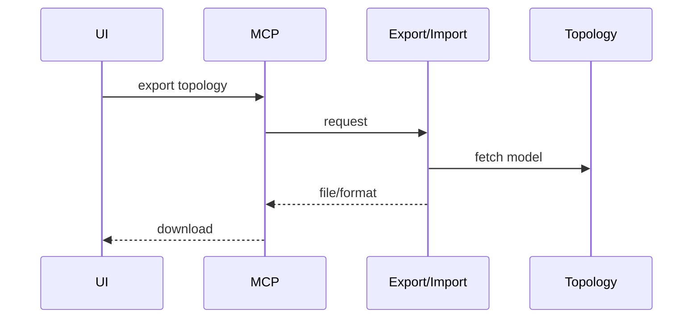
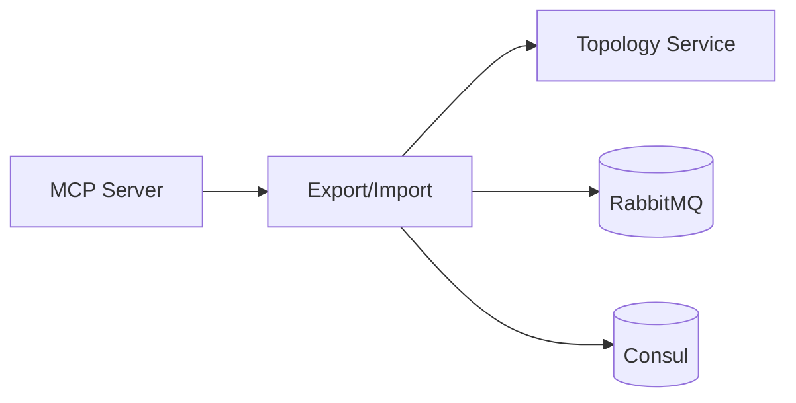

# Export/Import Service (Port 8008)

## Rol ve Amac
Topoloji format donusumlerini yapan servis katmanidir.

## Sorumluluk Sinirlari (Ne Yapar / Ne Yapmaz)
- Yapar: format donusumu ve import/export.
- Yapmaz: emulasyon runtime isletimi.

## Calisma Modeli (Adim Adim)
1. Topoloji verisini alir ve hedef formata cevirir (JSON/YAML/GraphML/Mininet/Containernet).
2. Import akisi ile dis formatlari sisteme kazandirir ve sema dogrulamasi yapar.
3. Donusum sonunda Topology Service veri modeli ile uyumlu cikti uretir.

## API ve Giris/Cikis
- REST: /api/export (format secimi ve cikti olusturma)
- REST: /api/import (format algilama ve iceri alma)
- Endpoint Listesi (gorunen):
  - GET /api/export/{topology_id}/{format}
  - GET /api/formats
  - GET /health
  - POST /api/import
## Veri ve Durum Yonetimi
- Donusum ciktisi dosya/JSON olarak uretilir.
- Gecici parse ve mapping state bellek icinde tutulur.

## Tipik Is Senaryolari
- Topoloji export edilip baska araca aktarilir.
- Diger platformdan gelen topoloji import edilip editor'de gosterilir.
- Mininet Python betigi olarak disa aktarma.

## Hata Senaryolari ve Kurtarma
- Uyumsuz format veya eksik alanlar hata dondurur.
- Buyuk topoloji donusumlerinde bellek/sure hatalari olabilir.

## Gozlemlenebilirlik
- Saglik endpointi (/health) servis durumunu raporlar.
- Export/import istek sayisi ve hata oranlari.
- Format donusum sureleri ve basarisiz parse sayisi.
- Boyut/eleman sayisi gibi ozet istatistiklerin loglanmasi onerilir.
## Guvenlik ve Politika
- Import edilen veriler sema dogrulamasindan gecmelidir.
- Dosya/icerik boyutu limitleri ile risk azaltma onerilir.

## Olceklenebilirlik Notlari
- Buyuk topolojilerde donusum suresi ve kaynak kullanimi artar.

## Genisletme Noktalari
- Yeni format adapterleri eklenebilir (GML, DOT vb).

## Bagimliliklar
- RabbitMQ
- Consul

## Entegrasyonlar
- Topology Service veri modeli ile uyumlu calisir.
- UI uzerinden export/import akislari tetiklenir.

## Veri Modeli Ozeti (DB Tablolari)
- PostgreSQL (okuma/uretme icin kullanilir):
  - topologies: topoloji metadata kaynaklari.
  - nodes: cihazlar ve pozisyonlar.
  - links: baglanti parametreleri.
- MongoDB/Redis: yok.

## UI Baglantisi ve Kullanici Akisi
- UI ekranlari:
  - /projects: ImportTopologyModal (JSON/GraphML import).
  - /network-manager: export format secimi.
- Feature -> servis haritasi:
  - Export -> /api/export (format: mininet, mininet-wifi, containernet, graphml, json, yaml).
  - Import -> /api/import ve /api/topologies/import*.
- Tipik kullanici akisi:
  1. Proje ekraninda dosya import edilir.
  2. Topoloji acilir; gerektiginde export edilir.

## Diyagramlar

### Sequence

### Deployment

