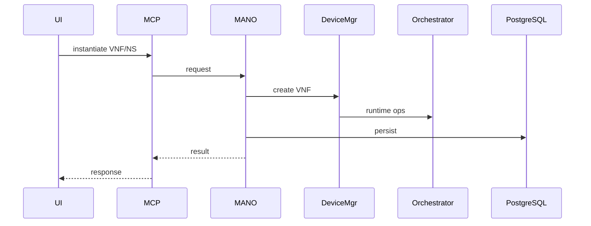
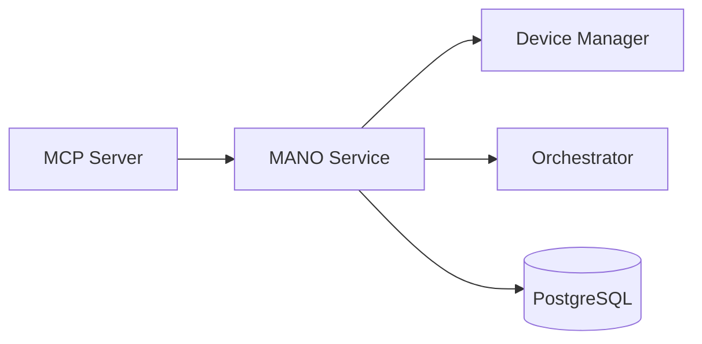

# MANO Service (Port 8015, gRPC 50052)

## Rol ve Amac
Yerel NFV MANO cekirdegi. VNF/NS lifecycle yonetimi saglar.

## Sorumluluk Sinirlari (Ne Yapar / Ne Yapmaz)
- Yapar: VNF/NS instantiate/terminate/scale akislari.
- Yapmaz: ETSI OSM dis entegrasyon (OSM Connector yapar).

## Calisma Modeli (Adim Adim)
1. VNFD/NSD kataloglari uzerinden VNF/NS olusturur.
2. Docker tabanli VNF icin Device Manager uzerinden runtime cihaz olusturur.
3. gRPC ve REST API uzerinden programatik kontrol sunar.

## API ve Giris/Cikis
- REST: /api/mano/*
- gRPC: MANO service API (50052)
- Endpoint Listesi (gorunen):
  - DELETE /api/mano/vnfm/vnf-instances/{vnf_id}
  - DELETE /api/vnfm/vnf-instances/{vnf_id}
  - GET /api/info
  - GET /api/mano/info
  - GET /api/mano/operations
  - GET /api/mano/operations/{op_id}
  - GET /api/mano/osm/mirror/resources
  - GET /api/mano/osm/mirror/stats
  - GET /api/mano/vim/inventory
  - GET /api/operations
  - GET /api/operations/{op_id}
  - GET /api/osm/mirror/resources
  - GET /api/osm/mirror/stats
  - GET /api/vim/inventory
  - GET /health
  - POST /api/mano/ns-instances/{ns_id}/terminate
  - POST /api/mano/osm/reconcile
  - POST /api/mano/osm/sync
  - POST /api/mano/vnfm/vnf-instances/{vnf_id}/exec
  - POST /api/ns-instances/{ns_id}/terminate
  - POST /api/osm/reconcile
  - POST /api/osm/sync
  - POST /api/vnfm/vnf-instances/{vnf_id}/exec
## Veri ve Durum Yonetimi
- PostgreSQL: MANO kataloglari ve instance kayitlari.

## Tipik Is Senaryolari
- Yeni VNF instantiate -> emulasyonda container olusur.
- NS instantiate -> birden fazla VNF ve link olusur.

## Hata Senaryolari ve Kurtarma
- VNF olusumu basarisizsa rollback ve status guncelleme gerekir.

## Gozlemlenebilirlik
- Saglik endpointi (/health) servis durumunu raporlar.
- VNF/NS lifecycle olaylari ve durum gecisleri.
- MANO istek sureleri ve hata oranlari.
## Guvenlik ve Politika
- Topoloji kapsamli kaynak kullanimi MCP uzerinden sinirlanir.

## Olceklenebilirlik Notlari
- VNF sayisi arttikca runtime kaynak kullanimi artar.

## Genisletme Noktalari
- Yeni VNF descriptor formatlari desteklenebilir.

## Bagimliliklar
- PostgreSQL
- Consul
- Orchestrator
- Device Manager

## Entegrasyonlar
- OSM Connector ile ETSI OSM senaryolari entegre edilebilir.
- Decision Engine MANO policy tetikleme yapabilir.

## Veri Modeli Ozeti (DB Tablolari)
- PostgreSQL:
  - mano_vnfd: id, name, version, provider, descriptor.
  - mano_nsd: id, name, version, provider, descriptor.
  - mano_ns_instance: id, name, topology_id, nsd_id, backend, status, external_id/ref.
  - mano_operation: id, ns_instance_id, kind, status, request, result, started_at, finished_at.
  - mano_vnf_instance: id, ns_instance_id, vnfd_id, name, device_type, device_name, status, properties.
  - mano_external_resource: backend, topology_id, resource_type, external_id, payload, deleted.
- MongoDB/Redis: yok.

## UI Baglantisi ve Kullanici Akisi
- UI ekranlari:
  - /network-manager (MANO tab): catalog, NS/VNF lifecycle, OSM mirror.
- Feature -> servis haritasi:
  - Catalog CRUD -> /api/mano/catalog/*.
  - NS instance lifecycle -> /api/mano/ns-instances/*.
  - VNF instance lifecycle -> /api/mano/vnfm/vnf-instances/*.
  - OSM mirror/stats -> /api/mano/osm/*.
- Tipik kullanici akisi:
  1. VNFD/NSD kaydi olusturulur.
  2. NS instance baslatilir ve VNF'ler olusur.
  3. Operasyonlar ve status MANO tabinda izlenir.

## Diyagramlar

### Sequence

### Deployment

