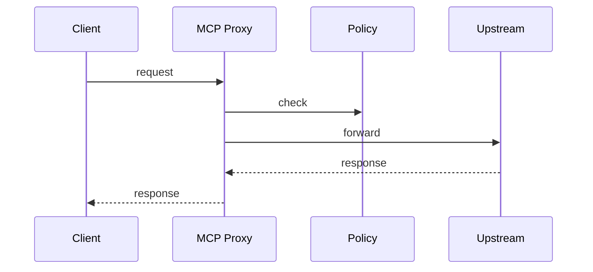
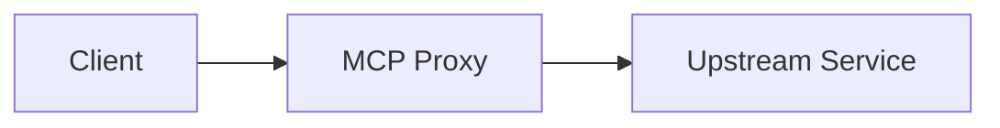

# MCP Proxy (Port 8000)

## Rol ve Amac
Genel amacli HTTP proxy shim. MCP arayuzuna uygun guvenli bir proxy saglar.

## Sorumluluk Sinirlari (Ne Yapar / Ne Yapmaz)
- Yapar: istek filtreleme ve proxy.
- Yapmaz: domain is mantigi.

## Calisma Modeli (Adim Adim)
1. Read-only, allowed methods ve path allow/deny kurallari ile istekleri filtreler.
2. Uygun istekleri upstream servise proxy eder.

## API ve Giris/Cikis
- REST: /health
- REST: /{path} (proxy)
- Endpoint Listesi (gorunen):
  - GET /health
## Veri ve Durum Yonetimi
- Konfigurasyon env veya servis metadata uzerinden saglanir.

## Tipik Is Senaryolari
- Read-only proxy ile observability servisi okuma.

## Hata Senaryolari ve Kurtarma
- Policy uyumsuz istekler 403 ile reddedilir.

## Gozlemlenebilirlik
- Saglik endpointi (/health) servis durumunu raporlar.
- Proxy istek sayisi ve hata oranlari.
- Allow/deny karar istatistikleri.
## Guvenlik ve Politika
- Read-only varsayilan guvenlik siniri.

## Olceklenebilirlik Notlari
- Stateless proxy olarak yatay olceklenebilir.

## Genisletme Noktalari
- Yeni allow/deny kurallari eklenebilir.

## Bagimliliklar
- Upstream servis

## Entegrasyonlar
- MCP Tool Hub ve AI Gateway senaryolarinda kullanilir.

## Veri Modeli Ozeti (DB Tablolari)
- PostgreSQL/MongoDB/Redis: yok.
- In-memory:
  - upstream URL + policy (read-only, allowed prefixes) env uzerinden.

## UI Baglantisi ve Kullanici Akisi
- UI ekranlari: dogrudan bagli bir ekran yok (MCP tool shim).
- Feature -> servis haritasi:
  - MCP proxy -> /{path} (upstream HTTP proxy).
- Tipik kullanici akisi:
  1. Admin upstream URL ve policy tanimlar.
  2. MCP client bu servisi read-only proxy olarak kullanir.

## Diyagramlar

### Sequence

### Deployment

