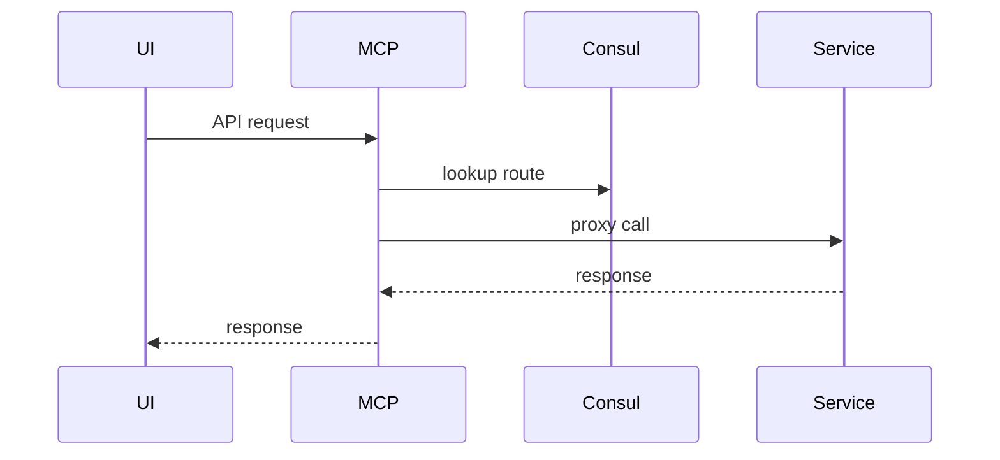
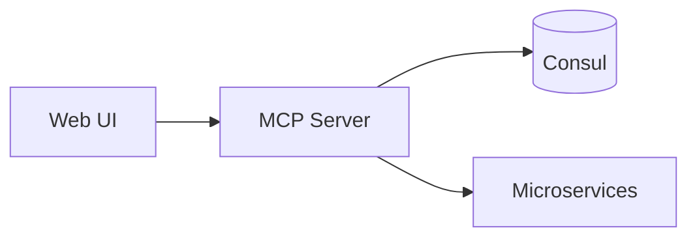

# MCP Server (Port 8012)

## Rol ve Amac
Tum mikroservisleri tek bir API kapisi altinda toplayan gateway servistir.

## Sorumluluk Sinirlari (Ne Yapar / Ne Yapmaz)
- Yapar: route yonlendirme, servis kesfi, OpenAPI proxy.
- Yapmaz: domain is mantigi ve veri isleme.

## Calisma Modeli (Adim Adim)
1. Path tabanli routing tablosu ile istekleri ilgili mikroservise proxy eder.
2. Servis kesfi icin registry/Consul bilgilerini kullanir.
3. OpenAPI dokumantasyonlarini toplayip tek noktadan sunar.

## API ve Giris/Cikis
- REST: /api/* -> ilgili mikroservis
- Docs: /docs veya /openapi proxy
- Endpoint Listesi (gorunen):
  - GET /
  - GET /api/dashboard
  - GET /api/docs
  - GET /api/docs/{service_name}
  - GET /api/health
  - GET /api/microservices
  - GET /api/openapi
  - GET /api/openapi/{service_name}
  - GET /api/redoc
  - GET /api/redoc/
  - GET /api/redoc/{service_name}
  - GET /api/services/{service_name}/health
  - GET /api/system/status
  - GET /health
  - POST /api/system/reload
  - POST /api/workflow/create-and-start
## Veri ve Durum Yonetimi
- Servis registry bilgisi bellek/Consul uzerinde tutulur.

## Tipik Is Senaryolari
- UI ve istemciler tek endpointten tum mikroservislere ulasir.
- Dokumantasyon tek noktadan goruntulenir.

## Hata Senaryolari ve Kurtarma
- Upstream servis kapali ise gateway 502/504 dondurur.
- Servis kesfi bozuksa route hatasi alinir.

## Gozlemlenebilirlik
- Saglik endpointi (/health) servis durumunu raporlar.
- Proxy gecis sayisi, hata kodlari ve latency metrikleri.
- Upstream hatalari ve route bazli istatistikler.
## Guvenlik ve Politika
- Merkezi giris noktasi oldugu icin politika/kimlik dogrulama icin uygundur.

## Olceklenebilirlik Notlari
- Stateless gateway olarak yatay olceklenebilir.

## Genisletme Noktalari
- Yeni servislerin eklenmesi route tablosuna ekleme ile saglanir.

## Bagimliliklar
- RabbitMQ
- Consul

## Entegrasyonlar
- Nginx frontend MCP Server'i tek API kapisi olarak kullanir.
- Tum mikroservislerle route tabanli entegrasyon.

## Veri Modeli Ozeti (DB Tablolari)
- PostgreSQL/MongoDB/Redis: yok.
- Consul: servis registry (servis adlari, portlar, health).

## UI Baglantisi ve Kullanici Akisi
- UI ekranlari:
  - /docs: API dokumantasyonu (OpenAPI proxy).
  - Tum UI ekranlari: /api baseURL MCP Server uzerinden routing.
- Feature -> servis haritasi:
  - /api/* istekleri -> MCP Server route eder ve ilgili servise iletir.
  - OpenAPI birlestirme -> /docs ve /openapi.json.
- Tipik kullanici akisi:
  1. UI istekleri MCP Server'a gelir.
  2. MCP Server path'e gore hedef servise proxy eder.

## Diyagramlar

### Sequence

### Deployment

