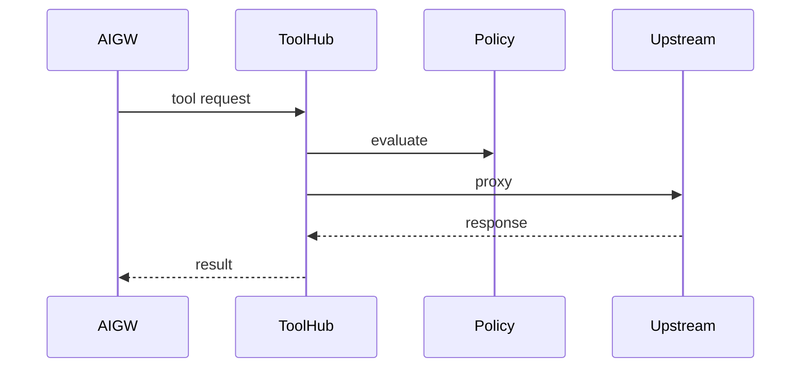
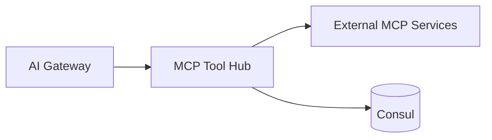

# MCP Tool Hub Service (Port 8018)

## Rol ve Amac
Harici MCP sunuculari icin registry ve guvenli proxy katmanidir.

## Sorumluluk Sinirlari (Ne Yapar / Ne Yapmaz)
- Yapar: MCP registry, policy enforcement, proxy.
- Yapmaz: domain islemleri (sadece proxy).

## Calisma Modeli (Adim Adim)
1. MCP server profillerini saklar ve konfigleri yonetir.
2. Read-only, allowlist/blocklist politikalarini uygular.
3. Sensitive header redaction uygular ve proxy eder.

## API ve Giris/Cikis
- REST: /api/mcp/tools/* (registry ve proxy)
- Endpoint Listesi (gorunen):
  - DELETE /api/mcp/servers/{name}
  - DELETE /api/mcp/{topology_id}/servers/{name}
  - GET /api/mcp/profiles
  - GET /api/mcp/servers
  - GET /api/mcp/servers/{name}
  - GET /api/mcp/{topology_id}/servers
  - GET /api/mcp/{topology_id}/servers/{name}
  - GET /health
  - POST /api/mcp/proxy
  - POST /api/mcp/{topology_id}/proxy
  - PUT /api/mcp/servers/{name}
  - PUT /api/mcp/{topology_id}/servers/{name}
## Veri ve Durum Yonetimi
- Registry konfigleri bellek/Consul uzerinde tutulur.

## Tipik Is Senaryolari
- AI Gateway bir tool cagrisini Tool Hub uzerinden calistirir.
- Grafana/InfluxDB/Prometheus gibi MCP profilleri proxy edilir.

## Hata Senaryolari ve Kurtarma
- Policy uyumsuz istekler 403 ile reddedilir.
- Upstream servise ulasilamazsa 5xx dondurulur.

## Gozlemlenebilirlik
- Saglik endpointi (/health) servis durumunu raporlar.
- Allow/deny karar sayisi ve policy ihlali istatistikleri.
- Upstream hata oranlari ve proxy latency.
- Redaction uygulanan header sayisi.
## Guvenlik ve Politika
- Read-only mod, path allow/deny, sensitive header redaction.
- Policy profilleri ile riskli yazma istekleri engellenir.

## Olceklenebilirlik Notlari
- Stateless; yatay olceklenebilir.

## Genisletme Noktalari
- Yeni MCP server profilleri ve policy kurallari eklenebilir.

## Bagimliliklar
- Consul

## Entegrasyonlar
- AI Gateway ile LLM tabanli tool cagrilari.
- MCP Proxy ile birlikte guvenli entegrasyon.

## Veri Modeli Ozeti (DB Tablolari)
- PostgreSQL/MongoDB/Redis: yok.
- Consul KV: MCP server registry, read-only/policy ayarlari.

## UI Baglantisi ve Kullanici Akisi
- UI ekranlari: dogrudan bagli bir ekran yok; AI/MCP akislari uzerinden kullanilir.
- Feature -> servis haritasi:
  - MCP server kayitlari -> /api/mcp-tool-hub/* (registry + policy).
- Tipik kullanici akisi:
  1. Admin MCP server ekler.
  2. AI Gateway bu kaydi kullanarak proxy eder.

## Diyagramlar

### Sequence

### Deployment

