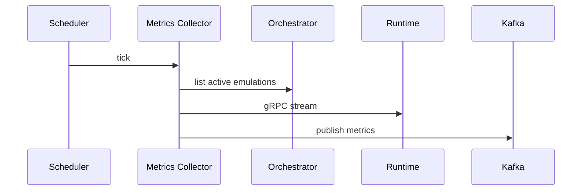
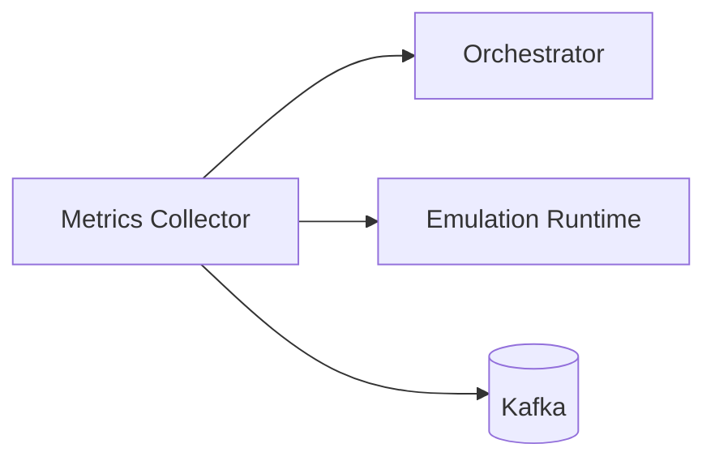

# Metrics Collector Service (Port 8013)

## Rol ve Amac
gRPC metrik akisini Kafka stream pipeline'ina tasiyan servistir.

## Sorumluluk Sinirlari (Ne Yapar / Ne Yapmaz)
- Yapar: gRPC metrik stream -> Kafka.
- Yapmaz: metrik depolama veya karar uretimi.

## Calisma Modeli (Adim Adim)
1. Orchestrator'dan aktif emulasyon listesini periyodik alir.
2. Her emulasyon icin gRPC stream acar ve metrikleri etiketler.
3. Kafka topiclerine (metrics.raw vb) yazar.
4. METRICS_BATCH_SIZE dolunca buffer flush edilir; METRICS_BUFFER_SIZE asilirsa zorunlu flush yapilir.
5. MONITORING_INGEST_ENABLED aktifse metrikler Monitoring servisine ingest edilir.

## API ve Giris/Cikis
- Internal: Kafka producer; gRPC client (runtime).
- Endpoint Listesi (gorunen):
  - GET /api/stats
  - GET /health
  - POST /api/collect/{device}
  - POST /api/flush
  - POST /api/start-collection
  - POST /api/stop-collection
## Veri ve Durum Yonetimi
- Kafka: metrics.raw gibi topicler.
- In-memory buffer: metrics_buffer (batch/flush kontrolu).
- Sayaclar: metrics_collected, metrics_sent_to_kafka, errors, buffer_overflows.

## Metrik Semasi (Uretilen Alanlar)
Bu servis gRPC StreamMetrics akisini Kafka'ya tasir ve her kayit icin asagidaki alanlari uretir:

- Kimlik alanlari: topology_id, emulation_id, device, source, timestamp
- Trafik sayaclari (int): bytes_sent, bytes_received, packets_sent, packets_received
- Hata/dusme sayaclari (int): errors_in, errors_out, drops_in, drops_out
- Sistem metrikleri (float): cpu_percent, memory_percent

Notlar:
- timestamp, emulation runtime'dan gelen ms epoch degeri ile ISO formatina cevrilir.
- source alani varsayilan olarak \"grpc\" gelir.

## Tipik Is Senaryolari
- Canli streaming pipeline icin metrik akisi saglama.
- Aktif emulasyonlar degistikce stream listesi guncellenir.

## Hata Senaryolari ve Kurtarma
- Kafka baglanti hatasi durumunda metrik kaybi olabilir.
- gRPC stream kopmasi durumunda tekrar baglanti gerekir.

## Gozlemlenebilirlik
- Saglik endpointi (/health) servis durumunu raporlar.
- /api/stats ile stats, buffer_size ve kafka_producer_stats goruntulenir.
- Stream sayisi ve stream basina mesaj hizi.
- Kafka publish hatalari ve retry sayilari.
- Orchestrator discovery hata oranlari.
## Guvenlik ve Politika
- Topoloji tag'leri ile izolasyon destegi.

## Olceklenebilirlik Notlari
- Emulasyon sayisi arttikca gRPC stream sayisi artar.

## Genisletme Noktalari
- Yeni topic yapilari ve tag setleri eklenebilir.

## Bagimliliklar
- Kafka
- gRPC
- Orchestrator API

## Entegrasyonlar
- Flink ve Decision Engine pipeline'lari bu akisi kullanir.

## Veri Modeli Ozeti (DB Tablolari)
- Kalici DB yok.
- In-memory:
  - metrics_buffer (batch + buffer size sinirlari) ve aktif stream listesi.
- Kafka:
  - metrics.raw topic (ham metrik akisi).

## UI Baglantisi ve Kullanici Akisi
- UI ekranlari:
  - /network-manager (TopologyTests paneli) uzerinden collection toggle.
- Feature -> servis haritasi:
  - Collection start/stop -> /api/metrics-collector/api/start-collection, /api/metrics-collector/api/stop-collection.
  - Health/status -> /api/metrics-collector/health.
- Tipik kullanici akisi:
  1. Test panelinde collector durumuna bakilir.
  2. Start/stop ile gRPC stream toplama acilir/kapanir.

## Diyagramlar

### Sequence

### Deployment

