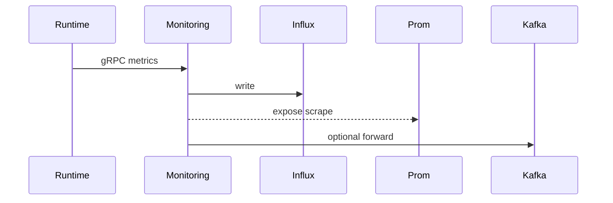
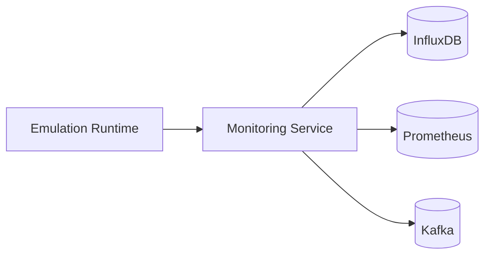

# Monitoring Service (Port 8011)

## Rol ve Amac
Metrik toplama ve zaman serisi depolama katmanini yoneten servistir.

## Sorumluluk Sinirlari (Ne Yapar / Ne Yapmaz)
- Yapar: gRPC metrik alma, InfluxDB yazma, Prometheus export.
- Yapmaz: karar uretimi (Decision Engine yapar).

## Calisma Modeli (Adim Adim)
1. Emulasyon runtime'dan gRPC ile metrik toplar.
2. InfluxDB'ye yazar ve Prometheus icin scrape endpoint saglar.
3. Topolojiye ozel InfluxDB varsa hedef yonlendirme yapar.
4. Kafka'dan gelen metrikleri de isleyebilir (opsiyonel).

## API ve Giris/Cikis
- Prometheus scrape endpointleri.
- gRPC: runtime metrik cagrilari.
- Endpoint Listesi (gorunen):
  - DELETE /api/metrics/{device}
  - GET /api/devices/{device}/metrics/latest
  - GET /api/monitoring/algorithms/topology/{topology_id}/runs
  - GET /api/monitoring/algorithms/topology/{topology_id}/runs/{run_id}/nodes
  - GET /api/monitoring/algorithms/topology/{topology_id}/runs/{run_id}/summary
  - GET /api/monitoring/devices/{device}
  - GET /api/monitoring/devices/{device}/arp
  - GET /api/monitoring/devices/{device}/interfaces
  - GET /api/monitoring/devices/{device}/routes
  - GET /api/monitoring/switches/{switch}/flows
  - GET /api/monitoring/topology/{topology_id}/metrics
  - GET /api/query
  - GET /api/topology/{topology_id}/metrics
  - GET /health
  - GET /metrics
  - POST /api/collect-all
  - POST /api/collect/{device}
  - POST /api/monitoring/algorithms/ingest
  - POST /api/monitoring/algorithms/ingest-summary
  - POST /api/monitoring/ingest/metrics
  - POST /api/monitoring/topologies/{topology_id}/influxdb/ensure
## Veri ve Durum Yonetimi
- InfluxDB: zaman serisi metrik depolama.

## Metrik Semasi (InfluxDB + Prometheus)
InfluxDB olcumleri:
- interface_metrics: rx_bytes, tx_bytes, rx_packets, tx_packets, rx_errors, tx_errors (tag: device, interface)
- system_metrics: cpu_percent, process_count, memory_total_mb, memory_used_mb, memory_free_mb (tag: device)
- protocol_metrics: neighbor_count (tag: device, protocol)

Prometheus gauge'lari:
- device_rx_bytes, device_tx_bytes, device_rx_packets, device_tx_packets (labels: device, interface)
- device_cpu_percent, device_memory_mb (label: device)
- protocol_neighbor_count (labels: device, protocol)
- flow_table_entries (label: switch)
- link_bandwidth_usage (labels: source, target)

## Tipik Is Senaryolari
- Monitoring UI'den canli metrik goruntuleme.
- Topoloji bazli InfluxDB bucket/instance yazimi.
- Shared vs isolated modda hedef secimi.

## Hata Senaryolari ve Kurtarma
- InfluxDB baglanti hatasi durumunda yazim aksar; fallback gerekebilir.
- gRPC metrik stream koparsa gecici veri kaybi olur.

## Gozlemlenebilirlik
- Saglik endpointi (/health) servis durumunu raporlar.
- Metrik yazim basari/hatali oranlari.
- InfluxDB write latency ve batch boyutlari.
- Prometheus scrape basarisizliklari.
## Guvenlik ve Politika
- Izole modda per-topoloji token ve bucket ayrimi.
- Metrik erisimi read-only proxy ile sinirlanabilir.

## Olceklenebilirlik Notlari
- Metrik oranina gore InfluxDB ve yazim kapasitesi etkilenir.

## Genisletme Noktalari
- Yeni metrik tipleri ve etiketleme stratejileri eklenebilir.

## Bagimliliklar
- InfluxDB
- Prometheus
- Kafka (opsiyonel)

## Entegrasyonlar
- Metrics Collector ve Decision Engine pipeline'lari ile birlikte calisir.
- UI Monitoring sayfasi ile dogrudan bagli.

## Veri Modeli Ozeti (DB Tablolari)
- InfluxDB (time-series):
  - interface_metrics: rx/tx bytes, packets, errors, drops.
  - system_metrics: cpu_percent, memory_mb, memory_percent, process_count.
  - protocol_metrics: neighbor_count vb.
- Prometheus (metrics registry):
  - device_rx_bytes, device_tx_bytes, device_cpu_percent, device_memory_mb vb.
- PostgreSQL/MongoDB/Redis: yok.

## UI Baglantisi ve Kullanici Akisi
- UI ekranlari:
  - /monitoring/:id: cihaz ve topoloji metrik panelleri.
  - /network-manager: overview ve monitoring panelleri.
- Feature -> servis haritasi:
  - Device metrics -> /api/monitoring/devices/{device}.
  - Interface/route/arp/flow -> /api/monitoring/devices/*, /api/monitoring/switches/*.
  - Topology metrics -> /api/monitoring/topology/{topologyId}.
- Tipik kullanici akisi:
  1. Monitoring sayfasinda cihaz secilir.
  2. Influx/Prometheus kaynakli metrikler goruntulenir.

## Diyagramlar

### Sequence

### Deployment

