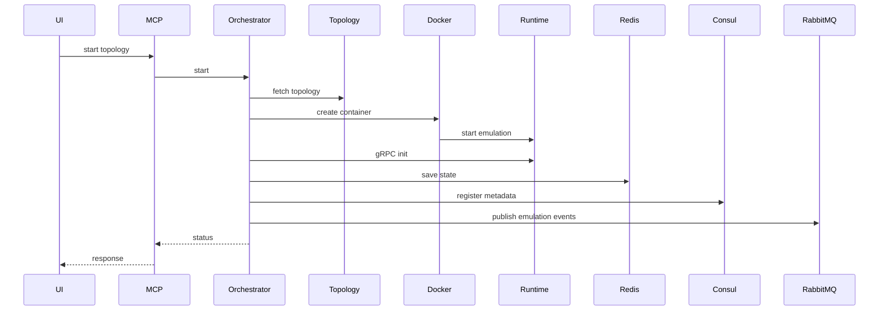
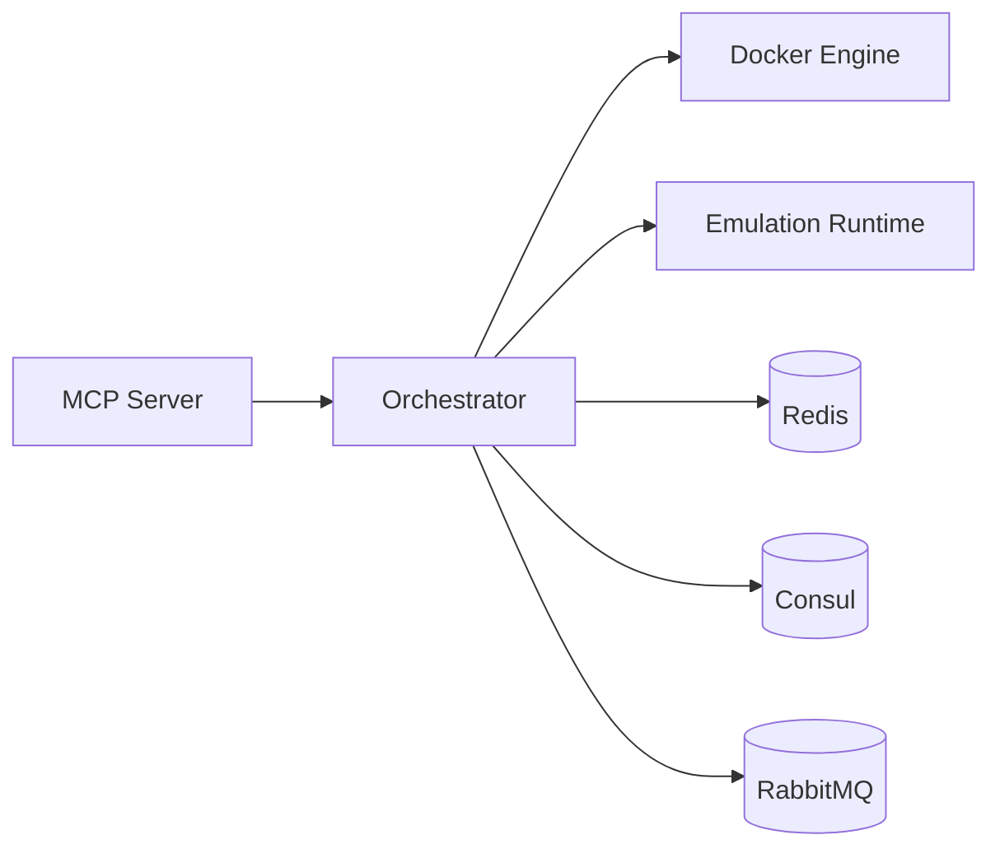

# Orchestrator Service (Port 8002)

## Rol ve Amac
Emulasyon yasam dongusunun cekirdek yoneticisidir. Topoloji verisini runtime emulasyona donusturur ve altyapiyi koordine eder.

## Sorumluluk Sinirlari (Ne Yapar / Ne Yapmaz)
- Yapar: emulasyon baslatma/durdurma, runtime port atama, izolasyon altyapisi kurma, test kosma.
- Yapmaz: topoloji CRUD, protokol/plugin gelistirme, LLM karar uretimi.

## Calisma Modeli (Adim Adim)
1. Topoloji bilgisi alinir ve her topoloji icin ayrik emulasyon container baslatilir.
2. gRPC portu dinamik atanir ve runtime baglantisi kurulur.
3. Aktif emulasyon state bilgileri Redis uzerinde tutulur.
4. Servis kesfi ve konfigurasyon icin Consul kullanilir.
5. Izole modda topolojiye ozel InfluxDB/Grafana/Consul/RabbitMQ/Kafka/Zookeeper/Portainer stacki olusturulur.
6. Test kosuculari ile ping/iperf/CPU/bellek testleri calistirilir.
7. PCAP yakalama akislari ve JupyterLab erisim bilgisi saglanir.

## API ve Giris/Cikis
- REST: /api/emulation/* (start/stop/status/active)
- REST: /api/tests/* (ping/iperf/cpu/mem)
- REST: /api/pcap/* (start/stop)
- REST: /api/infrastructure/* (isolated infra info)
- REST: /api/diagnostics/*, /api/algorithms/*
- gRPC: emulasyon runtime kontrolu
- Event: RabbitMQ emulation.*
- Endpoint Listesi (gorunen):
  - DELETE /api/emulation/devices/{device_name}
  - GET /api/algorithms/runs/{run_id}/events
  - GET /api/algorithms/runs/{run_id}/validate
  - GET /api/emulation/active
  - GET /api/emulation/containers
  - GET /api/emulation/devices
  - GET /api/emulation/shell/{emulation_id}
  - GET /api/infrastructure/jupyter
  - GET /api/infrastructure/status
  - GET /api/infrastructure/topologies
  - GET /api/infrastructure/topologies/{topology_id}/infra/credentials
  - GET /api/infrastructure/topologies/{topology_id}/infra/status
  - GET /api/infrastructure/topologies/{topology_id}/osm/status
  - GET /api/tests/{run_id}/results
  - GET /api/topologies/{topology_id}/infra/status
  - GET /health
  - POST /api/emulation/devices/add
  - POST /api/emulation/links/add
  - POST /api/emulation/sync/{topology_id}
  - POST /api/infrastructure/ensure
  - POST /api/infrastructure/topologies/{topology_id}/controllers/{controller_id}/exec
  - POST /api/infrastructure/topologies/{topology_id}/controllers/{controller_id}/restart
  - POST /api/infrastructure/topologies/{topology_id}/controllers/{controller_id}/start
  - POST /api/infrastructure/topologies/{topology_id}/controllers/{controller_id}/stop
  - POST /api/infrastructure/topologies/{topology_id}/infra/ensure
  - POST /api/infrastructure/topologies/{topology_id}/infra/purge
  - POST /api/infrastructure/topologies/{topology_id}/infra/restart
  - POST /api/infrastructure/topologies/{topology_id}/infra/stop
  - POST /api/infrastructure/topologies/{topology_id}/infra/sync-logins
  - POST /api/infrastructure/topologies/{topology_id}/observability/ensure
  - POST /api/infrastructure/topologies/{topology_id}/osm/ensure
  - POST /api/infrastructure/topologies/{topology_id}/osm/purge
  - POST /api/infrastructure/topologies/{topology_id}/osm/stop
  - POST /api/osm/shared/bootstrap/{topology_id}
  - POST /api/topologies/{topology_id}/infra/ensure
  - POST /api/topologies/{topology_id}/observability/ensure
## Veri ve Durum Yonetimi
- Redis: aktif emulasyonlarin runtime state ve cache bilgisi.
- Consul: topology infra metadata, secret ve servis kayitlari.

## Tipik Is Senaryolari
- Topoloji baslatma -> emulasyon container -> runtime gRPC handshake.
- Izole altyapi modunda per-topoloji servislerin kurulumu.
- Test kosma ve sonuclari metrik olarak yazma.

## Hata Senaryolari ve Kurtarma
- Docker container olusturma/port tahsisi hatalari durumunda cleanup gerekir.
- Izole infra kurulumu basarisizsa shared moda fallback gerekebilir.
- Runtime gRPC baglantisi kurulamiyorsa emulasyon basarisiz olur.

## Gozlemlenebilirlik
- Saglik endpointi (/health) servis durumunu raporlar.
- Emulasyon start/stop olaylari ve sureleri.
- Izole altyapi kurulum basarim/hatali oranlari.
- Test kosucu basarisiz senaryolari ve sonuc metrikleri.
- PCAP baslatma/durdurma loglari ve hata kodlari.
## Guvenlik ve Politika
- Topoloji bazli kilitler ile cakisma azaltma.
- Izole altyapida credential uretimi ve saklama.
- MCP gateway uzerinden tek giris noktasi.

## Olceklenebilirlik Notlari
- Topoloji sayisi arttikca container sayisi artar; host kaynaklari sinirlidir.
- Izole modda her topoloji icin ek servisler calistigi icin kaynak ihtiyaci artar.

## Genisletme Noktalari
- Yeni test kosuculari veya altyapi servisleri eklenebilir.
- K8s tabanli orchestration icin altyapi genisletilebilir.

## Bagimliliklar
- Docker
- Redis
- RabbitMQ
- Consul
- InfluxDB/Grafana/Kafka (opsiyonel)

## Entegrasyonlar
- Device/Controller/Protocol Manager runtime istekleri Orchestrator uzerinden uygulanir.
- Snapshot Service checkpoint/restore akisi icin Orchestrator ile calisir.
- Monitoring/Metrics Collector aktif emulasyon listesini Orchestrator'dan alir.

## Veri Modeli Ozeti (DB Tablolari)
- Redis:
  - active_emulations (hash): topology_id -> emulation_id, container_name, grpc_port, status, started_at benzeri runtime alanlari.
  - algorithm_runs (hash): run_id -> topology_id, status, params, started_at, transport bilgileri.
  - algorithm_latest_by_topology (hash): topology_id -> son run_id.
- PostgreSQL/MongoDB: yok (runtime state Redis + Docker uzerinden takip edilir).

## UI Baglantisi ve Kullanici Akisi
- UI ekranlari:
  - /topology/:id: emulation start/stop/pause/resume, sync, shell info.
  - /network-manager: emulation kontrolu, test kosulari, algoritma calistirma, network-config apply.
  - /infrastructure: altyapi durumu/ensure/purge (shared + topology izolasyonu).
  - /snapshots ve /schedules: container listesi ve emulation bilgisi (snapshot akisi icin).
  - /data-lab: Jupyter token/port bilgisi.
- Feature -> servis haritasi:
  - Emulation lifecycle -> /api/emulation/*.
  - Test kosulari -> /api/tests/*.
  - Algoritma run akisi -> /api/algorithms/*.
  - Infra yonetimi -> /api/infrastructure/*.
  - Diagnostics (Influx query) -> /api/diagnostics/*.
  - Network-config apply -> /api/emulation/network-config/apply.
- Tipik kullanici akisi:
  1. Topology Editor uzerinden start islemi -> Orchestrator emulation container olusturur.
  2. Network Manager uzerinden runtime degisiklik/test/algoritma calistirma.
  3. Infrastructure sayfasindan izole yigin veya shared servisler izlenir.

## Diyagramlar

### Sequence

### Deployment

