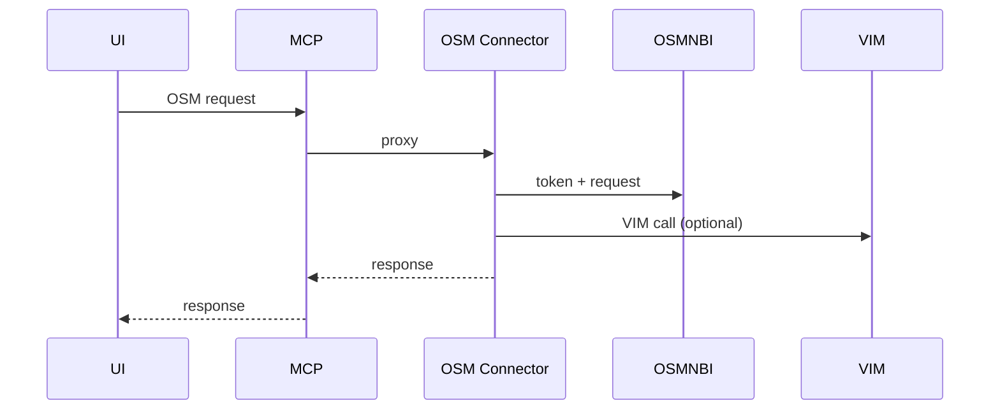
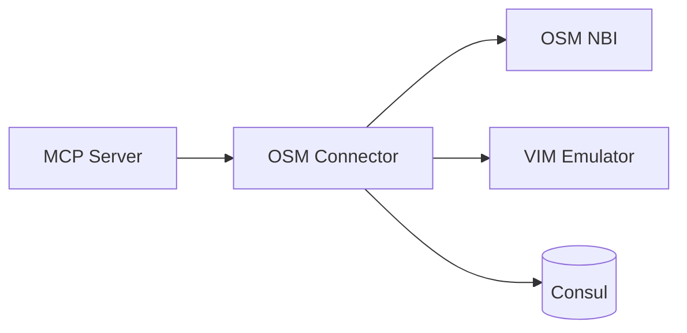

# OSM Connector Service (Port 8020)

## Rol ve Amac
ETSI OSM NBI icin adaptor/proxy gorevi gorur.

## Sorumluluk Sinirlari (Ne Yapar / Ne Yapmaz)
- Yapar: OSM token yonetimi ve NBI proxy.
- Yapmaz: yerel MANO akislari (MANO Service yapar).

## Calisma Modeli (Adim Adim)
1. OSM NBI icin token alir ve TTL bazli cache tutar.
2. OSM API isteklerini proxy ederek iletir.
3. Topolojiye bagli VIM emulator akislarini destekler.

## API ve Giris/Cikis
- REST: /api/osm/* (proxy)
- Endpoint Listesi (gorunen):
  - DELETE /api/osm/ns-instances/{ns_instance_id}
  - DELETE /api/osm/nsd-packages/{pkg_id}
  - DELETE /api/osm/vnfd-packages/{pkg_id}
  - GET /api/osm/info
  - GET /api/osm/ns-instances
  - GET /api/osm/ns-instances/{ns_instance_id}
  - GET /api/osm/ns-lcm-op-occs
  - GET /api/osm/ns-lcm-op-occs/{op_id}
  - GET /api/osm/nsd-packages
  - GET /api/osm/nsd-packages/{pkg_id}
  - GET /api/osm/projects
  - GET /api/osm/vim-accounts
  - GET /api/osm/vnfd-packages
  - GET /api/osm/vnfd-packages/{pkg_id}
  - GET /api/osm/wim-accounts
  - GET /health
  - POST /api/osm/ns-instances
  - POST /api/osm/ns-instances/{ns_instance_id}/instantiate
  - POST /api/osm/ns-instances/{ns_instance_id}/terminate
  - POST /api/osm/nsd-packages/upload
  - POST /api/osm/proxy-upload/{path:path}
  - POST /api/osm/vnfd-packages/upload
## Veri ve Durum Yonetimi
- Token cache bellek icinde tutulur.

## Tipik Is Senaryolari
- OSM UI veya MANO uzerinden NBI cagrilarinin proxy edilmesi.
- Token expiration durumunda otomatik yenileme.

## Hata Senaryolari ve Kurtarma
- Token yenileme hatasi durumunda OSM cagrilari basarisiz olur.

## Gozlemlenebilirlik
- Saglik endpointi (/health) servis durumunu raporlar.
- Token refresh sayisi ve basarisiz oranlar.
- Proxy istek sayisi ve NBI hata kodlari.
## Guvenlik ve Politika
- Topoloji bazli izolasyon ve token scope ile erisim kontrolu.

## Olceklenebilirlik Notlari
- Topoloji sayisi arttikca token cache ve proxy yuk artar.

## Genisletme Noktalari
- OSM NBI endpoint uyarlamalari genisletilebilir.

## Bagimliliklar
- Consul

## Entegrasyonlar
- VIM Emulator ile OSM VIM entegrasyonu.
- Nginx proxy uzerinden OSM UI erisimi.

## Veri Modeli Ozeti (DB Tablolari)
- PostgreSQL/MongoDB/Redis: yok.
- In-memory:
  - token cache (token + expires_at).

## UI Baglantisi ve Kullanici Akisi
- UI ekranlari:
  - /network-manager (MANO tab): OSM NBI istekleri.
  - OSM UI proxy: /infra-proxy/osm-ng-ui/{id8}/ veya /infra-proxy/osm-light-ui/{id8}/.
- Feature -> servis haritasi:
  - OSM NBI proxy -> /api/osm/{topologyId}/*.
  - OSM UI -> infra-proxy endpointleri (Nginx/Orchestrator).
- Tipik kullanici akisi:
  1. OSM projeleri/paketleri listelenir.
  2. NS instance yaratilir/sonlandirilir.

## Diyagramlar

### Sequence

### Deployment

