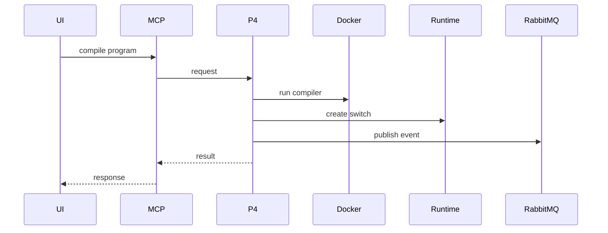
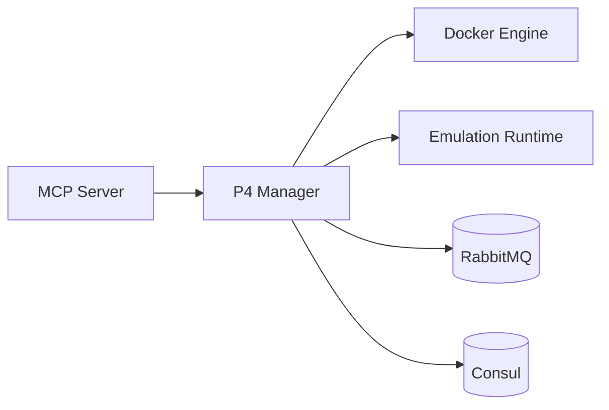

# P4 Manager Service (Port 8010)

## Rol ve Amac
P4 programlarini derler ve BMv2 switch lifecycle yonetimini saglar.

## Sorumluluk Sinirlari (Ne Yapar / Ne Yapmaz)
- Yapar: P4 compile, BMv2 switch yaratma ve program baglama.
- Yapmaz: topoloji CRUD, metrik analizi.

## Calisma Modeli (Adim Adim)
1. P4 kaynak kodu alinir ve compile edilir.
2. Compile artefact (p4info, json vb) runtime icin hazirlanir.
3. BMv2 switch olusturulur ve topolojiye baglanir.
4. Gerekirse runtime konfigurasyon guncellenir.

## API ve Giris/Cikis
- REST: /api/p4/programs/compile
- REST: /api/p4/switches
- Endpoint Listesi (gorunen):
  - GET /health
## Veri ve Durum Yonetimi
- Compile artefact metadata serviste tutulur.

## Tipik Is Senaryolari
- Yeni P4 programini derle ve switch'e bagla.
- Calisan topolojide P4 switch ekleme.

## Hata Senaryolari ve Kurtarma
- Compile hatalari kullaniciya geri dondurulur.
- BMv2 switch olusmazsa runtime rollback gerekebilir.

## Gozlemlenebilirlik
- Saglik endpointi (/health) servis durumunu raporlar.
- Compile basari/hatali sayilari ve sureleri.
- BMv2 switch create/update olaylari.
- P4 artefact boyut ve versiyon bilgisi.
## Guvenlik ve Politika
- P4 kodu kullanici tarafindan geldigi icin giris dogrulama onemlidir.

## Olceklenebilirlik Notlari
- Birden fazla P4 switch desteklenir; kaynak kullanimi artar.

## Genisletme Noktalari
- P4Runtime yetenekleri ve hedef switch profilleri genisletilebilir.

## Bagimliliklar
- Docker
- RabbitMQ
- Consul

## Entegrasyonlar
- Emulasyon runtime (BMv2) ile dogrudan entegrasyon.
- UI tarafinda P4 program yonetimi ve switch baglama.

## Veri Modeli Ozeti (DB Tablolari)
- Dosya/volume tabanli depolama:
  - /var/lib/caduceus/p4 altinda p4 kaynak, json, p4info ve artefact dosyalari.
  - caduceus-p4-programs volume ile kalicilik.
- In-memory:
  - p4_programs registry (program_id -> status, paths, compile metadata).
- PostgreSQL/MongoDB/Redis: yok.

## UI Baglantisi ve Kullanici Akisi
- UI ekranlari:
  - /topology/:id: P4 Editor (compile/upload, taslak -> program).
  - DevicePropertiesPanel: switch uzerine p4 program secimi.
- Feature -> servis haritasi:
  - P4 compile -> /api/p4/programs/compile.
  - P4 upload -> /api/p4/programs/upload.
  - Program list/get -> /api/p4/programs, /api/p4/programs/{id}.
- Tipik kullanici akisi:
  1. P4 taslagi olustur (Topology Service) ve compile et.
  2. Programi BMv2 switch'e ata.

## Diyagramlar

### Sequence

### Deployment

