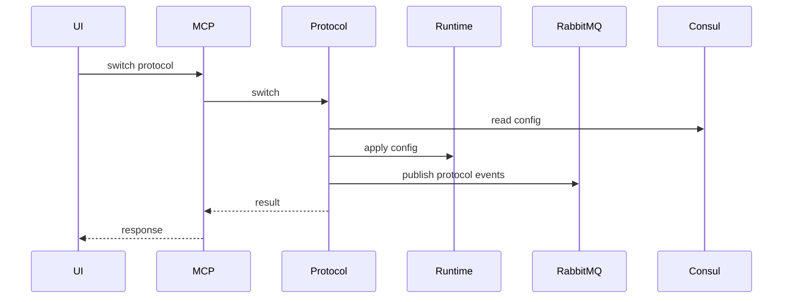
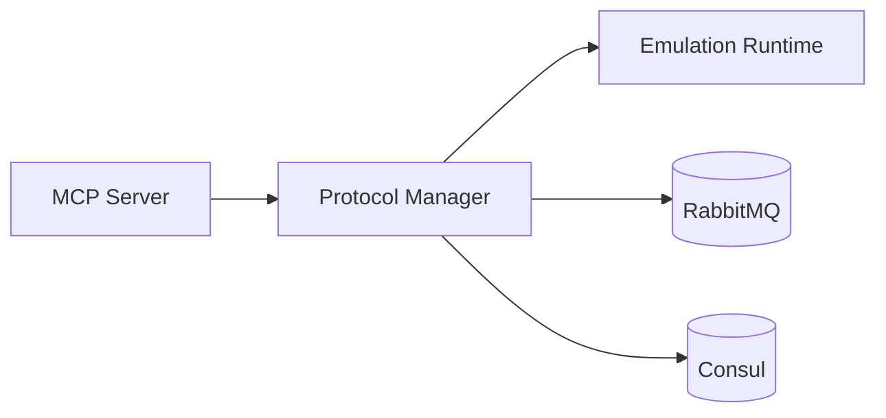

# Protocol Manager (Port 8003)

## Rol ve Amac
Protokol plugin sistemi ve runtime hot-swap mekanizmasini yoneten servistir.

## Sorumluluk Sinirlari (Ne Yapar / Ne Yapmaz)
- Yapar: protokol degisimi, konfig dogrulama, status sorgulama.
- Yapmaz: cihaz yaratma/silme, controller lifecycle, metrik toplama.

## Calisma Modeli (Adim Adim)
1. Protokoller plugin registry ile tanimlanir ve secilebilir hale getirilir.
2. Switch/router hedefinde config apply edilir veya protokol hot-swap yapilir.
3. Durum bilgisi runtime'dan cekilir ve geri raporlanir.
4. Uygun degilse rollback/disable akislari tetiklenir.

## API ve Giris/Cikis
- REST: /api/protocols/switch
- REST: /api/protocols/validate
- REST: /api/protocols/status (varsa)
- Event: RabbitMQ protocol.*
- Endpoint Listesi (gorunen):
  - GET /api/devices/{device_type}/protocols
  - GET /api/protocols/status/{device}/{protocol}
  - GET /api/protocols/{protocol_name}/default-config
  - GET /health
  - POST /api/protocols/configure
  - POST /api/protocols/disable
  - POST /api/protocols/enable
  - POST /api/protocols/switch
  - POST /api/protocols/validate
## Veri ve Durum Yonetimi
- Plugin registry ve gecici config state bellek uzerinde tutulur.

## Tipik Is Senaryolari
- OSPF -> BGP hot-swap; state preserve akisi.
- RIP/ISIS gibi routing protokollerine gecis ve geri donus.

## Hata Senaryolari ve Kurtarma
- Hedef protokol baslatilamazsa rollback gerekir.
- Gecersiz konfig 4xx ile reddedilir.

## Gozlemlenebilirlik
- Saglik endpointi (/health) servis durumunu raporlar.
- Protokol degisim sureleri ve basarisiz denemeler.
- Validation hatalari ve neden kodlari.
- protocol.* event sayisi.
## Guvenlik ve Politika
- Allowed protokol seti ve topoloji kapsamli istekler MCP uzerinden sinirlanir.
- Konfig girisleri sema dogrulamasindan gecmelidir.

## Olceklenebilirlik Notlari
- Stateless yapisi nedeniyle yatay olceklenebilir.

## Genisletme Noktalari
- Yeni protokol pluginleri ile genisletilebilir (plugins dizini).

## Desteklenen Protokol Pluginleri (Koddan Gorulen)
- bgp
- ospf
- isis
- rip
- static

## Bagimliliklar
- RabbitMQ
- Consul

## Entegrasyonlar
- Orchestrator/runtime ile config apply ve status sorgu akisi.
- Device Manager ile runtime degisim senaryolari.

## Veri Modeli Ozeti (DB Tablolari)
- PostgreSQL/MongoDB/Redis: yok (plugin registry ve gecici state bellek uzerinde).

## UI Baglantisi ve Kullanici Akisi
- UI ekranlari: dogrudan bagli bir ekran gorunmuyor (frontend'de protocolsAPI cagrisi yok).
- Feature -> servis haritasi:
  - Protokol configure/enable/disable/hot-swap -> /api/protocols/* (API clients, MCP, AI Gateway).
- Tipik kullanici akisi:
  1. API/MCP uzerinden protokol secimi ve konfig gonderilir.
  2. Servis runtime'a uygular ve status dondurur.

## Diyagramlar

### Sequence

### Deployment

