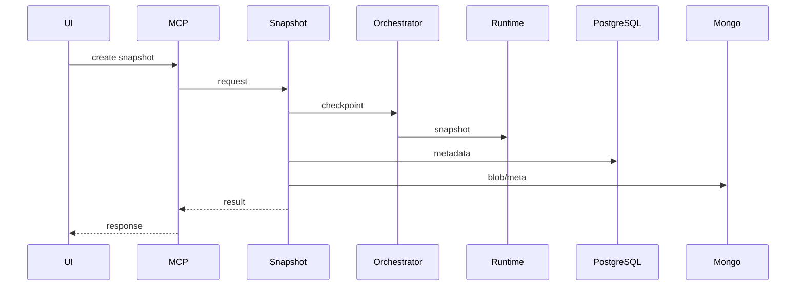
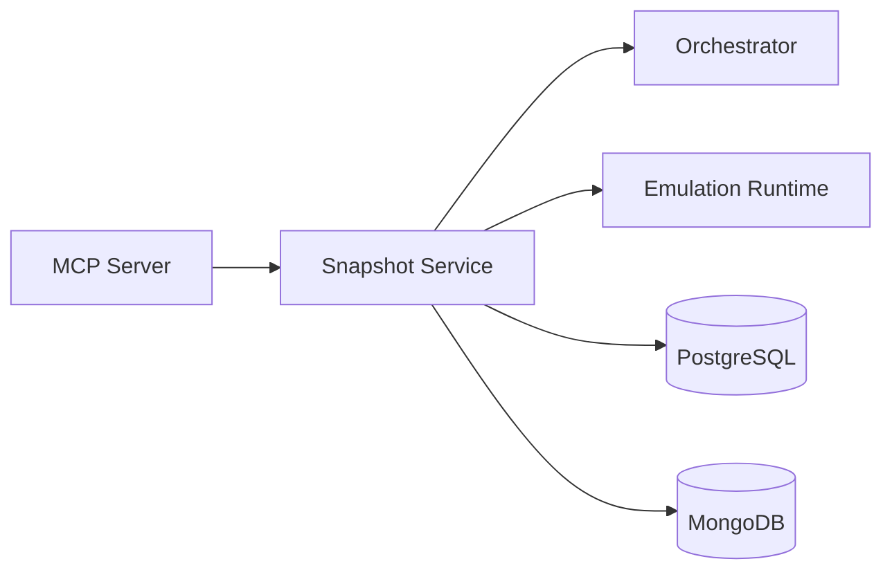

# Snapshot Service (Port 8006)

## Rol ve Amac
Snapshot/restore operasyonlarini ve zamanlama planlarini yoneten servistir.

## Sorumluluk Sinirlari (Ne Yapar / Ne Yapmaz)
- Yapar: snapshot olusturma, listeleme, geri donus, zamanlama.
- Yapmaz: runtime kontrolunu dogrudan calistirma (Orchestrator araciligiyla).

## Calisma Modeli (Adim Adim)
1. Snapshot isteklerini alir ve Orchestrator ile runtime checkpoint/restore akisini koordine eder.
2. APScheduler ile periyodik planlari yukler ve calistirir.
3. Topoloji-only, Docker commit, CRIU ve hybrid snapshot turleri desteklenir.
4. Snapshot metadata DB katmaninda saklanir.

## API ve Giris/Cikis
- REST: /api/snapshots/*
- REST: /api/schedules/*
- Endpoint Listesi (gorunen):
  - GET /api/snapshots/schedules/presets
  - GET /api/snapshots/{snapshot_id}/download
  - GET /api/snapshots/{snapshot_id}/progress
  - GET /health
## Veri ve Durum Yonetimi
- PostgreSQL: snapshot metadata ve schedule kayitlari.
- MongoDB: buyuk snapshot metadata/binary kayitlari.

## Tipik Is Senaryolari
- Manuel snapshot al -> listele -> restore et.
- Schedule olustur -> periyodik snapshot cikisi.
- Snapshot ile deney tekrarlanabilirligi saglama.

## Hata Senaryolari ve Kurtarma
- CRIU/commit hatalarinda snapshot basarisiz olur.
- Restore sirasinda runtime uyumsuzlugu hata uretebilir.
- Schedule calisma hatalari loglanir ve retry gerekebilir.

## Gozlemlenebilirlik
- Saglik endpointi (/health) servis durumunu raporlar.
- Snapshot olusturma sureleri ve basarisiz snapshot sayilari.
- Schedule trigger sayisi ve basarisiz calisma oranlari.
- Restore basarim/hatali oranlari.
## Guvenlik ve Politika
- Topoloji kapsamli snapshot islemleri MCP uzerinden kontrol edilir.
- Snapshot metadata erisimi yetkilerle sinirlanir.

## Olceklenebilirlik Notlari
- Snapshot metadata DB uzerinde birikir; saklama politikasi gerekir.

## Genisletme Noktalari
- Yeni snapshot tipleri eklenebilir (incremental, diff tabanli).

## Bagimliliklar
- PostgreSQL
- MongoDB
- RabbitMQ
- Consul
- Docker

## Entegrasyonlar
- Orchestrator ile checkpoint/restore koordinasyonu.
- UI snapshot ve schedule panelleri.

## Veri Modeli Ozeti (DB Tablolari)
- PostgreSQL:
  - snapshots: snapshot metadata; alanlar: id, topology_id, emulation_id, name, snapshot_type, status, mongo_state_id, checkpoint_path, size_bytes, created_at, captured_at, restored_at, error_message, extra_metadata.
  - snapshot_restore_history: restore loglari; alanlar: id, snapshot_id, restored_at, status, duration_seconds, devices_restored, containers_restored, error_message, warnings.
  - snapshot_schedules: planli snapshot; alanlar: id, name, topology_id, cron_expression, snapshot_type, retention_count, is_active, last_run_at, next_run_at.
- MongoDB:
  - snapshot_states: topology/network/docker/criu state dokumani; alanlar: snapshot_id, topology_id, topology, network_state, docker_snapshots, criu_checkpoints, runtime_config, compressed, version.
  - snapshot_blobs: buyuk binary payloadlar (docker/criu artefacts) ve snapshot_id baglantisi.
- Redis: yok.

## UI Baglantisi ve Kullanici Akisi
- UI ekranlari:
  - /snapshots ve /snapshots/:topologyId: snapshot list/olustur/restore.
  - /schedules ve /schedules/:topologyId: schedule yonetimi.
- Feature -> servis haritasi:
  - Snapshot create/restore/delete -> /api/snapshots, /api/snapshots/{id}/restore.
  - Schedule CRUD/trigger -> /api/snapshots/schedules/*.
  - Container secimi -> Orchestrator /api/emulation/containers (UI tarafindan kullanilir).
- Tipik kullanici akisi:
  1. Snapshot olustur (tip secimi: topology_only/docker_commit/criu_live/hybrid_full).
  2. Listele ve gerekiyorsa restore et.
  3. Schedule ile periyodik capture otomasyonu kur.

## Diyagramlar

### Sequence

### Deployment

