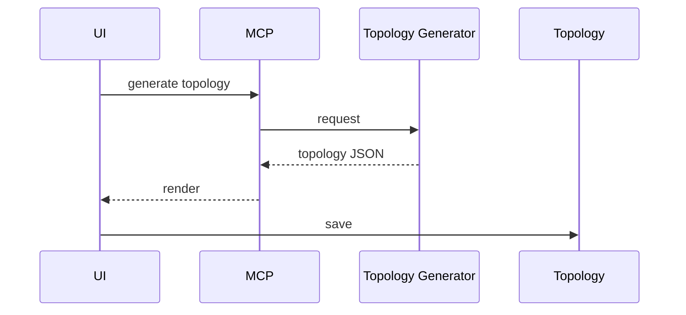
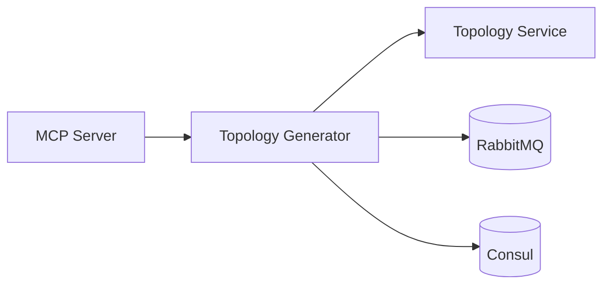

# Topology Generator Service (Port 8009)

## Rol ve Amac
Parametrik topoloji uretimi yapan servis katmanidir.

## Sorumluluk Sinirlari (Ne Yapar / Ne Yapmaz)
- Yapar: otomatik topoloji uretimi ve template listesi.
- Yapmaz: emulasyon calistirma.

## Calisma Modeli (Adim Adim)
1. Algoritma template listesini saglar (tree/mesh/ring/fat-tree).
2. Parametrelerle node/link seti uretir ve editor icin hazirlar.
3. Uretilen topoloji JSON cikti olarak UI'ye gonderilir.

## API ve Giris/Cikis
- REST: /api/generate
- REST: /api/templates
- Endpoint Listesi (gorunen):
  - GET /api/templates
  - GET /health
## Veri ve Durum Yonetimi
- Uretilen topoloji JSON olarak UI'ye dondurulur.
- Gecici uretim state bellek uzerinde tutulur.

## Tipik Is Senaryolari
- Tree/mesh/ring/fat-tree topolojisi uretme.
- Uretilen topolojiyi editor'de duzenleme ve kaydetme.

## Hata Senaryolari ve Kurtarma
- Parametreler uyumsuzsa hata dondurur.
- Cok buyuk topoloji icin performans sorunlari olabilir.

## Gozlemlenebilirlik
- Saglik endpointi (/health) servis durumunu raporlar.
- Generate istek sayisi ve hata oranlari.
- Uretilen node/link sayisi gibi ozet metrikler.
- Algoritma bazli uretim sureleri.
## Guvenlik ve Politika
- Topoloji uretimi MCP uzerinden kontrollu erisir.

## Olceklenebilirlik Notlari
- Buyuk topolojilerde uretim maliyeti artar.

## Genisletme Noktalari
- Yeni generator algoritmalari eklenebilir.

## Bagimliliklar
- RabbitMQ
- Consul

## Entegrasyonlar
- UI editor icin hizli topoloji uretimi saglar.

## Veri Modeli Ozeti (DB Tablolari)
- PostgreSQL/MongoDB/Redis: yok (tamamen hesaplama + cikti uretir).

## UI Baglantisi ve Kullanici Akisi
- UI ekranlari: dogrudan bagli bir ekran gorunmuyor (frontend'de generatorAPI cagrisi yok).
- Feature -> servis haritasi:
  - Topoloji uretimi -> /api/generate (algoritma + parametreler).
- Tipik kullanici akisi:
  1. API/MCP uzerinden algoritma secilir (tree/mesh/ring/star/fat-tree).
  2. Ciktilar Topology Service'e uygulanir.

## Diyagramlar

### Sequence

### Deployment

