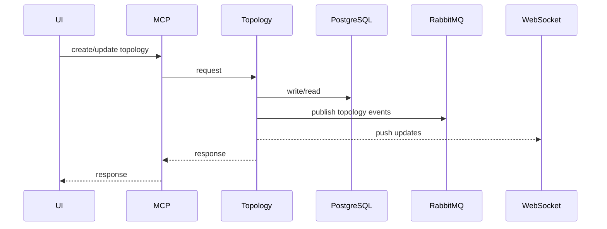
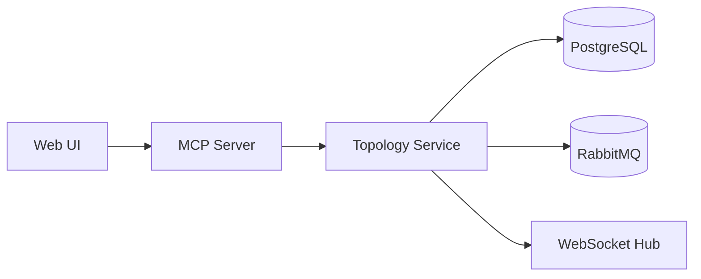

# Topology Service (Port 8001)

## Rol ve Amac
Platformin merkezi topoloji ve proje kayit servisidir. Editor ve diger servisler icin tekil dogru kaynak saglar.

## Sorumluluk Sinirlari (Ne Yapar / Ne Yapmaz)
- Yapar: proje/topoloji CRUD, staged degisiklik ve apply, versiyonlama, olay yayini.
- Yapmaz: emulasyon baslatma, metrik toplama, test kosma.

## Calisma Modeli (Adim Adim)
1. REST uzerinden proje/topoloji isteklerini alir ve giris dogrulamasi yapar.
2. Topoloji semasini kontrol eder; node/link tutarliligini dogrular.
3. PostgreSQL uzerinde projeler, topolojiler ve bilesen kayitlarini gunceller.
4. Staged degisiklikleri apply ederek atomik guncelleme uygular.
5. Degisikliklerde topology.* olaylarini RabbitMQ uzerinden yayinlar.
6. UI icin WebSocket/canli guncelleme kanali uzerinden degisimleri iletir.

## API ve Giris/Cikis
- REST: /api/projects (create/list/update/delete)
- REST: /api/topologies (create/list/update/delete)
- REST: /api/topologies/{id}/apply (staged diff apply)
- WebSocket: canli topoloji guncellemeleri
- Event: RabbitMQ topology.*
- Endpoint Listesi (gorunen):
  - GET /health
  - POST /api/topologies/import-and-start
  - WS /ws/topology/{topology_id}
## Veri ve Durum Yonetimi
- PostgreSQL: projects, topologies, nodes, links, metadata/versiyon kayitlari.
- Bellek: aktif WebSocket baglantilari ve gecici staged degisiklik state.

## Tipik Is Senaryolari
- Proje olusturma -> topoloji tanimlama -> node/link ekleme -> apply.
- Mevcut topolojide staged degisiklikleri tek seferde uygulama.
- Editor uzerinden canli guncellemeler ve isbirlikci akislar.

## Hata Senaryolari ve Kurtarma
- Eksik/yanlis sema veya tutarsiz node/link verisi 4xx ile reddedilir.
- Es zamanli guncelleme cakismasi apply sirasinda hata dondurebilir.
- DB baglantisi kesilirse CRUD islemleri basarisiz olur.

## Gozlemlenebilirlik
- Saglik endpointi (/health) servis durumunu raporlar.
- HTTP istek sayisi ve hata kodlari (CRUD basarim/hatali akislari).
- Apply islem sureleri ve basarisiz apply nedenleri.
- RabbitMQ topology.* event publish sayisi.
- WebSocket baglanti sayisi ve kopma olaylari.
## Guvenlik ve Politika
- MCP Server uzerinden tekil giris noktasi ile erisim sinirlanir.
- Topoloji kapsamli islemler projeye bagli kimliklerle iliskilidir.
- Girdi sema dogrulama ve alan kisitlari ile risk azaltma.

## Olceklenebilirlik Notlari
- Stateless yapisi nedeniyle yatay olceklenebilir; DB ortak paylasilir.
- WebSocket baglanti sayisi arttikca servis kapasitesi ve sticky session ihtiyaci dogabilir.

## Genisletme Noktalari
- Yeni cihaz tipleri ve topoloji semasi genisletilebilir.
- Yeni export/import formatlari icin veri alanlari eklenebilir.

## Bagimliliklar
- PostgreSQL
- RabbitMQ
- Consul

## Entegrasyonlar
- Orchestrator topoloji verisini buradan cekerek runtime olusturur.
- Export/Import servisi bu veri modelini donusum icin kullanir.
- UI editor tum CRUD islemlerini bu servis uzerinden yapar.

## Veri Modeli Ozeti (DB Tablolari)
- PostgreSQL:
  - projects: proje kaydi; alanlar: id, name, description, owner, created_at, updated_at.
  - topologies: proje baglantisi ve versiyon; alanlar: id, project_id, name, version, is_active, emulation_status, metadata, created_at, updated_at.
  - nodes: topoloji node'lari; alanlar: id, topology_id, name, device_type, x, y, properties, created_at, updated_at.
  - links: link parametreleri; alanlar: id, topology_id, source_node_id, target_node_id, source_port, target_port, bandwidth, delay, loss, max_queue_size, status, properties.
  - controllers: controller tanimlari; alanlar: id, topology_id, name, controller_type, ip, port, is_active, properties.
  - network_configurations: runtime config versiyonlari; alanlar: id, topology_id, name, version, config(JSON), description, created_at, updated_at.
- MongoDB/Redis: yok (bu servis kalici state icin Postgres kullanir).

## UI Baglantisi ve Kullanici Akisi
- UI ekranlari:
  - /projects: proje listesi + proje/topoloji olusturma ve import.
  - /topology/:id: topoloji editoru (node/link CRUD, drag-drop).
  - /network-manager: topoloji ozeti ve konfig goruntuleme.
- Feature -> servis haritasi:
  - Proje CRUD -> /api/projects (Topology Service).
  - Topoloji CRUD + versiyonlama -> /api/topologies.
  - Node/link CRUD -> /api/topologies/{id}/nodes, /api/topologies/{id}/links.
  - Network config template/versiyon -> /api/network-configs/{topology_id}*.
  - P4 taslaklari -> /api/topologies/{id}/p4/programs (P4 Editor paneli).
  - Import/Export tetigi -> /api/topologies/import*, /api/export (Export/Import servisi ile birlikte).
- Tipik kullanici akisi:
  1. /projects uzerinden proje olustur.
  2. /topology/:id editorunde node/link ekle ve kaydet.
  3. Network config versiyonunu olustur; gerekirse export et.

## Diyagramlar

### Sequence

### Deployment

