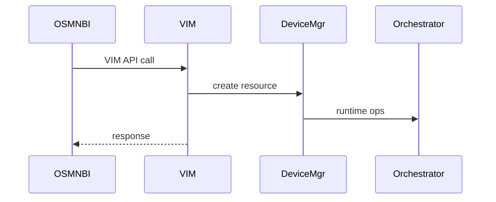
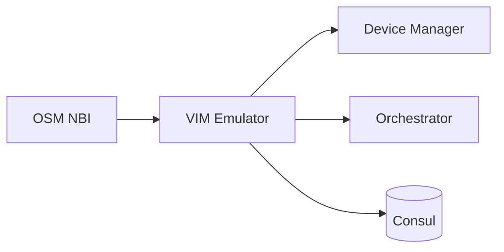

# VIM Emulator Service (Port 6001)

## Rol ve Amac
OpenStack benzeri VIM API sunar ve OSM tarafindan VIM olarak gorulur.

## Sorumluluk Sinirlari (Ne Yapar / Ne Yapmaz)
- Yapar: VIM API endpointleri sunma ve topolojiye map etme.
- Yapmaz: gercek bulut altyapi yonetimi (emulasyon icindir).

## Calisma Modeli (Adim Adim)
1. Keystone/Nova/Neutron benzeri endpointleri saglar.
2. TOPOLOGY_ID kapsaminda calisir ve istekleri topolojiye map eder.
3. VNF/NS kaynaklarini emulasyon runtime'da olusturur.

## API ve Giris/Cikis
- REST: /v2.0/tokens, /v2/servers, /v2.0/networks vb.
- Endpoint Listesi (gorunen):
  - GET /
  - GET /glance/
  - GET /glance/v2
  - GET /glance/v2/images
  - GET /glance/v2/images/{image_id}
  - GET /glance/v2/schemas/image
  - GET /health
  - GET /neutron/
  - GET /neutron/v2.0
  - GET /neutron/v2.0/networks
  - GET /neutron/v2.0/networks/{network_id}
  - GET /neutron/v2.0/ports
  - GET /neutron/v2.0/ports/{port_id}
  - GET /neutron/v2.0/subnets
  - GET /nova/
  - GET /nova/v2.1/{tenant_id}
  - GET /nova/v2.1/{tenant_id}/flavors
  - GET /nova/v2.1/{tenant_id}/flavors/detail
  - GET /nova/v2.1/{tenant_id}/flavors/{flavor_id}
  - GET /nova/v2.1/{tenant_id}/flavors/{flavor_id}/os-extra_specs
  - GET /nova/v2.1/{tenant_id}/os-availability-zone
  - GET /nova/v2.1/{tenant_id}/os-availability-zone/detail
  - GET /nova/v2.1/{tenant_id}/servers
  - GET /nova/v2.1/{tenant_id}/servers/detail
  - GET /nova/v2.1/{tenant_id}/servers/{server_id}
  - GET /v2.0
  - GET /v3
  - GET /v3/projects
  - POST /v2.0/tokens
  - POST /v3/auth/tokens
## Veri ve Durum Yonetimi
- Topoloji kapsamli VIM state metadata tutulur.

## Tipik Is Senaryolari
- OSM NBI uzerinden VNF placement ve network olusturma.

## Hata Senaryolari ve Kurtarma
- Topoloji kapsam disi istekler reddedilir.
- Emulasyon kaynaklari yetersizse VIM hata dondurur.

## Gozlemlenebilirlik
- Saglik endpointi (/health) servis durumunu raporlar.
- VIM API cagri sayisi ve hata kodlari.
- VNF olusum sureleri ve basarisiz oranlar.
## Guvenlik ve Politika
- Topoloji bazli scope siniri (TOPOLOGY_ID).

## Olceklenebilirlik Notlari
- Topoloji basina bir VIM emulator ornegi ile izolasyon saglanir.

## Genisletme Noktalari
- OpenStack API kapsam alanlari genisletilebilir.

## Bagimliliklar
- Consul
- Orchestrator

## Entegrasyonlar
- OSM Connector ile ETSI OSM akisini tamamlar.

## Veri Modeli Ozeti (DB Tablolari)
- PostgreSQL/MongoDB/Redis: yok.
- In-memory:
  - MemoryStore: tokens, images, flavors, networks, subnets, ports, servers.

## UI Baglantisi ve Kullanici Akisi
- UI ekranlari: dogrudan bagli bir ekran yok (OSM tarafindan kullanilir).
- Feature -> servis haritasi:
  - Keystone/Nova/Neutron benzeri endpointler -> /v2.0, /v2, /v3 altinda.
- Tipik kullanici akisi:
  1. OSM VIM account baglantisi yapilir.
  2. OSM, VIM Emulator uzerinden server/network create eder.

## Diyagramlar

### Sequence

### Deployment

