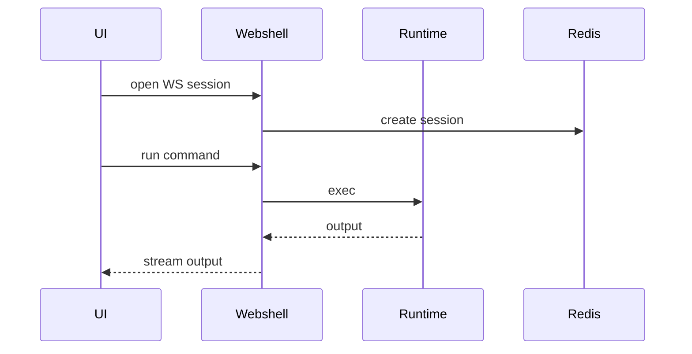
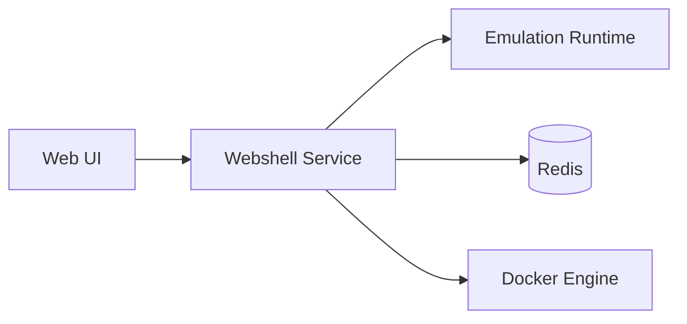

# Webshell Service (Port 8007)

## Rol ve Amac
Web uzerinden Mininet CLI ve cihaz namespace komut calistirma deneyimini saglar.

## Sorumluluk Sinirlari (Ne Yapar / Ne Yapmaz)
- Yapar: interaktif CLI oturumu, tekil komut calistirma.
- Yapmaz: topoloji CRUD, emulasyon lifecycle.

## Calisma Modeli (Adim Adim)
1. WebSocket uzerinden Mininet CLI oturumu acar.
2. REST endpointi ile tekil cihaz namespace icinde komut calistirir.
3. Oturum bilgilerini Redis uzerinde tutar ve timeout uygular.

## API ve Giris/Cikis
- WebSocket: /ws/mininet-cli
- REST: /api/devices/{device}/execute
- Endpoint Listesi (gorunen):
  - DELETE /api/sessions/{session_id}
  - GET /api/devices/{device}/execute
  - GET /api/sessions
  - GET /health
  - POST /api/broadcast/{device}
  - WS /ws/mininet-cli
  - WS /ws/shell/{device}
## Veri ve Durum Yonetimi
- Redis: terminal oturum state ve session metadata.

## Tipik Is Senaryolari
- UI uzerinden CLI acip ping/iperf calistirma.
- Tekil cihazda komut calistirip cikti alma.

## Hata Senaryolari ve Kurtarma
- Runtime baglantisi koparsa oturum kapanir; tekrar baglanti gerekir.
- Komut hata kodu ve stdout/stderr geri dondurulur.

## Gozlemlenebilirlik
- Saglik endpointi (/health) servis durumunu raporlar.
- WS oturum sayisi, aktif oturum suresi.
- Komut calistirma hata oranlari.
- Session timeout ve disconnect olaylari.
## Guvenlik ve Politika
- Topoloji kapsamli komut calistirma sinirlari.
- Read-only/allowlist gibi ek kontroller eklenebilir.

## Olceklenebilirlik Notlari
- Oturum sayisi arttikca Redis kaynak ihtiyaci artar.

## Genisletme Noktalari
- Ek komut filtreleri ve politika kontrolleri eklenebilir.

## Bagimliliklar
- Redis
- Docker

## Entegrasyonlar
- Orchestrator runtime bilgisi saglar.
- UI Network Manager icinde terminal deneyimi sunar.

## Veri Modeli Ozeti (DB Tablolari)
- PostgreSQL/MongoDB/Redis: yok.
- Dosya tabanli durum:
  - /var/lib/caduceus/emulation_state.json: aktif emulation, cihaz listesi, runtime bilgilerinin snapshot'i.
- In-memory:
  - active_terminals: websocket oturumlari, cihaz + container baglamlari, son aktivite.

## UI Baglantisi ve Kullanici Akisi
- UI ekranlari:
  - /topology/:id: WebShell modal (cihaz secip komut calistirma).
  - /network-manager: WebShell + Mininet CLI paneli.
  - Controllers tab: controller container shell.
- Feature -> servis haritasi:
  - WebSocket Mininet CLI -> /ws/mininet-cli.
  - Cihaz komut calistirma -> /api/devices/{device}/execute.
  - Session list/kill -> /api/sessions, /api/sessions/{session_id}.
- Tipik kullanici akisi:
  1. UI'da cihaz secilir ve WebShell acilir.
  2. Komutlar runtime namespace icinde calisir.
  3. Oturum listesi ve temizleme islemleri yapilir.

## Diyagramlar

### Sequence

### Deployment

