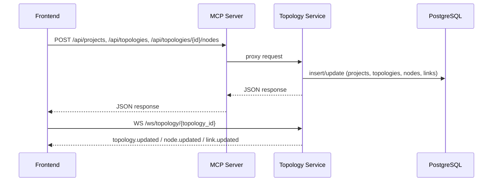
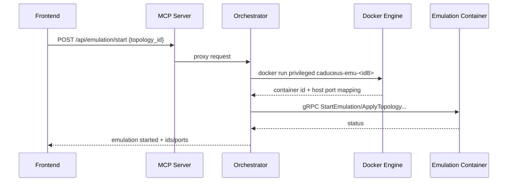

# Caduceus‑Flux System Architecture

Caduceus‑Flux is a **microservices-based network emulation platform** that combines:

- a **privileged emulation engine** (Mininet/Mininet‑WiFi/Containernet + FRR/OVS/BMv2) exposed through **gRPC**, and
- a **containerized control plane** (FastAPI services) exposed through a **unified API gateway** (Nginx → MCP Server).

This document is written for:
- **GitHub** (high-level architecture, how components fit together)
- **academic writing** (design goals, system decomposition, data/control flows)

## 1) Design Goals

1. **Interactive topology engineering**: CRUD + versioning, import/export, and UI-friendly representations.
2. **Runtime mutability**: add/remove devices/links and apply network configuration without re-deploying the whole stack.
3. **Protocol diversity + extensibility**: routing protocols, OpenFlow versions, wireless modes, and P4 pipelines.
4. **Separation of concerns**: microservices with clear boundaries; central orchestration for side-effectful operations.
5. **Observability + analytics**: real-time metrics, dashboards, long-term storage, and streaming analytics.
6. **NFV/MANO integration**: support both “local MANO” flows and integration with ETSI OSM (isolated stack).
7. **AI/ML assist**: model registry + assignments, LLM-based control-plane assistance, and automated decision tasks.

## 2) Top-Level Architecture (Component View)

### 2.1 Control plane vs. emulation plane

- **Control plane (Docker Compose)**: API services, message bus, databases, observability, and optional analytics/MANO stacks.
- **Emulation plane (per topology)**: a privileged container running the network namespace / virtual switch / routing daemon logic.

### 2.2 High-level data/control paths

```mermaid
flowchart LR
  User((User)) --> UI[Frontend (React)]
  UI -->|HTTP / WS| Nginx[Nginx Gateway]
  Nginx -->|/api/*| MCP[MCP Server (API aggregator)]

  MCP --> Topology[Topology Service]
  MCP --> Orchestrator[Orchestrator Service]
  MCP --> DeviceMgr[Device Manager]
  MCP --> ProtoMgr[Protocol Manager]
  MCP --> CtlMgr[Controller Manager]
  MCP --> Snapshot[Snapshot Service]
  MCP --> WebShell[WebShell Service]
  MCP --> Export[Export/Import Service]
  MCP --> TopoGen[Topology Generator]
  MCP --> P4Mgr[P4 Manager]
  MCP --> Monitoring[Monitoring Service]
  MCP --> MetricsCollector[Metrics Collector]
  MCP --> AIGW[AI Gateway]
  MCP --> MANO[MANO Service]
  MCP --> Config[Config Service]
  MCP --> OSMConn[OSM Connector]

  Topology <-->|SQL| Postgres[(PostgreSQL)]
  Snapshot <-->|SQL| Postgres
  Snapshot <-->|docs| Mongo[(MongoDB)]
  Orchestrator <-->|state| Redis[(Redis)]
  Monitoring <-->|timeseries| Influx[(InfluxDB)]

  Topology -->|events| Rabbit[(RabbitMQ)]
  Orchestrator -->|events| Rabbit
  Monitoring -->|events| Rabbit

  Orchestrator -->|Docker API| DockerSock[/var/run/docker.sock/]
  Orchestrator -->|spawn per-topology| Emu[Emulation Container\ncaduceus-emu-<id8>]
  Orchestrator -->|gRPC| Emu
  MetricsCollector -->|gRPC StreamMetrics| Emu

  MetricsCollector -->|metrics.raw| Kafka[(Kafka)]
  Decision[Decision Engine] -->|consume metrics.processed| Kafka
  Decision -->|alerts/actions| Kafka
```

Notes:
- The **MCP Server** provides a single `/api/*` surface and routes requests to internal services.
- The **Orchestrator** is the only component that **spawns privileged containers** and performs “hard” side effects.
- “Per topology” resources are identified by `topology_id` and commonly named using `topology_id[:8]`.

## 3) Runtime Model (Per-Topology Emulation)

### 3.1 Emulation containers

When an emulation is started for a topology, the orchestrator spawns a container:

- Name: `caduceus-emu-<topology_id[:8]>`
- Image: `caduceus-flux-emulation-container:latest`
- gRPC: container port `50051`, mapped to a dynamically allocated host port
- Security / privileges: **privileged**, `pid_mode=host`, and mounts like `/sys`, `/lib/modules`, `/var/run/netns`

This design enables Mininet/Containernet to create network namespaces and virtual links reliably from inside the container.

### 3.2 Topology infrastructure modes

The orchestrator supports different “infra scoping” strategies (configured via `TOPOLOGY_INFRA_MODE`):

- **Shared**: topologies share a single stack for things like Kafka/Influx/Grafana (simpler operations).
- **Isolated**: the orchestrator can ensure per-topology infrastructure (e.g., per-topology InfluxDB) and store credentials in Consul KV for routing.

### 3.3 JupyterLab (genel arastirma ortami)

JupyterLab, platformun veri bilimi ve deney analizi icin ortak calisma ortamini saglar. Notebook tabanli akislarda metrik sorgulama, veri on-isleme, model gelistirme ve raporlama yapilabilir. Bu bileşen, topolojiden bagimsiz bir genel arac olarak konumlandirilir ve paylasimli altyapida calisir.

### 3.4 Izole analitik stack (opsiyonel / genisletilebilir)

Izolasyon modunda temelde InfluxDB/Grafana/Consul/RabbitMQ/Kafka/Portainer gibi cekirdek servisler per-topology ayaga kaldirilir. Buna ek olarak, analitik servislerin de topolojiye ozel calistirilmasi istenirse (opsiyonel/gelistirilebilir mod), su bilesenler izole altyapi altinda konumlandirilabilir:

- **Kafka + Zookeeper**: streaming veri otobusu (metrics.raw / metrics.processed).
- **Kafka UI**: Kafka topic/consumer gozlem ve yonetimi.
- **Flink**: streaming feature engineering ve akis tabanli isleme.
- **Spark + HDFS**: batch analiz ve buyuk veri isleri.
- **Hive**: SQL tabanli sorgular ve veri ambari katmani.
- **Hue**: Hive/Spark/HDFS icin web tabanli arayuz.

Not: Mevcut varsayilan kurulumda bu analitik servisler paylasimli stack icinde konumlanir; izole stack'e tasinmasi topoloji-bazli analitik izolasyon ihtiyaci olan senaryolarda tercih edilecek opsiyonel bir genisletmedir.

## 4) Microservices Inventory (What Each Service Does)

The Compose stack includes the following primary HTTP services (all reachable through the gateway):

| Service | Port | Role | Responsibilities (high level) |
|---|---:|---|---|
| `topology-service` | 8001 | source of truth | CRUD for projects/topologies/nodes/links, topology metadata (incl. P4 drafts), live editor WebSocket events |
| `orchestrator-service` | 8002 | coordinator | emulation lifecycle, per-topology infra ensure/purge, southbound gRPC calls to emulation, test/pcap helpers |
| `protocol-manager-service` | 8003 | plugin registry | protocol discovery + configuration endpoints, plugin-based protocol abstractions |
| `device-manager-service` | 8004 | runtime ops | runtime device/link operations by delegating to orchestrator; keeps a runtime device registry in Postgres |
| `controller-manager-service` | 8005 | SDN lifecycle | start/stop SDN controllers (OS-Ken/Ryu/etc.) and publish events |
| `snapshot-service` | 8006 | state capture | snapshot create/restore + scheduling; hybrid storage (Postgres metadata + Mongo documents + snapshot volume) |
| `webshell-service` | 8007 | interactive exec | WebSocket terminal sessions into emulated devices via `docker exec` + Mininet hooks |
| `export-import-service` | 8008 | interchange | export topology to Mininet scripts and other formats; import helpers |
| `topology-generator-service` | 8009 | synthesis | generate common topologies (tree/mesh/etc.) for rapid experimentation |
| `p4-manager-service` | 8010 | P4 lifecycle | compile P4 programs (local `p4c` or dockerized), manage BMv2 artifacts and runtime deploy metadata |
| `monitoring-service` | 8011 | observability | Prometheus `/metrics`, InfluxDB writer, optional Kafka consumer, per-topology Influx routing (optional) |
| `mcp-server` | 8012 | API aggregator | single entry point for frontend/clients; service discovery (static + Consul) and request proxying |
| `metrics-collector-service` | 8013 | metrics bridge | consumes gRPC `StreamMetrics` from emulation containers, batches, writes to Kafka and optionally per-topology Influx |
| `ai-gateway-service` | 8014 | AI/LLM gateway | provider-agnostic chat, MCP request generator/executor, model registry + assignments, network diagnostics analysis |
| `mano-service` | 8015 | MANO core | local OSM-like catalog + NS/VNF lifecycle, plus OSM mirroring/sync via connector; also exposes gRPC on `50052` |
| `config-service` | 8016 | unified control | JSON “control config” that orchestrates multi-step actions across emulation/SDN/MANO via MCP |
| `decision-engine-service` | 8017 | streaming decisions | consumes `metrics.processed` and emits `alerts.*` / `actions.*`; uses AI Gateway model assignments |
| `osm-connector-service` | 8020 | OSM adapter | authenticated adapter/proxy for ETSI OSM NBI (SOL005); also supports per-topology connectors |

Related docs:
- Control Config: `docs/CONTROL_CONFIG.md`
- Metrics pipeline: `METRICS_PIPELINE.md`
- AI/ML control plane: `docs/AI_ML_STREAMING_CONTROL_PLANE.md`
- MANO + OSM integration: `docs/MANO_FEATURES.md`, `docs/OSM_INTEGRATION.md`

## 5) Key End-to-End Flows

### 5.1 Topology authoring (CRUD + live updates)



### 5.2 Start emulation (per-topology container spawn + gRPC control)



### 5.3 Runtime changes (device/link + config application)

Runtime changes are executed through orchestrator southbound APIs (and then gRPC):

- **Add/remove node/link**: from UI → MCP → Device Manager / Orchestrator → gRPC to emulation container
- **Apply host/router config**: UI → MCP → Orchestrator (`network_config.apply`) → exec/sysctl/route commands in namespaces

For multi-step orchestration (e.g., “ensure infra → start emulation → apply config → restart controller”), use:
- `config-service` (`/api/config/*`) with the schema described in `docs/CONTROL_CONFIG.md`.

### 5.4 Metrics pipeline (gRPC → Kafka → storage → decisions)

The minimal hot-path:

1. Emulation container exports periodic device counters via gRPC `StreamMetrics`.
2. Metrics Collector batches and writes to Kafka `metrics.raw`.
3. Monitoring Service stores to InfluxDB and exposes Prometheus metrics.
4. Optional: Flink feature engineering produces `metrics.processed`.
5. Decision Engine consumes `metrics.processed` and emits alerts/actions.

See: `METRICS_PIPELINE.md` and `docs/AI_ML_STREAMING_CONTROL_PLANE.md`.

### 5.5 Snapshots (checkpoint + metadata)

The snapshot subsystem is designed for “experiment reproducibility”:

- **Metadata**: Postgres (snapshot records, schedules, status)
- **Large state**: MongoDB documents + snapshot volume (`emulation_snapshots`)
- **Checkpointing**: optional Docker checkpoint/restore via CRIU when available

### 5.6 MANO / ETSI OSM integration (hybrid approach)

Two complementary paths exist:

- **Local MANO** (`mano-service`): a minimal catalog + NS/VNF lifecycle for direct emulation orchestration.
- **ETSI OSM integration**: an isolated OSM stack plus an adapter (`osm-connector-service`) and a topology-scoped **OpenStack-like VIM emulator** (`vimemu-service`) that translates OpenStack calls into emulation runtime actions.

See: `docs/MANO_FEATURES.md`, `docs/OSM_INTEGRATION.md`.

## 6) State, Storage, and Artifacts

### 6.1 Databases

- **PostgreSQL**: core “control plane” source of truth (projects/topologies/nodes/links, runtime devices, AI model registry, MANO state).
- **MongoDB**: snapshot documents / large JSON blobs for snapshot restore workflows.
- **Redis**: active emulation runtime state and fast coordination caches.
- **InfluxDB**: time-series metrics for dashboards and analysis.

### 6.2 Volumes / file artifacts

Common volumes surfaced in Compose and by the orchestrator:

- `p4_programs`: P4 program sources + compilation artifacts shared between orchestrator/p4-manager/emulation.
- `pcap_data`: PCAP captures for offline analysis and reproducible experiments.
- `emulation_snapshots`: snapshot payload storage on disk.

## 7) Extensibility Points

### 7.1 Protocol plugins

`protocol-manager-service` discovers protocol plugins from `backend/services/protocol_manager/plugins/*_plugin.py` built on the shared interface in:
- `backend/shared/plugins/protocol_plugin.py`

This provides a clear place to add:
- new routing protocol backends,
- OpenFlow version behavior,
- wireless/security management extensions.

### 7.2 P4 programs and BMv2

- `p4-manager-service` handles compilation and artifact management.
- Topology metadata can carry **P4 drafts** and references to compiled programs.
- Emulation container includes BMv2 components for programmable switches.

### 7.3 AI/ML and automation

- `ai-gateway-service` provides model registry + assignments and LLM-based MCP request generation/execution.
- `decision-engine-service` turns processed metrics streams into alerts and recommended control actions.
- `config-service` is the “action executor surface” for safe, auditable multi-step changes (supports `dry_run`).

## 8) Security / Threat Model Notes (Important for papers)

This project intentionally runs privileged components:

- Emulation containers run `privileged` with host mounts to create namespaces and virtual links.
- The orchestrator has access to Docker Engine via `/var/run/docker.sock`.

For a production/academic security discussion, consider documenting:

- **Trust boundaries**: UI ↔ control plane ↔ privileged emulation plane.
- **Hardening**: least-privilege alternatives (dedicated hosts/VMs, cgroup/device filtering, SELinux/AppArmor).
- **API protection**: authentication/authorization for `/api/*` (the codebase includes JWT hooks in MCP; deployments should enforce auth at the gateway).

## 9) Pointers to Code (for readers/reviewers)

- Orchestrator emulation spawn: `backend/services/orchestrator/orchestrator_app/app.py` (function `spawn_emulation_container`)
- MCP routing rules: `backend/services/mcp_server/mcp_server_app/app.py` (`ServiceRegistry.route_path_to_service`)
- Metrics bridge: `backend/services/metrics_collector/metrics_collector_app/app.py`
- Decision engine: `backend/services/decision_engine/decision_engine_app/app.py`
- VIM emulator: `backend/services/vimemu_service/vimemu_service_app/app.py`
- Emulation gRPC server: `emulation-container/grpc_agent/server.py`
